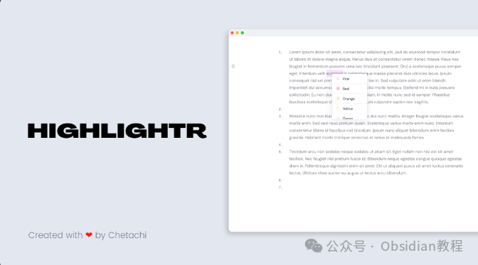
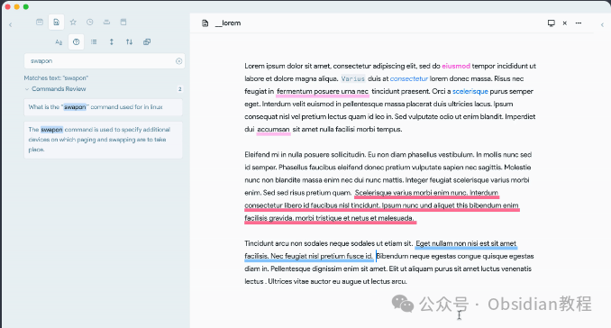
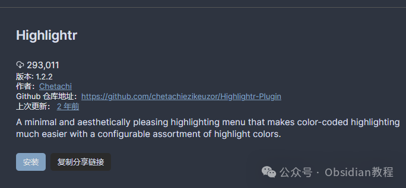
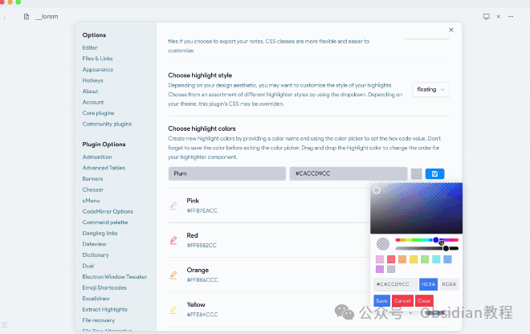
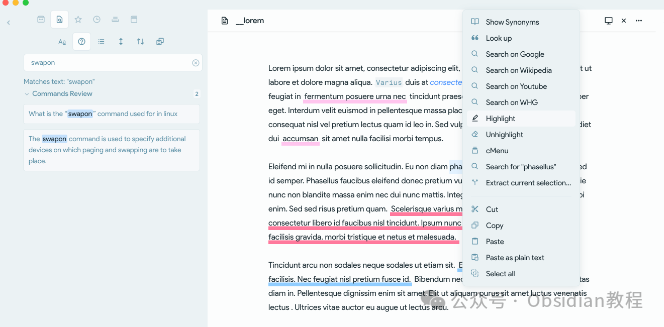

# 告别枯燥笔记，Highlightr让你的笔记瞬间高亮！

最近在Obsidian上发现了一款超级实用的插件——Highlightr。  
说实话，这插件简直就是为我们这些笔记狂热者量身定制的。谁不想在笔记里随心所欲地高亮各种内容，用各种颜色来区分重要信息呢？Highlightr就能满足你的这个愿望！

### **什么是Highlightr？**

  
Highlightr是一个Obsidian插件，提供了一个简单且美观的高亮菜单。相比起传统的Markdown语法和复杂的CSS技巧，这款插件让你可以轻松地为笔记添加各种颜色的高亮，无需繁琐的操作。  
Highlightr不仅让笔记看起来更美观，还能帮助你更好地组织和查找信息。

### **Highlightr的优势**

####   

#### **1\. 易用性**

  
Highlightr插件的设计初衷就是让高亮变得简单又直观。安装好插件后，只需简单几步，就可以轻松上手。插件内置了多种颜色，适用于不同主题，不管你是用浅色还是深色模式，都能找到适合的高亮颜色。  

#### **2\. 高度自定义**

  
虽然插件已经提供了很多默认颜色，但你可以根据自己的需求和喜好来自定义高亮颜色。只需打开插件设置页面，输入高亮颜色的名称，选择颜色并保存，就能将新颜色添加到高亮菜单中。这让你的笔记更加个性化，符合你的使用习惯。  

#### **3\. 兼容性强**

  
Highlightr使用内联CSS，这意味着当你导出笔记时，不需要依赖任何外部的CSS样式。这大大增强了笔记的灵活性和可移植性。  
不论你是在Obsidian内部查看，还是导出到其他平台，笔记的高亮效果都能完美保留。  

### **安装和使用**

####   

#### **1.在线安装**

  
Highlightr插件可以直接在Obsidian的社区插件商店中找到并安装。具体步骤如下：  

  1. 打开Obsidian，点击左下角的设置按钮。
  2. 在设置菜单中选择“Community plugins”。
  3. 点击“Browse”，搜索“Highlightr”。
  4. 找到插件后，点击“Install”进行安装。
  5. 安装完成后，返回设置菜单，启用该插件。

### **2.离线安装：**  
很多同学无法直接在线安装obsidian插件，这里我已经把obsidian所有热门插件下载好了  
只需要关注下方公众号，后台回复：插件 即可获取

### 

#### 

####   

#### **使用**

  1. 安装插件后，打开任意笔记。
  2. 选中需要高亮的文本。
  3. 右键点击选中文本，选择“Highlight”菜单项。
  4. 在弹出的高亮菜单中选择你喜欢的颜色。
  5. 如果需要取消高亮，只需再次选中该文本，右键点击选择“Unhighlight”。

  
此外，你还可以通过快捷键快速打开高亮菜单，并为每种颜色设置独立的快捷键。这使得在编辑笔记时更加方便快捷。  

### **高级功能**

  
Highlightr不仅仅是一个简单的高亮插件，还提供了一些高级功能，让你的笔记更加丰富和有趣。  

#### **1\. 内联CSS和CSS类**

  
Highlightr插件支持内联CSS和CSS类两种模式。内联CSS适用于导出笔记时保持高亮效果，而CSS类则让高亮的自定义性和灵活性更强。你可以在插件设置中选择适合自己的模式。  

#### **2\. 快捷键支持**

  
你可以为每种高亮颜色设置快捷键，这样在编辑笔记时，只需按下相应的快捷键，就能快速应用高亮效果。这大大提高了工作效率，让你在笔记中快速标记重要信息。  

作为一个Obsidian的深度用户，我对Highlightr插件的评价非常高。它不仅提升了笔记的美观度，还让信息的组织和查找更加方便。尤其是自定义高亮颜色的功能，让我可以根据不同项目和任务来区分笔记内容，极大地提高了我的工作效率。  

### **总结**

  
Highlightr插件是一款功能强大、易于使用的高亮工具，让你可以轻松地在Obsidian笔记中添加各种颜色的高亮。  
如果你还没有试过Highlightr，强烈推荐你赶紧去安装试试，相信你会和我一样爱上它的！  

> **对obsidian感兴趣的同学，可以链接我微信：hls404 拉你进入“obsidian交流社群”。**

  
**热门推荐**  
**  
**

  * [告别混乱，拥抱高效！Obsidian Projects让你的笔记管理更上一层楼。](http://mp.weixin.qq.com/s?__biz=MzkyMDUyMDM2Mg==&mid=2247485949&idx=1&sn=f967bcb184d1b9d9340c8a553e3f7153&chksm=c190da38f6e7532e5e50fdece0947e600be5ab90d16b199e1308b09d232bbf166157d513a699&scene=21#wechat_redirect)

  * [Obsidian 高手必备：Advanced URI 带你解锁 Obsidian 高效新姿势，效率提升100%！](http://mp.weixin.qq.com/s?__biz=MzkyMDUyMDM2Mg==&mid=2247485940&idx=1&sn=7bf6eb6efb4dce6e041f39d4c89bb50b&chksm=c190da31f6e75327958c08cbe56c25001b183478e582b195ea170df1fcbb434e140abbdb893e&scene=21#wechat_redirect)

  * [Obsidian 必备！Emoji Toolbar 插件让你的笔记更生动~](http://mp.weixin.qq.com/s?__biz=MzkyMDUyMDM2Mg==&mid=2247485934&idx=1&sn=d5db7239eda390ed50c1b5b96e55c9cd&chksm=c190da2bf6e7533d1be5d807a06da4e5bb9e57ac7f31b0eb023c94156d835a2333988d5e0b82&scene=21#wechat_redirect)  

