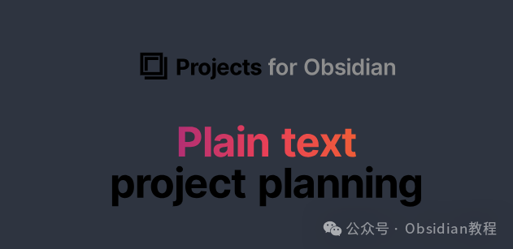
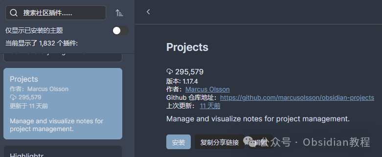
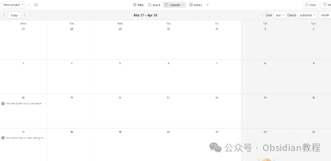
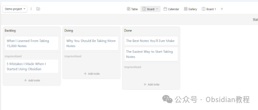

# 告别混乱，拥抱高效！Obsidian Projects让你的笔记管理更上一层楼。

嗨，大家好，今天我们来聊聊Obsidian的一个超级实用的插件——Projects。

  

如果你经常需要进行项目管理，那么这个插件绝对是你的不二之选。

  

无论你是内容经理、项目经理，还是自由职业者，只要你需要管理和可视化笔记，Projects都能满足你的需求。

  

### **Projects 插件简介**

  

Projects是由Marcus Olsson开发的一款插件，旨在帮助用户在Obsidian中管理项目。

  

它支持多种视图模式，包括表格视图、看板视图、日历视图和画廊视图。因此，你可以将其用作文档陈列架或书籍陈列架。

  

这个插件的多功能性使得它不仅适用于项目管理，还能满足其他组织需求。

### **功能与特性**

  

Projects插件的最大亮点在于其多视图管理功能：

  

  1. 表格视图：以表格形式展示文档内容，适合结构化数据展示。

  2. 看板视图：以卡片形式管理文章或待办事项，类似于Trello的使用体验。

  3. 日历视图：以日历形式展示任务的完成时间，方便时间管理。

  4. 画廊视图：以画廊方式展示文章内容，适合视觉化需求较高的用户。

###   

### **安装指南**

  

注意：使用Projects之前，需要关闭Obsidian的受限模式。

  

  1. 打开Obsidian的设置。

  2. 在“社区插件”下，选择“浏览”。

  3. 搜索“Projects” by Marcus Olsson，然后选择它。

  4. 选择“安装”。

  5. 安装完成后，按Ctrl+P（macOS上为Cmd+P）打开命令面板，然后选择“Projects: Show projects”开始使用。

### 

### **2.离线安装：**  
很多同学无法直接在线安装obsidian插件，这里我已经把obsidian所有热门插件下载好了  
只需要关注下方公众号，后台回复：插件 即可获取

### 

###   

### **使用步骤**

  

Projects的使用步骤非常简单：

  

  1. 在左侧栏点击Projects的图标，或者在命令中输入“Show Projects”来打开对应的窗口。

  2. 你可以直接在文件夹上右键点击“Create project in folder”来创建新的Project。

  

初次打开Projects时，会提示你选择一个文件夹，或者尝试使用Projects内置的Demo Projects，打开后可以看到以下的界面：

  

  * 表格视图：展示文档中的key-value或者frontmatter内容。

  * 看板视图：管理文章或者待办事项的卡片视图。

  * 日历视图：展示需要完成或已完成的任务。

  * 画廊视图：以瀑布流方式展示文章内容。

### 

###   

### **设置与配置**

  

在Obsidian插件窗口中，你可以看到以下一些配置项：

  

  1. 项目命名：会显示在选择不同Project时的下拉列表中。

  2. 使用Dataview来索引数据：当你没有安装Dataview时默认不显示。

  3. 使用文件夹地址来索引数据：当留空时，索引根目录（即全库）。

  4. 包括子路径：是否索引指定文件夹下的子文件夹内容。

  5. 默认笔记名：新建笔记时的默认名称。

  6. 模板：可以设置多个模板。

  

配置好后，点击创建Project就可以进入到Projects的窗口了。

  

### **项目管理与视图管理**

  

Projects不仅可以管理项目，还可以灵活切换视图：

  

  1. 切换项目：在Projects界面左上角的下拉选框中选择。

  2. 编辑项目：在更多按钮（三个竖向排列的圆点图标）上，编辑、复制或删除项目。

  3. 新建项目：选择新建Project、视图或笔记。

  4. 视图管理：可以在视图顶部加号中新增不同视图，单击已有视图的下拉箭头选择复制或删除该视图。

###   

### **视图具体操作**

**  
**

  * 表格视图：支持重命名、删除、隐藏列，按Tag、Number、Boolean、日期和文本列展示数据。
  * 日历视图：可以添加、修改事件的元数据，按日期排序事件，查看日、月、周、双周视图。

  * 看板视图：添加新笔记并附带状态、优先级和权重，Kanban生成不同列和排序卡片。

  * 画廊视图：适合喜欢大卡片和精美图片展示的用户。

###   

### **设计理念**

  

Projects在设计上非常注重用户体验，遵循以下几个原则：

  

  1. 不留痕迹：插件不会在笔记中留下任何插件特定的配置。

  2. 保持原生感：插件的外观和感觉尽量与Obsidian保持一致。

  3. 稳定性优先于功能：优先处理bug报告和可用性问题。

###   

### **使用示例**

####   

#### **内容管理**

  

假设你是一位内容经理，Projects可以帮助你轻松管理内容日历。你可以创建不同的草稿笔记，跟踪每篇文章的状态，从初稿到审核再到发布。

  

日历视图可以让你直观地看到每篇文章的发布时间安排，而看板视图则能帮助你更好地管理不同阶段的文章。

  

### **总结**

  

作为一款功能强大的Obsidian插件，Projects让项目管理变得更加高效和便捷。

  

无论你是初学者还是有经验的用户，都可以通过Projects提升自己的工作效率。赶紧安装试试吧，绝对不会让你失望！

> **对obsidian感兴趣的同学，可以链接我微信：hls404 拉你进入“obsidian交流社群”。**

  
**热门推荐**  
**  
**

  * [Obsidian 高手必备：Advanced URI 带你解锁 Obsidian 高效新姿势，效率提升100%！](http://mp.weixin.qq.com/s?__biz=MzkyMDUyMDM2Mg==&mid=2247485940&idx=1&sn=7bf6eb6efb4dce6e041f39d4c89bb50b&chksm=c190da31f6e75327958c08cbe56c25001b183478e582b195ea170df1fcbb434e140abbdb893e&scene=21#wechat_redirect)

  * [Obsidian 必备！Emoji Toolbar 插件让你的笔记更生动~](http://mp.weixin.qq.com/s?__biz=MzkyMDUyMDM2Mg==&mid=2247485934&idx=1&sn=d5db7239eda390ed50c1b5b96e55c9cd&chksm=c190da2bf6e7533d1be5d807a06da4e5bb9e57ac7f31b0eb023c94156d835a2333988d5e0b82&scene=21#wechat_redirect)

  * [告别杂乱笔记！Periodic Notes插件让你的Obsidian更高效](http://mp.weixin.qq.com/s?__biz=MzkyMDUyMDM2Mg==&mid=2247485926&idx=1&sn=08f94ccc5bd059ed65cc0d4b03db72dd&chksm=c190da23f6e753357596438122483832b6595111839928e34bd2c24aba53b0ebd949eab46471&scene=21#wechat_redirect)  

