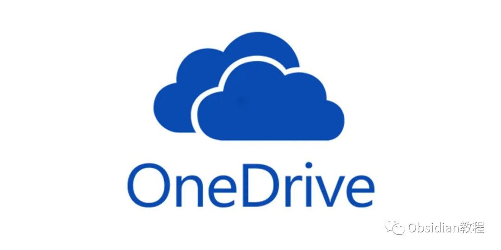
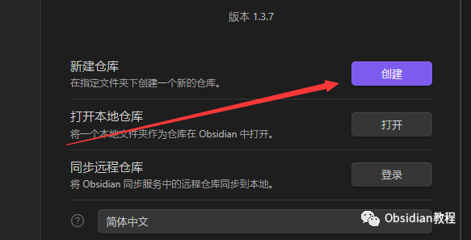

# 彻底解决！obsidian 多设备同步难题

### 点击下方公众号，回复关键字：**Obsidian** ，获取Obsidian资料合集。

  
  

引言：

  
Obsidian 以其本地存储特性和丝滑无延迟的体验受到众多用户的喜爱。但多设备同步成为了一道挑战。不过不用担心，本文将教你如何轻松实现这一功能。  
  

1\. 了解 Obsidian 的存储方式

  
Obsidian 的每一个库实际上就是电脑上的一个文件夹。它不同于许多在线笔记应用，因为所有的数据都是本地存储的。这为我们提供了一个非常明确的同步路径：只要同步这个文件夹，就可以同步你的所有笔记。  
  

2\. 选择云同步软件：

  

虽然有很多云存储服务可供选择，但在这里我们将主要讨论 OneDrive 和坚果云，这两个是最常用的。

  

3\. 具体操作步骤：

  

a. 在 OneDrive 或坚果云上设置：

  * 登录你的 OneDrive 或坚果云账号。
  * 新建一个文件夹，这将用来存放你的 Obsidian 仓库。

  
b. 在 Obsidian 上设置：  
1.打开 Obsidian。2.在初始界面选择“打开本地仓库”，然后导航到你在 OneDrive 或坚果云上新建的文件夹。  

如果你是新用户，也可以选择“新建仓库”并直接在 OneDrive 或坚果云的文件夹中创建。  

c. 对于 iPad 用户：  

  * iPad 上的 Obsidian 默认会将数据存储在 iCloud 中。
  * 打开 iCloud，找到存有 Obsidian 数据的文件夹。
  * 将此文件夹同步到 OneDrive 或坚果云。

  

  

结论：

  
  
虽然这种同步方式可能初次设置时比较麻烦，但只需要设置一次。而且，正是因为 Obsidian 的本地存储特性，用户可以享受到快速、流畅的笔记体验，这是很多云笔记应用无法比拟的。  
现在，随着这一同步方法，你可以在任何设备上都访问和编辑你的 Obsidian 笔记了！  
  
  
1点击下方公众号，回复关键字：**Obsidian** ，获取Obsidian资料合集。
