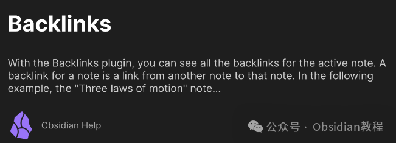
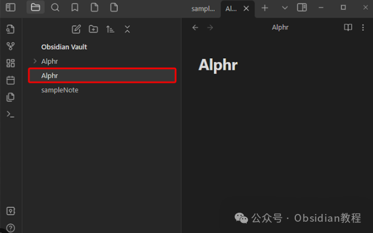
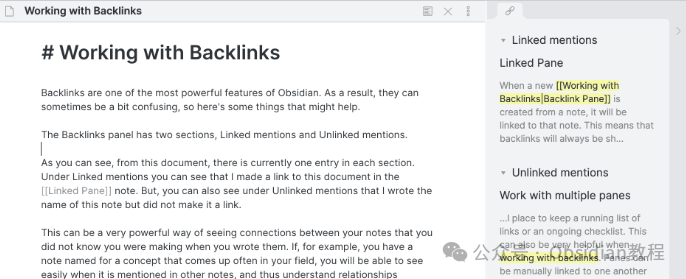
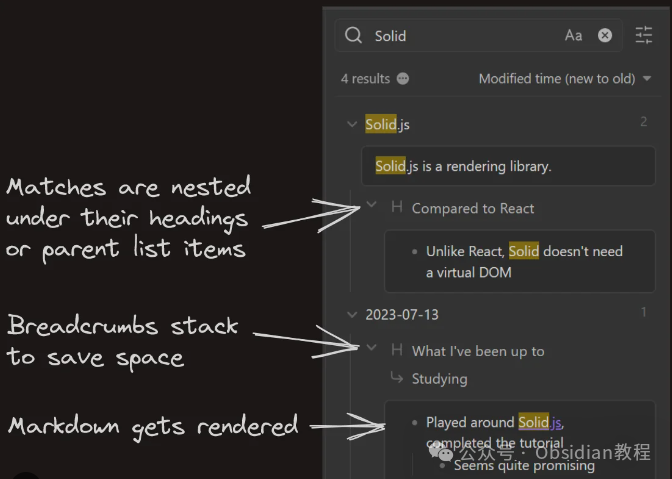

# 整理笔记的利器：Obsidian Backlinks in Document 插件详解

作为一名程序员，大家应该都知道，无论是写代码还是整理笔记，组织结构的重要性都不言而喻。而今天我想和大家聊的，就是在笔记管理中，那个经常被忽视但其实非常强大的功能——**Backlinks in Document** 。

相信很多人用过像Notion、Obsidian这样的工具，它们都支持Backlinks in Document的功能。简单来说，反向链接就是一种可以让你看到哪些文档或页面链接到当前笔记的功能。听起来是不是有点像社交网络中的“你可能认识的人”？

没错，反向链接就是这么一个有趣且实用的功能。它可以帮助你发现笔记之间隐藏的关系，避免信息孤岛的产生，甚至能激发你新的灵感。别小看这一个小小的功能，它能让你在笔记管理中游刃有余，做到有条理、有逻辑，思维也更加清晰。

### 反向链接功能的实际应用

我在使用Obsidian时，突然意识到，反向链接真的是一个宝藏功能。以前，我总是习惯把每一份笔记当做一个孤立的文件，甚至有时候自己写完一篇笔记，过了几个月都不记得里面写了什么。于是，我只能通过一些关键字搜索，重新找到相关的内容。但是自从我开启了反向链接功能，我的笔记管理方式就彻底改变了。

举个例子，我当时在做一个关于项目管理的笔记。在写完一篇关于“敏捷开发”的笔记后，我在其他相关笔记中也引用了这篇文章的内容，或者简单提到过敏捷相关的概念。

结果，我只要打开这个“敏捷开发”的笔记，就能看到所有链接到它的笔记。我甚至可以根据这些反向链接，看到别人是如何在自己的笔记中引用我的笔记，进而了解这些笔记的脉络和内容。这个功能的魔力就在于，它让所有看似孤立的笔记都能紧密联系在一起，形成一个完整的知识网络。

### 增强笔记之间的关联性

说到增强笔记之间的关联性，这个功能就显得尤为重要了。没有反向链接的笔记管理，可能就像散落在房间各处的物品，只有在你翻找时才能偶然碰到，而有了反向链接，它就像一条条“线”，把所有的物品都串联起来。每一篇笔记都能找到自己的“家人”，无论是前后顺序上的关系，还是思想上的呼应，反向链接都能为你提供线索。

比如，在我的工作笔记中，常常会涉及到某些编程语言的语法和使用方法。每次需要查找某个语法点时，直接去搜索引擎查找会很麻烦，有时候还得翻到几年前的文档才找得到。

而有了反向链接后，我可以看到自己之前写的相关内容，甚至能从别人的笔记中得到启发，这样不仅提高了效率，还能不断拓展自己的思维边界。在一些笔记管理工具中，反向链接还可以帮助你追踪到哪些笔记有你需要的信息。

这种从内容到内容的快速跳转，简直就是一个超级快速的“知识传送带”。而且更妙的是，反向链接不仅仅是单向的，实际上它们还是双向的——你不仅可以看到指向当前笔记的链接，还能看到当前笔记指向的所有内容，形成了完整的双向沟通链条。

### **很多同学无法直接在线安装obsidian插件，这里我已经把obsidian所有热门插件下载好了**  
只需要关注下方公众号，后台回复：**插件** 即可获取

### 更高效的知识回顾与复习

作为程序员，我们经常需要处理各种不同领域的知识。这些知识可能在短期内就需要用上，但也可能在一段时间后才会再次接触。而在复习或回顾时，传统的笔记方式可能让你感到困惑。

你可能会回想起某些重要的概念，但记不清楚具体是在哪篇笔记中提到的。反向链接的出现解决了这一问题。举个例子，我曾在学习某个框架的实现原理时，做了大量的笔记。

但因为这些笔记内容涉及多个模块和技术栈，时间一长，我再去查找时就很费劲。通过开启反向链接，我可以看到哪些笔记引用了这个框架，哪些笔记与之相关。这种在笔记之间的跳转和链接，让我能轻松找到自己当初的学习轨迹，快速进行回顾。

反向链接不仅帮助我找到自己曾经写的内容，还能让我看到其他人的反馈和思路。假设某个笔记提到的一个点很有意思，后来我可能会有新的想法，反向链接能帮助我在别人的笔记中看到那些对我有帮助的部分，进而提升我的理解。这种类似“上下游”的信息流动，使得知识的学习更加完整，记忆的回顾也更加高效。

### 避免信息孤岛

你是否有过这样一种感受：你在某一段时间积累了大量的知识，但这些知识彼此之间并没有有效的连接，导致你在回顾时感觉很混乱，甚至感觉自己学的东西像是一个个孤立的小岛。这种现象在没有反向链接的情况下尤为明显。

举个例子，如果你正在研究一种新的技术栈，你可能会在笔记中分别记录它的安装步骤、基本语法、常见错误以及一些进阶用法。每一篇笔记都独立存在，但你可能永远都不清楚它们之间的联系。

正是反向链接的功能，让这些独立的笔记能够有效地“搭桥”互通。你可以轻松地跳转到相关的笔记，看到哪些地方需要补充，哪些内容需要更新，甚至哪些地方与其他知识点产生了交集。反向链接，让这些孤立的信息不再是单一的小岛，而是一个紧密相连的知识群岛。

### 反向链接的挑战

不过，反向链接虽然非常强大，但也不是完美无缺。首先，反向链接的效果需要你在写笔记时就有意识地去链接其他内容，这对于一些习惯单独记录的朋友来说可能需要一些时间适应。

而且，笔记内容的丰富程度也直接影响到反向链接的效果。如果笔记太过简略或者没有深入探讨，反向链接的作用就会大打折扣。另外，反向链接的过度使用也可能会导致信息过载。

尤其是在笔记量极其庞大的情况下，单纯依赖反向链接进行信息查找，有时可能会让你迷失在信息的海洋中。这时，如何合理组织笔记结构、选择适当的标签和分类，成为了更加重要的问题。

### 总结

总的来说，反向链接是笔记管理中一个非常有用的功能，能够帮助我们打破信息孤岛，增强笔记之间的联系，并且极大地提高了我们回顾、复习和学习的效率。通过它，我们不仅能更好地整理思路，还能发现笔记中潜在的价值和联系。而在我看来，这个功能不仅仅是整理笔记的工具，更像是一种让我们思维更加活跃的助推器。

反向链接看似简单，但它在日常工作中的应用，能让你事半功倍。相信我，开启反向链接后，你会发现自己对笔记的管理有了更深的理解，整个笔记的世界也因此变得更加有趣起来。

****-END****-****

  

**ok，今天先说到这，如果你想更深入的了解Obsidian，现在只要购买我们的《Obsidian实操案例课》，便可免费加入「玩转效率笔记」社群，与一群人交流效率提升的经验，实现自我管理的目标。** 如果你对Obsidian有热情，这个课程绝对不容错过！
