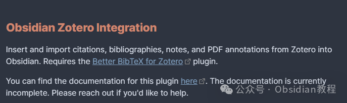
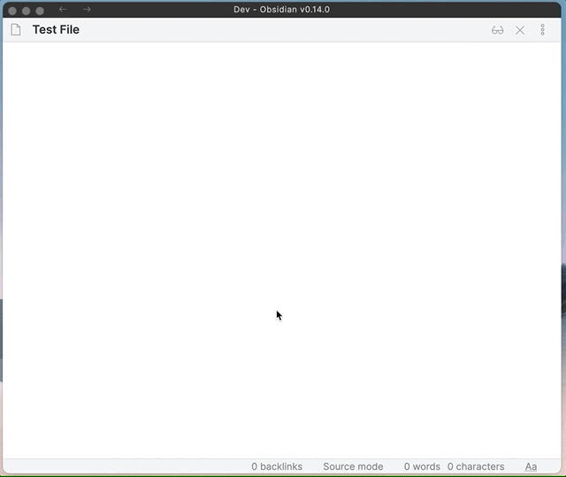
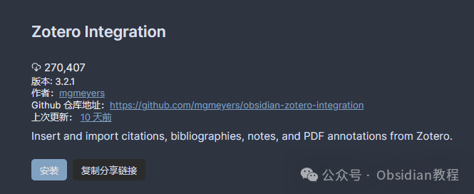
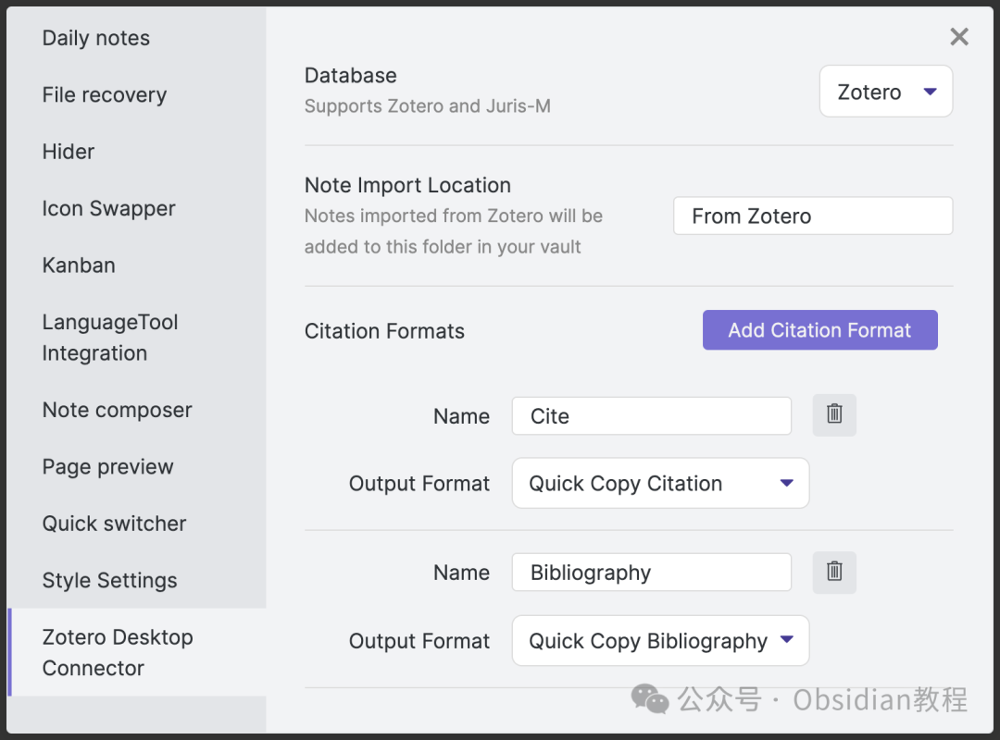
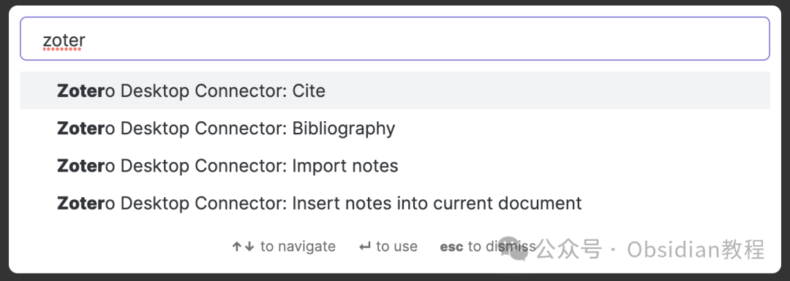
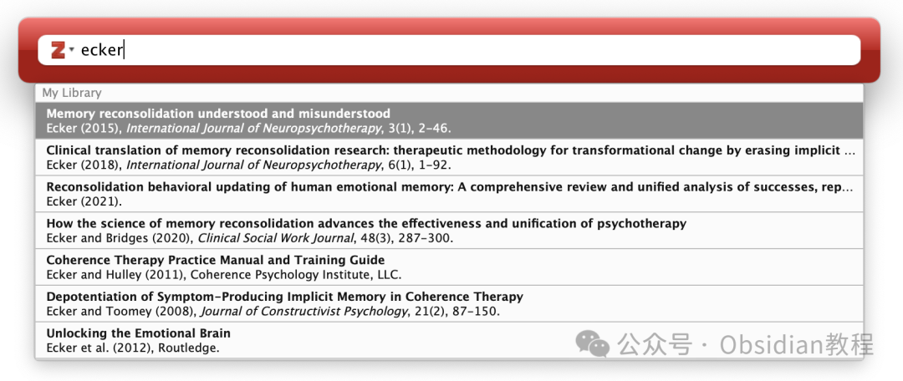

# 用 Obsidian 和 Zotero 打造你的终极知识库！

嗨，我是何老师。

  

今天咱们来聊聊 Obsidian 和 Zotero 的强强联合，这可是重度学术用户的福音！作为一个资料管理和文献管理的重度用户，你可能已经习惯了用 Zotero 管理各种参考文献，分类整理笔记。

  

然而，随着 Obsidian 的普及，越来越多的研究者开始把注意力转向这款超强大的笔记软件。

  

毕竟，Obsidian 的双链、图谱功能简直是学术研究的利器。

  

问题来了：如何在 Obsidian 里流畅地插入和引用 Zotero 中的文献呢？这就要靠 "Obsidian Zotero Integration" 插件出场了。

  

**Zotero Integration 插件是什么？**

  

简单来说，Obsidian Zotero Integration 插件就是用来在 Obsidian 里插入和导入 Zotero 资料的神器。

  

它不仅可以直接从 Zotero 导入文献、书目、笔记，还能让你把 PDF 标注的内容轻松地带入 Obsidian 中。

  

这个插件的开发者明确要求你需要安装 Zotero 的 Better BibTeX 插件，只有这样才能顺利导出和导入引用格式。不过，安装插件并不是那么麻烦，下面手把手教你怎么搞定。

### **插件安装指南**

  

要在 Obsidian 里使用 Zotero Integration 插件，首先你得先安装好它。具体步骤如下：

  

  1. 打开 Obsidian 的设置：点击左下角的小齿轮图标，进入设置界面。

  2. 进入社区插件：在设置页面的左侧栏中找到 "Community Plugins"（社区插件）选项，并点击。

  3. 浏览并安装插件：在社区插件页面，点击 "Browse" 按钮，搜索 "Zotero Integration"。找到后点击 "Install" 进行安装。

  4. 启用插件：安装完毕后，点击 "Enable" 按钮启用插件。

  

### **离线安装：**  
很多同学无法直接在线安装obsidian插件，这里我已经把obsidian所有热门插件下载好了  
只需要关注下方公众号，后台回复：**插件** 即可获取

### 

###   

### **插件不加载怎么办？**

  

如果你发现插件安装后并没有正常加载，别急，何老师这里有几个排查方法供你参考：

  

  1. 检查 Obsidian 版本：确保你安装的 Obsidian 版本至少是 v0.13.24。如果你的版本太旧，这个插件可能无法正常工作。

  2. 重装 Obsidian：如果版本没问题但插件依然无法加载，可以尝试卸载并重新安装 Obsidian，有时候这能解决问题。

###   

### **创建引用或书目时遇到错误？**

  

有时候你在使用插件创建引用或书目时可能会遇到错误。这种情况往往是因为 Zotero 的配置问题。以下是解决方法：

  

  1. 检查 Zotero 的快捷复制样式设置：

     * 打开 Zotero，进入设置菜单，确保你已经选择了快捷复制样式。这个设置决定了当你复制引用时，Zotero 会以什么格式输出。

     * 确保可以在 Zotero 中选中文献并复制引用。如果在 Zotero 中无法复制引用，Obsidian 中自然也无法正常工作。

  2. 在 Zotero 中验证：

     * 进入 Zotero 的设置，找到快捷复制设置，确保已经配置好。

     * 然后，在 Zotero 的编辑菜单中确认可以正常复制引用。

###   

### **插件设置和使用**

  

当插件成功安装并启用后，你可以通过插件设置页面进行一些定制化配置，比如选择导入哪些类型的内容、默认的引用格式等。

  

以下是一些常见的设置页面截图和功能：

  

  * 插件设置页面截图：在这里你可以调整各种选项。

  * 插件命令的可用列表：你可以在 Obsidian 中使用哪些命令。

  * Zotero 搜索栏的截图：如何通过插件直接搜索 Zotero 中的文献。

  * 导入笔记的演示 GIF：插件是如何将 Zotero 笔记导入到 Obsidian 文件中的。

### 

  

  

### 

###   

何老师觉得，Obsidian Zotero Integration 插件简直是 Obsidian 用户的必备神器，特别是对于那些需要频繁引用文献的学术人士来说。

###   

### 这个插件大大提高了文献管理的效率，不仅让你可以轻松管理自己的笔记和文献，还让你可以快速生成书目和引用，再也不用担心手动整理引用格式的烦恼了。用起来非常顺手，绝对值得一试！

# **  
**

# **Obsidian交流社群来了**

[**我们搞了一个专门分享笔记工具的社群：**](http://mp.weixin.qq.com/s?__biz=MzkyMDUyMDM2Mg==&mid=2247485997&idx=1&sn=9a528871be62e4c74a1df3807b28f2bd&chksm=c190d9e8f6e750fe9df7a333b666fdd8561fdeb928d1df1f367d2374742efa34727a3f91cbc0&scene=21#wechat_redirect)****[**玩转效率笔记**](http://mp.weixin.qq.com/s?__biz=MzkyMDUyMDM2Mg==&mid=2247485997&idx=1&sn=9a528871be62e4c74a1df3807b28f2bd&chksm=c190d9e8f6e750fe9df7a333b666fdd8561fdeb928d1df1f367d2374742efa34727a3f91cbc0&scene=21#wechat_redirect)，社群的主要内容包括**使用技巧、模板主题和插件** 等，帮助更多人提升效率，实现自我管理的目标。  
如果你对Notion、Obsidian有热情、对知识有渴望，这个社群绝对不容错过！
