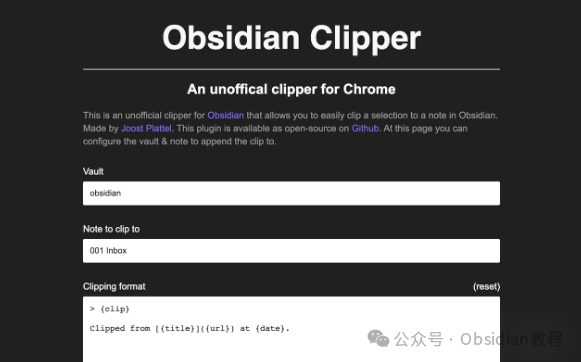

# 用Clipper插件轻松将内容保存到Obsidian笔记！

嗨，大家好。我是何老师。

  

大家平时在网上看到有用的内容，想要快速保存下来做笔记，用什么方法比较方便呢？

  

当然了，能直接把你看到的内容迅速剪辑保存到笔记工具里是最理想的方案。

  

最近我发现了一个特别好用的小插件——Clipper，专门为Obsidian用户设计的剪辑工具。

  

这款插件其实是一个非官方的Obsidian剪辑器，主要是帮助大家在Chrome浏览器中，轻松地把所选内容保存到Obsidian笔记里。

不仅如此，它还支持Markdown格式，这对喜欢用Obsidian来整理笔记的人来说，简直就是个福音。

**  
**

**插件功能特点**

  

**1\. 快速剪辑内容**

  

你在Chrome浏览器中浏览网页时，只要发现想要保存的内容，选中它，使用Clipper插件就可以直接将选中的内容保存到Obsidian笔记中。这一操作非常简便，无需切换应用或复制粘贴。

  

**2\. 支持Markdown格式**

  

Clipper插件不仅能把普通文本保存到Obsidian中，还支持Markdown格式。也就是说，如果你希望保存的内容保留特定的格式。

  

比如标题、链接、列表等，这个插件都能帮你实现。Markdown格式的支持使得你的笔记内容更整洁有序，也更加符合Obsidian的使用习惯。

  

**3\. 灵活的内容管理**

  

你可以根据需要选择是否将剪辑内容直接保存为新的笔记，或者添加到已有的笔记中。这样一来，不管是零散的信息整理，还是系统性的笔记收集，这款插件都可以灵活应对。

  

**4\. 适配Obsidian**

  

Clipper作为Obsidian的非官方插件，它经过优化，可以很好地与Obsidian配合工作，不会影响你的Obsidian使用体验。安装简单，不需要复杂的设置，安装后即可开始使用。

  

**使用场景**

  

举个例子吧，假如你在浏览某篇技术博客，想要把某段代码或者教程内容保存到Obsidian笔记中，方便以后参考。

  

用Clipper插件，你只需要简单地选中那段代码或文字，一键保存到Obsidian笔记中，免去了繁琐的复制粘贴过程，直接提升了效率。

  

再比如，你在进行资料收集时，常常会遇到一些有用的段落或引用，这时通过这个插件你可以直接剪辑保存，Markdown格式的支持还能帮你更好地管理和组织这些资料。

  

**安装方法**

  

### **很多同学无法直接在线安装obsidian插件，这里我已经把obsidian所有热门插件下载好了**  
只需要关注下方公众号，后台回复：**插件** 即可获取

当然，第一次使用时你需要稍微配置一下，比如设置Obsidian的存储路径，确保插件可以顺利将内容保存到你的Obsidian笔记中。

**  
**

**小结**

  

作为一个常常需要记录和整理内容的人，这个Clipper剪辑插件给了我很多便利。我再也不用在多个应用之间来回切换，所有的内容都可以直接从Chrome中一键保存到Obsidian里。

  

不仅如此，Markdown的支持也让我笔记的格式更加规范，再加上Obsidian本身的强大功能，这个插件的组合几乎让我找不到更好的替代品。

  

我的感觉是，这款Obsidian剪辑插件非常适合那些已经在使用Obsidian并且希望提高内容收集效率的用户。

  

如果你也习惯用Obsidian来做笔记管理，强烈建议你试试这个插件，肯定能让你的工作和学习更轻松。

  

# **Obsidian交流社群来了**

[**我们搞了一个专门分享Obsidian的交流社群：****玩转效率笔记****社群的主要内容包括使用技巧、模板主题和插件等，** 帮助更多人提升效率，实现自我管理的目标。](http://mp.weixin.qq.com/s?__biz=MzkyMDUyMDM2Mg==&mid=2247485997&idx=1&sn=9a528871be62e4c74a1df3807b28f2bd&chksm=c190d9e8f6e750fe9df7a333b666fdd8561fdeb928d1df1f367d2374742efa34727a3f91cbc0&scene=21#wechat_redirect)

  
如果你对Obsidian有热情，这个社群绝对不容错过！
