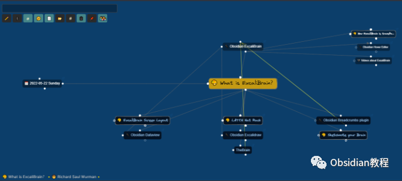
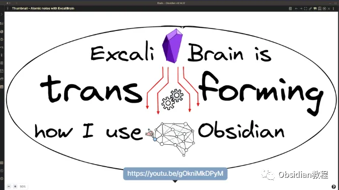
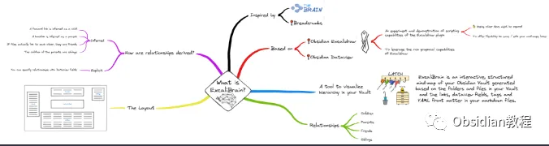

# 用ExcaliBrain 插件，打造结构化的思维导图体验~

嗨，大家好。我是何老师。

  

你是否在寻找一种更为直观的方式来管理你在 Obsidian 中的笔记关系？

  

ExcaliBrain 就是这样一个能够帮助你将复杂的笔记网络以思维导图方式展现出来的插件。

**插件概述**

  

这款插件的灵感来源于 TheBrain 和 Breadcrumbs，它能够识别笔记之间的各种关系，并将这些关系以图形化的方式展示出来。让你的知识库看起来不再像一个个孤立的笔记，而是一个有机连接的整体。

  

**ExcaliBrain关系特性**

  

可以识别五种笔记间的关系：

  

子节点（Children）、父节点（Parents）、朋友节点（Friends）、其他朋友（横向关系 Other Friends）、兄弟节点（Siblings）。

  

这些关系的推导依据是基于你的 Markdown 文件中的链接、Dataview 字段和标签等信息。

**  
**

**必备前置插件**

  

在你开始使用 ExcaliBrain 插件之前，有几个前置步骤需要完成：

**  
**

**1\. 禁用 Obsidian 的安全模式**

  

ExcaliBrain 是社区插件之一，所以在使用之前，需要先关闭 Obsidian 的安全模式。

  

具体操作方法是在 Obsidian 的设置页面找到“社区插件”选项，关闭其中的“安全模式”。

  

当然了，关闭安全模式前要阅读一下安全警告，确保自己了解这可能带来的风险。

  

**2\. 安装前置插件**

  

ExcaliBrain 插件的运行依赖于两个其他插件：Dataview 和 Excalidraw。

  

Dataview 用于从 Markdown 文件中提取数据，而 Excalidraw 则提供可视化的绘图功能。

  

如果因为网络原因你无法直接在 Obsidian 中安装这些插件，可以通过其他渠道获取这些插件的安装包。

  

**安装方法**

**  
**

**1.在线安装**

  

完成上述步骤后，你就可以在社区插件中搜索 ExcaliBrain 并进行安装。

  

安装完成后，记得根据自己的需求进行一些基础的配置，比如设置好插件如何解析 Markdown 文件中的关系字段。

  

**2.离线安装**

**  
**

### **很多同学无法直接在线安装obsidian插件，这里我已经把obsidian所有热门插件下载好了**  
只需要关注下方公众号，后台回复：**插件** 即可获取  
**使用方法**  
接下来就是实际使用 ExcaliBrain 来管理你的笔记间关系了。插件的核心功能就是通过思维导图的形式可视化笔记之间的关系。  
**1\. 建立笔记间的关系**  
你可以通过在笔记中添加 Dataview 字段来明确设定笔记间的关系。  
ExcaliBrain 会根据这些字段为你生成思维导图，帮助你更直观地看到不同笔记之间的联系。

**2\. 交互式的思维导图**

  

ExcaliBrain 生成的思维导图不仅仅是静态的，你可以通过点击导图上的节点快速查看与该节点关联的笔记，这让你在管理大量笔记时不会感到混乱。

**3\. 与 Hover Editor 插件协同工作**

  

ExcaliBrain 还可以与其他插件结合使用，比如 Hover Editor 插件。Hover Editor 允许你在不离开当前笔记的情况下快速查看或编辑其他笔记，与 ExcaliBrain 的思维导图功能完美搭配，极大提升了知识管理的效率。

**  
**

**遇到问题怎么办？**

  

如果你在使用 ExcaliBrain 的过程中遇到了问题，可以通过以下几种方式寻求帮助：

  

**\- 观看教程视频：** YouTube 上有许多关于 Obsidian 和 ExcaliBrain 的教程视频，能够直观地展示操作步骤和使用方法。

**\- 访问 GitHub：** ExcaliBrain 插件的 GitHub 页面上不仅有插件的最新更新和功能介绍，还能反馈问题和提议功能建议。如果你遇到了 Bug，可以通过 GitHub 提交 Issue。

  

**总结  
**

  

总的来说，ExcaliBrain 是一款非常实用的插件，特别是对于那些笔记量庞大、需要经常梳理知识结构的用户来说，它提供了一种非常直观且有效的管理方式。

  

此外，与其他插件的协同使用也让整个工作流程变得更加高效。在我看来，无论你是 Obsidian 的新手还是老用户，ExcaliBrain 都能够为你的知识管理带来不小的帮助。

  

如果你对现有的知识管理方式感到不够直观，不妨试试 ExcaliBrain 这款插件，说不定它就是你一直在寻找的答案呢！

  

# **Obsidian交流社群来了**

[**我们搞了一个专门分享Obsidian的交流社群：****玩转效率笔记****社群的主要内容包括使用技巧、模板主题和插件等，** 帮助更多人提升效率，实现自我管理的目标。](http://mp.weixin.qq.com/s?__biz=MzkyMDUyMDM2Mg==&mid=2247485997&idx=1&sn=9a528871be62e4c74a1df3807b28f2bd&chksm=c190d9e8f6e750fe9df7a333b666fdd8561fdeb928d1df1f367d2374742efa34727a3f91cbc0&scene=21#wechat_redirect)

  
如果你对Obsidian有热情，这个社群绝对不容错过！  

