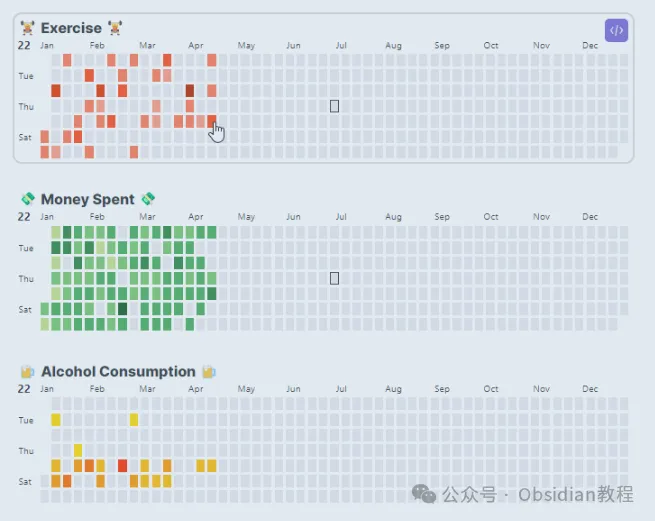
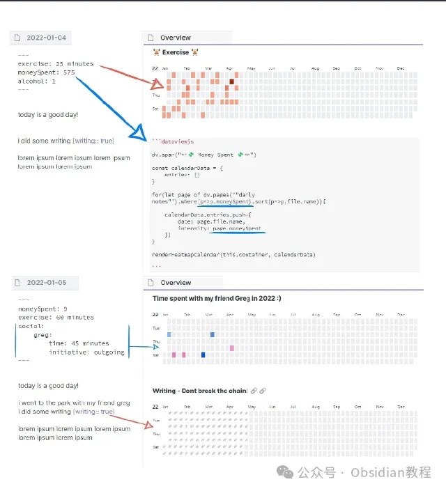
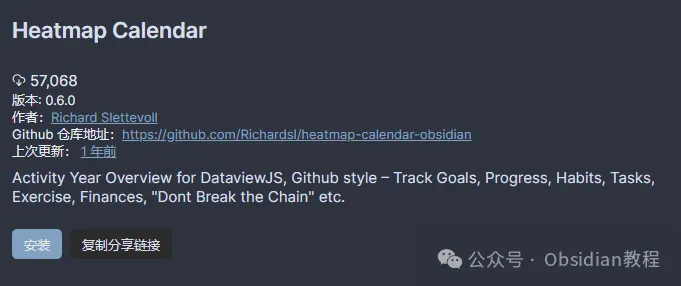

# 用Heatmap Calendar插件将Obsidian数据直观可视化

嗨，大家好，我是何老师。

  

今天我们来聊聊Obsidian中的一个非常有趣又实用的插件——Heatmap Calendar（热图日历）。

  

说到数据可视化，很多人可能第一时间会想到Excel的各种表格图表，或者是一些复杂的BI工具，但其实在Obsidian中，我们也有一种更加简单、直接的方法来展示数据，那就是使用Heatmap Calendar。

  

  

这个插件的核心理念和GitHub的贡献日历有点类似：通过不同颜色的热图单元来标记数据强度，让你一眼就能看出某个时间段内的活动情况，非常适合用于追踪个人习惯、项目进度或者其他类型的数据。

  

## **Heatmap Calendar：展示数据的“日历风”  
  
**

Heatmap Calendar插件最大的亮点在于它能够像GitHub的活动日历那样，把你的数据可视化成一个全年或者某段时间的热图。

  

例如，你可以用它来追踪每天的运动时间、学习时长、工作效率、甚至是日常生活中的一些小习惯——比如每天喝水的量、阅读的篇幅等。通过这种方式，你能够非常直观地看到自己的习惯是如何在一段时间内变化的，并且迅速发现哪些行为在你的生活中形成了模式。

  

### **使用方式：从数据收集到可视化  
  
**

虽然Heatmap Calendar看起来非常简单，但要用好它，前期的数据收集和准备也是至关重要的。在Obsidian中，要实现这个效果，你需要先把你想要追踪的数据以某种形式记录下来，比如你可以在“每日笔记”中为自己记录当天的运动时长、工作小时数或者其他你想要追踪的活动数据。这些数据将成为后续生成热图日历的基础。  
  

接着，你需要创建一个DataviewJS代码块来收集这些数据，并使用Heatmap Calendar提供的renderHeatmapCalendar()函数来进行展示。  
  
例如，你可以先定义一个基本的calendarData对象，并为每个日期添加对应的数据条目。这个对象包含年份、颜色、强度等参数，然后通过循环语句来把数据一一填入，最终通过函数渲染出热图日历。简单来说，这个插件的操作逻辑大致如下：  
  

  1. 数据收集：通过DataviewJS从“每日笔记”中收集想要追踪的数据（如运动、饮食、学习时长等）。  
  

  2. 创建可视化代码块：在笔记中创建DataviewJS代码块，并调用Heatmap Calendar插件的renderHeatmapCalendar()函数。  
  

  3. 热图生成与展示：将收集到的数据传递给渲染函数，自动生成热图日历。  
  

### **配色与强度：数据直观化的关键  
  
**

Heatmap Calendar插件允许你自由定义颜色和强度，以便于更好地传达数据背后的信息。默认情况下，插件使用绿色作为配色方案，就像GitHub的贡献日历一样。但如果你有多种不同的数据类型需要展示（比如工作、运动、休闲等），你可以自定义不同颜色来区分它们。

  

  

此外，还可以设置颜色的强度范围，从而使得数据的差异更加显著。例如，当某天的“学习时长”特别长时，可以通过较深的颜色来表示，而学习较少的天数则使用较浅的颜色。  
  

### **主题与样式适配：深色模式的完美搭配  
  
**

如果你是Obsidian深色模式的爱好者，那么Heatmap Calendar的设计对你非常友好。插件会根据Obsidian的主题自动调整热图的配色：浅色模式下使用黑色图标，深色模式下则使用白色图标，确保在不同的环境下都能保持较高的可读性。

  

再加上Obsidian提供的CSS片段，你还可以进一步调整热图的样式，比如改变单元格的大小、边框样式、悬停效果等，让整个日历的视觉效果更加契合你的个人审美。  
  

### **安装与配置：快速上手不费劲  
  
**

Heatmap Calendar的安装过程很简单，如果你是Obsidian的新用户，只需进入“社区插件”选项卡，搜索“Heatmap Calendar”并点击安装即可。对于那些习惯离线安装插件的小伙伴，可以从开发者提供的插件包中获取离线版本进行手动安装。  
  

### **  
很多同学无法直接在线安装obsidian插件，这里我已经把obsidian所有热门插件下载好了**  
只需要关注下方公众号，后台回复：**插件** 即可获取

安装完成后，你可以通过Obsidian的“设置”页面来配置插件的细节。例如，你可以定义全局颜色方案、调整强度参数或者设置默认的日历样式，甚至可以为不同的数据类型定义不同的配色方案。

  

这种个性化的配置使得Heatmap Calendar能够更好地适应各种使用场景，无论是简单的数据追踪，还是复杂的进度管理，它都能够提供清晰易懂的视觉反馈。

  

### **应用场景：习惯追踪与工作规划  
  
**

Heatmap Calendar插件特别适合用于追踪个人习惯和工作规划。想象一下，你可以用它来记录每天的学习时长，通过一段时间的热图来查看自己是否保持了稳定的学习习惯；或者在项目管理中使用它来标记每个阶段的任务进展，帮助你更好地把握项目的节奏。

  

这种直观的可视化方式不仅能够提高数据展示的效率，还能帮助你更好地从整体上把握自己的时间分配情况。  
  

### **新功能与更新：持续改进，功能更强大  
  
**

Heatmap Calendar插件的开发团队一直致力于为用户提供更加完善和丰富的功能。从最初的简单日历热图，到现在支持自定义颜色、全局配置和与其他插件的深度联动（如DataviewJS），插件在短短的时间内经历了多次更新。  
  
例如，最近新增的悬浮预览功能，能够让你在热图上悬停时直接看到对应的数据详情，非常适合用于展示详细的数据信息。这种不断完善的用户体验使得Heatmap Calendar插件成为Obsidian社区中越来越受欢迎的一个工具。  
  

### **总结  
  
**

Heatmap Calendar插件通过热图的形式帮助用户在日历中可视化地展示各种数据，无论是追踪日常习惯、规划项目进度，还是简单地记录某种行为模式，它都能提供一种直观、易懂的视角来分析和理解数据。

  

而且它还具备丰富的自定义选项和与其他插件的强大联动能力，能够适应各种复杂的使用场景。对于那些需要在Obsidian中进行数据可视化的用户来说，Heatmap Calendar无疑是一个值得尝试的插件。  
  

# **Obsidian交流社群来了**

[**我们搞了一个专门分享Obsidian的交流社群：****玩转效率笔记****社群的主要内容包括使用技巧、模板主题和插件等，** 帮助更多人提升效率，实现自我管理的目标。](http://mp.weixin.qq.com/s?__biz=MzkyMDUyMDM2Mg==&mid=2247485997&idx=1&sn=9a528871be62e4c74a1df3807b28f2bd&chksm=c190d9e8f6e750fe9df7a333b666fdd8561fdeb928d1df1f367d2374742efa34727a3f91cbc0&scene=21#wechat_redirect)

  
如果你对Obsidian有热情，这个社群绝对不容错过！
