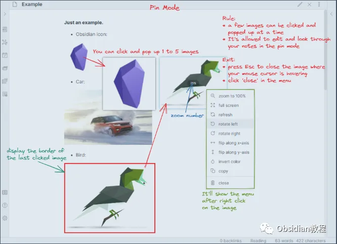
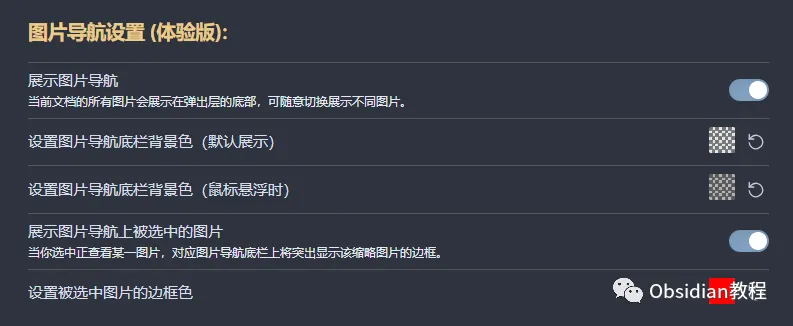
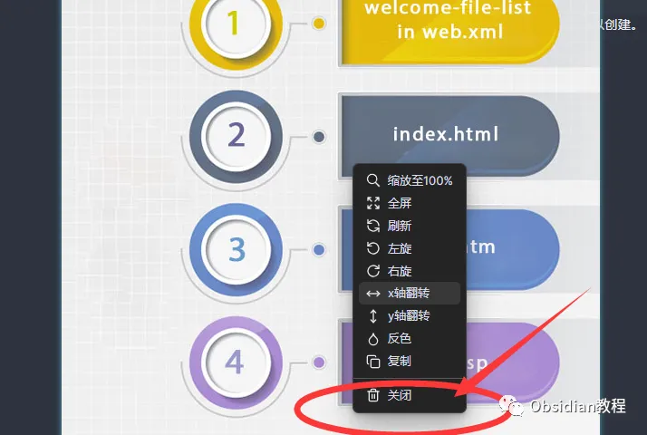
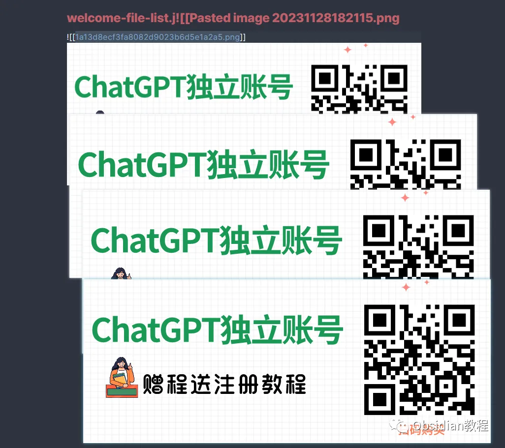
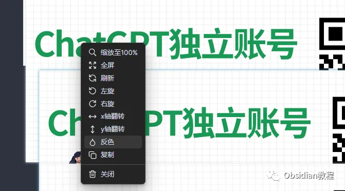
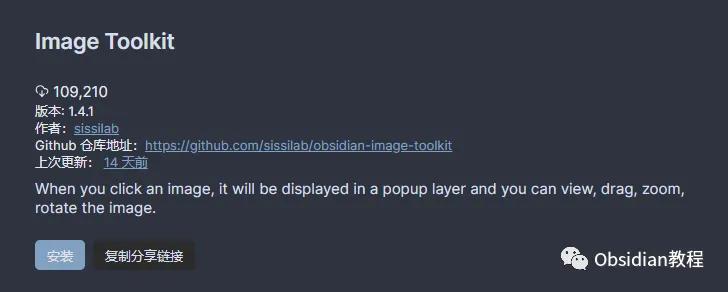

# 用Image Toolki插件，轻松提升Obsidian图像处理体验！

嗨，大家好，我是何老师。

  

你是否曾经在 Obsidian 中管理图片时，感到查看、调整或者处理图片不够顺手？有了 Image Toolkit 这个插件，问题迎刃而解。

它能大幅提升你的图像操作体验，不仅让你能够轻松预览图片，还能进行缩放、旋转、翻转等一系列操作，简直就是 Obsidian 笔记系统中的图像管理利器。

**  
**

**1\. 基础功能**

  

Image Toolkit 提供了丰富的图像预览和操作功能，让图片处理变得简单直观：

  

**\- 缩放：** 可以通过鼠标滚轮轻松调整图片的大小，或者点击工具栏中的缩放图标来放大或缩小图像。

**\- 移动：** 只需拖动鼠标或使用键盘箭头键，就能在页面中移动图片，方便查看图片的每一个细节。****

**\- 全屏预览：** 对于需要更大视野时，全屏模式下观看图片是一大亮点。

**\- 旋转与翻转：** 点击底部工具栏的旋转或翻转按钮即可实现。

**\- 反色处理：** 对于特殊的图片处理需求，可以选择反色功能，快速改变图片的色彩。

**\- 复制图像：** 还可以直接将图片复制到剪贴板，便于快速粘贴到其他地方。

**2\. 模式介绍**

  

Image Toolkit 提供两种主要模式供用户选择，分别适用于不同的使用场景：

  

**2.1 正常模式（Normal Mode）**

  

当在插件设置页面关闭“固定图片”选项时，Image Toolkit 将进入正常模式。

  

在这种模式下，点击图片会弹出一个带有透明遮罩层的背景，图片在该背景上显示出来。

  
一次只能预览一张图片，并且在预览图片时，笔记的其他部分是无法编辑的。

  

**\- 画廊导航栏：** 如果开启了“显示画廊导航栏”选项，当前笔记中的所有图片会以缩略图的形式显示在页面底部，方便快速切换查看其他图片。你还可以自定义画廊的背景色和选中图片的边框颜色。

**\- 退出方法：** 想要退出图片预览？点击图片区域或选择关闭按钮即可。如果是在全屏模式下，记得先退出全屏再关闭弹出层。

**2.2 固定模式（Pin Mode）**

  

当在设置页面开启“固定图片”选项时，插件将进入固定模式。

  

这种模式允许一次弹出多张图片（最多5张），并且与正常模式不同，你可以在预览图片的同时继续编辑或查阅笔记内容。

**\- 右键菜单：** 在弹出的图片上右键点击，会显示一个包含缩放、旋转、全屏、复制等功能的菜单，极大提升操作的便捷性。

**\- 移动图片：** 你可以通过鼠标直接拖动图片的位置，但不能像正常模式那样通过键盘箭头键移动。

  

**3\. 安装方法**

  

Image Toolkit 的安装过程非常简单，你可以选择在线或离线安装，下面是详细步骤：

  

**3.1 在线安装（适用于科学上网用户）**

  

1\. 打开 Obsidian 的“社区插件”页面，点击“浏览”按钮。

2\. 在左上角的搜索框中输入“Image Toolkit”，然后点击“安装”按钮。

3\. 安装完成后，点击“启用”以激活插件。

**3.2 离线安装**

**  
**

### **很多同学无法直接在线安装obsidian插件，这里我已经把obsidian所有热门插件下载好了**  
只需要关注下方公众号，后台回复：**插件** 即可获取**4\. 使用场景**  
Image Toolkit 的强大功能不仅仅体现在基础操作上，它在多个实际应用场景中都有着极大的帮助：**  
****\- 学术研究：** 在整理学术资料时，Image Toolkit 让你可以快速查看、对比图表和图片，帮助你更好地理解和分析数据。

**- 创意写作：**对于需要视觉灵感的创意写作工作，快速浏览和操作图片可以激发更多的创作灵感，提升写作效率。

**\- 项目管理：** 在处理大量视觉资料的项目管理中，Image Toolkit 可以帮助你快速整理和管理图片文件，提高工作效率。

**  
**

**5\. 总结**

  

Image Toolkit 是一款强大且实用的 Obsidian 插件，它不仅大大提升了图像处理的体验，还让图片管理变得更加灵活和便捷。

  

无论你是初学者，还是需要频繁处理图片的资深用户，这款插件都能够为你带来更多便利，显著提升工作效率。

  

最后嘛，我个人觉得，这个插件是每个 Obsidian 用户都不容错过的宝藏！

  

  

# **Obsidian交流社群来了**

[**我们搞了一个专门分享Obsidian的交流社群：****玩转效率笔记****社群的主要内容包括使用技巧、模板主题和插件等，** 帮助更多人提升效率，实现自我管理的目标。](http://mp.weixin.qq.com/s?__biz=MzkyMDUyMDM2Mg==&mid=2247485997&idx=1&sn=9a528871be62e4c74a1df3807b28f2bd&chksm=c190d9e8f6e750fe9df7a333b666fdd8561fdeb928d1df1f367d2374742efa34727a3f91cbc0&scene=21#wechat_redirect)

  
如果你对Obsidian有热情，这个社群绝对不容错过！
