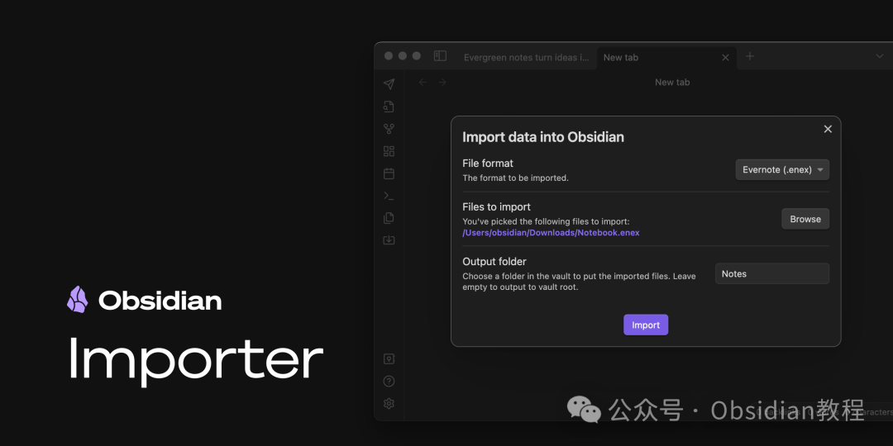
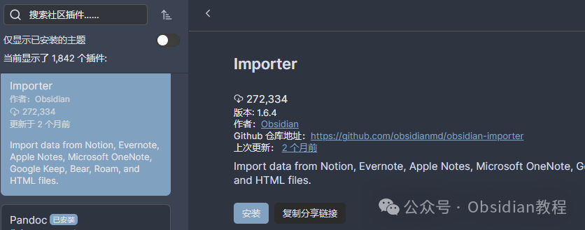

# 用Importer插件，轻松搞定Obsidian笔记导入

今天我们来聊聊Obsidian的一个神器级插件——Importer。  
这个插件主要用来导入其他应用程序中的笔记到Obsidian库中，并将它们转换为纯文本的Markdown文件。  

Obsidian这款工具大家都不陌生，它在知识管理领域中以其强大的可扩展性和便捷的双链功能而广受欢迎。  
然而，我们常常会遇到一个问题：在使用Obsidian之前，很多笔记都存储在其他应用中，比如Apple Notes、Bear、Evernote、Google Keep、Microsoft OneNote、Notion、Roam Research等。  
那么，如何无缝地将这些笔记迁移到Obsidian中呢？这时候，Importer插件就派上用场了。安装和使用这个插件可以帮助我们实现笔记的自由转移，大大提升效率和体验。  

### **Importer 插件介绍**

  
Importer插件，顾名思义，是一个导入工具。其主要功能就是帮助用户从其他应用程序或文件格式中导入笔记，自动转换为Markdown格式，并存储到Obsidian的库中。  
这不仅为我们提供了极大的便利，也让Obsidian成为了管理所有笔记的中心枢纽。  

#### **安装步骤**

  
想要安装Importer插件，只需要简单几步：  

  1. 打开Obsidian。
  2. 进入“设置”。
  3. 选择“社区插件”。
  4. 搜索“Importer”，然后点击“安装”。
  5. 安装完成后，启用插件即可开始使用。

### **离线安装：**  
很多同学无法直接在线安装obsidian插件，这里我已经把obsidian所有热门插件下载好了  
只需要关注下方公众号，后台回复：**插件** 即可获取

### 

### 

###   

### **支持的导入格式**

  
Importer 插件支持从以下应用程序和文件格式中导入笔记：  

  * Apple Notes：导入过程非常顺畅，自动转换为Markdown格式。
  * Bear：支持直接将Bear中的笔记迁移到Obsidian中。
  * Evernote：无需担心ENEX格式，直接导入即可。
  * Google Keep：让你的云端笔记不再孤单。
  * Microsoft OneNote：完美支持OneNote的笔记迁移。
  * Notion：轻松从Notion导入结构化内容。
  * Roam Research：导入你的思维导图和知识节点。
  * HTML文件：支持网页导入，方便整理网络资源。
  * Markdown文件：无缝整合已有Markdown文档。

###   

### **使用方法**

  
Importer 的使用相当简单：  

  * 在Obsidian的界面中，选择“Import”选项。
  * 选择要导入的笔记来源。
  * 根据指引选择文件或账号，系统将自动完成导入和转换。
  * 导入完成后，所有笔记都会以Markdown格式展示在你的Obsidian库中。

###   

使用Importer插件有诸多好处：  

  1. 统一管理：将所有笔记集中在一个平台上，方便管理和搜索。
  2. 数据安全：导入的笔记保存在本地，不用担心数据丢失。
  3. 格式兼容：自动转换为Markdown格式，兼容Obsidian的双链和标签功能。
  4. 时间节省：批量导入笔记，减少手动复制的繁琐步骤。

###   

### **解决的问题**

  
使用Importer插件，可以有效解决以下问题：  

  * 多平台笔记管理：消除在多个应用程序间来回切换的麻烦。
  * 格式转换困难：自动化的格式转换使得迁移工作更加轻松。
  * 数据备份：集中存储便于数据备份和迁移。

  
Importer插件真的是一个极大的便利工具，对于想要将各类笔记整合到Obsidian中的朋友来说，它无疑是一个强力助手。  
它不但帮助我们节省了大量的时间和精力，还能确保我们的数据在统一平台下的安全性和可操作性。能够不费力地把所有资料汇聚到Obsidian中，真的是太棒了。

> **对obsidian感兴趣的同学，可以链接我微信：hls404 拉你进入“obsidian交流社群”。**

  
**热门推荐**  
**  
**

  * [用Obsidian插件轻松打造专业公众号文章！](http://mp.weixin.qq.com/s?__biz=MzkyMDUyMDM2Mg==&mid=2247485973&idx=1&sn=9aefeeb057749af331421f97eb7f0644&chksm=c190d9d0f6e750c60a744f72ea116b7fa165ced94003adc927f3139d1dfdce87a94482f9735a&scene=21#wechat_redirect)

  * [轻松管理多媒体文件！解锁 Ozan's Image in Editor 插件的强大功能](http://mp.weixin.qq.com/s?__biz=MzkyMDUyMDM2Mg==&mid=2247485967&idx=1&sn=1a9f201769cd18f7fdba929e44e7b2a9&chksm=c190d9caf6e750dcc9d6080538e7a0bbfeeed137f625c2fa72e50d62391cc5c2a5560499647e&scene=21#wechat_redirect)

  * [告别枯燥笔记，Highlightr让你的笔记瞬间高亮！](http://mp.weixin.qq.com/s?__biz=MzkyMDUyMDM2Mg==&mid=2247485959&idx=1&sn=9d9c4293bdf6cbbfecffdbf32181f8c1&chksm=c190d9c2f6e750d4147e8bb6a95e3aad07ee677a04384a18d827f55edff6ed8744108b9a0f7a&scene=21#wechat_redirect)  

