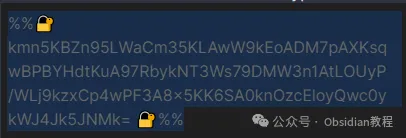
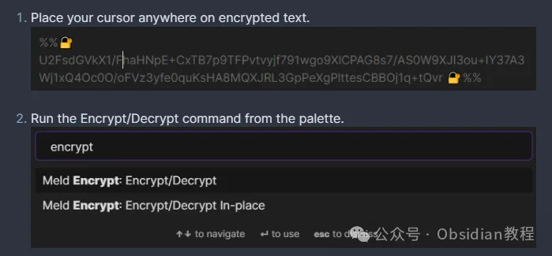
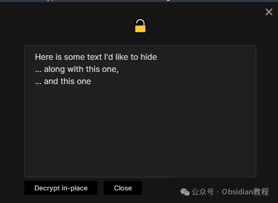

# 用Meld Encrypt插件，保护你的笔记隐私~

嗨，大家好。我是何老师。

  

你有没有在使用Obsidian记录笔记时，突然想保护某些敏感信息不被泄露呢？这时Meld Encrypt插件就派上用场了！

  

它能让你方便地加密笔记内容，保证重要信息的安全。接下来，我会详细介绍如何安装和使用Meld Encrypt插件，并分享一些实用的小技巧。

**  
**

**使用Meld Encrypt创建加密笔记**

  

**1.创建新的加密笔记**

  

要创建加密笔记，先按下快捷键 Ctrl+P 或 Cmd+P，打开命令面板。在面板中搜索并选择“创建加密笔记”命令。

  

此时，你需要输入并确认一个密码。为了防止忘记密码，还可以设置一个提示信息。

  

完成这些步骤后，你就可以编辑你的加密笔记啦。编辑完成后，笔记会自动加密并保存到磁盘上，非常方便。

**2.查看和编辑加密笔记**

  

想要查看已经加密的笔记？那也很简单，只需在Obsidian的导航树中正常打开该笔记，系统会要求你输入密码，解密后你就可以查看和编辑内容了。编辑完成后，笔记会再次加密保存。

**3\. 修改加密笔记的密码和提示**

  

如果你担心密码不够安全或者想修改提示信息，只需打开加密笔记并输入现有密码。

  

在笔记标题栏或者右键菜单中，点击“更改密码”图标，输入新的密码和提示信息就可以啦。

**  
**

**4\. 加密或解密现有笔记**

  

你还可以对现有的笔记进行加密或解密。只需右键点击需要加密或解密的笔记文件，选择“加密笔记”或者“解密笔记”即可。

  

另外，在工具栏中还有一个“转换为加密笔记或非加密笔记”的图标，你也可以通过它来快速切换文件的加密状态。

  

如果你喜欢使用快捷键，还可以通过命令面板绑定快捷键来实现这一操作，效率更高哦。

**5\. 部分加密文本**

  

有时候，你可能只想加密笔记的一部分内容，Obsidian也是可以做到的。

  

选中你想加密的文本，运行命令面板中的加密/解密命令，输入并确认密码及提示信息，这样选中的文本就会被加密了。

  

解密时，同样通过命令面板操作，输入正确的密码后就能显示原始文本。

**  
**

**安装方法**

  

**1.在线安装（适用于可以科学上网的用户）**

  

首先，打开Obsidian，进入“社区插件”页面。在界面上，找到左侧的“浏览”按钮，点击它，然后在搜索框中输入“Meld Encrypt”。

  

很快就会找到该插件，接着点击“安装”按钮。安装完成后，别忘了点击“启用”按钮，这样插件才会真正生效。

**2.离线安装**

**  
**

**很多同学无法直接在线安装obsidian插件，这里我已经把obsidian所有热门插件下载好了**

  

只需要关注下方公众号，后台回复：**插件** 即可获取

### 

**  
**

**插件设置小技巧**

  

Meld Encrypt插件有一些设置可以进一步提升使用体验：

  

**- 确认密码：**加密时可以设置需要再次确认密码，避免输入错误。

**- 记住密码：**插件可以为当前会话记住上一次使用的密码，减少重复输入。

**- 记住密码超时：**你可以设置密码记住的时间，默认是几分钟。

**\- 加密标记：** 在阅读视图中是否显示加密文本的标记，可以根据喜好自行设置。

**- 部分加密扩展：**部分加密时默认加密整行文本。

  

**注意事项**

  

当然了，Meld Encrypt虽然好用，但还是有几点需要注意：

  

**- 密码不会被存储：**这意味着如果忘记密码，将无法解密笔记。所以记得备份密码！

**\- 加密方法未经审计：** 尽管Meld Encrypt提供了加密功能，但它的安全性并未经过专业审计，仍然有一定的被解密风险。

**- 插件更新带来的问题：**插件更新有时会引入新的bug，所以养成定期备份笔记的习惯是很重要的。

  

**结语**

  

我自己用了Meld Encrypt一段时间，感觉确实很方便，尤其是在我需要保存一些敏感信息的时候。

  

有了加密功能，我再也不用担心笔记被别人看到啦。不过嘛，密码管理真的要特别注意。

  

最好使用一些密码管理工具来存储这些密码，不然一旦忘记了，那可就麻烦了。

  

总的来说，Meld Encrypt让Obsidian用户可以更安心地使用这款笔记软件来管理敏感信息。

  

只要谨慎管理密码并做好备份，你就能放心地加密每一篇笔记，享受更高的安全性。

# **Obsidian交流社群来了**

[**我们搞了一个专门分享Obsidian的交流社群：****玩转效率笔记****社群的主要内容包括使用技巧、模板主题和插件等，** 帮助更多人提升效率，实现自我管理的目标。](http://mp.weixin.qq.com/s?__biz=MzkyMDUyMDM2Mg==&mid=2247485997&idx=1&sn=9a528871be62e4c74a1df3807b28f2bd&chksm=c190d9e8f6e750fe9df7a333b666fdd8561fdeb928d1df1f367d2374742efa34727a3f91cbc0&scene=21#wechat_redirect)

  
如果你对Obsidian有热情，这个社群绝对不容错过！
