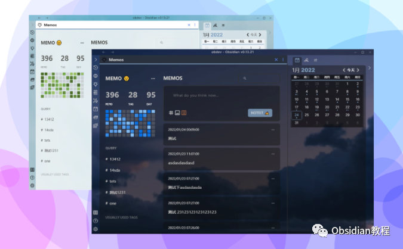
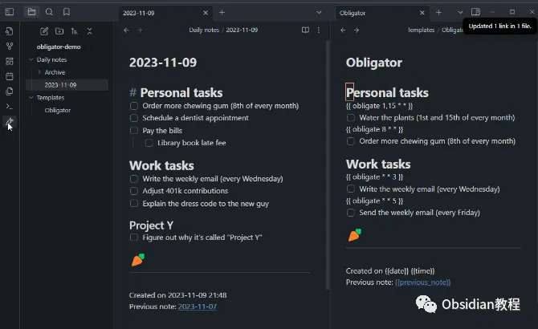
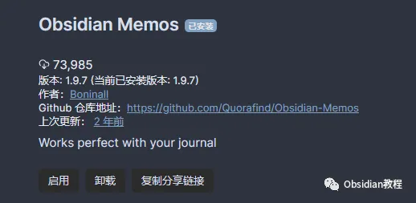
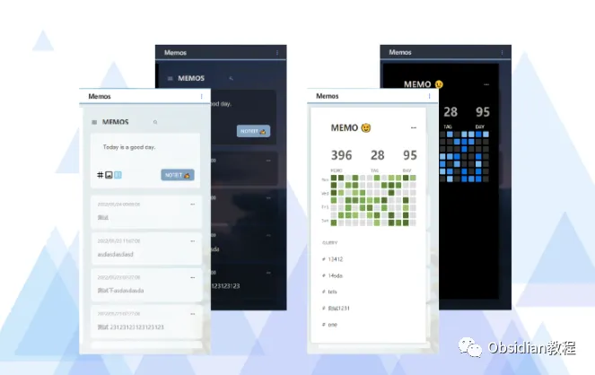

# 用Memos插件，让你的日常笔记秒变高效备忘录！

嗨，大家好。

  

最近，我发现了一个特别好用的插件——Obsidian中的Memos，这工具让我笔记管理的效率提高了不少。

  

简单来说，它是一个为Obsidian用户提供快速捕捉思想和管理日常笔记的工具。

  

虽然听起来有点普通，但当你用上之后，绝对会改变你对日常笔记管理的认知。

  

先说说这个插件的来历吧。Memos其实是基于两个开源项目——memos和flomo，但在此基础上做了很多改进和扩展，简直像是个加强版的备忘录神器。

## **介绍**

##   

## Obsidian Memos的神奇之处在于，它允许你从日常笔记里提取备忘录。

##   

## 但这个功能可不是开了就能用的，它要求你得先启用一个核心插件，叫Obligator Plugin。

##   

## 所有备忘录都是基于这个插件，来自于你日常记录的那些笔记。

##   

## 你可能会问：“笔记多了，备忘录该怎么提取呢？”备忘录是根据你配置中的“Process Memos below”标题来提取的，默认是# Journal。

##   

## 现在你也可以设定为自己喜欢的其他标题，灵活性非常高。而且，插件会在你设置的“Insert After”标题下创建备忘录。

##   

## 这意思是，你可以调整备忘录插入的位置，想放在哪儿就放在哪儿，笔记结构可以随心所欲地定制。

****

**如何安装**

**  
**

**1.在线安装：** 只要在Obsidian的“社区插件”里搜索“Obsidian Memos”，点一下“安装”，再启用，搞定。

  

启用插件：安装成功后，点击“启用”以启用插件。

### **2.离线安装：**  
**很多同学无法直接在线安装obsidian插件，这里我已经把obsidian所有热门插件下载好了**  
只需要关注下方公众号，后台回复：**插件** 即可获取

**如何使用**

**  
**

**1.启用日常笔记插件：** 装完插件，接下来就是怎么使用了。首先得确保Obsidian的“Obligator”这个核心插件启用了，因为备忘录都来自你的日常笔记。

  

**2.配置标题：** 这个“Obligator”插件在Obsidian里就像是个数据源，帮助你整理各种备忘录，所有的记录都会按你设置的标签和标题提取出来。

  

**3.打开Memos并点击'NOTEIT'：** 设置完标签后，打开Memos插件。你只需点击一个按钮——“NOTEIT”，快速记录备忘录。

说实话，这个功能的简洁和直接让我非常喜欢，尤其是当你灵光一现、突然想到某个idea的时候，动动鼠标，马上把想法写下来，不会错过任何一个“脑洞”。

  

**功能特点**

  

用了Memos后，我才发现它的小功能设计是真心好，你可以用它来展示所有来自日常笔记的备忘录。

  

像是翻看自己的日记一样，不管是昨天记录的代码问题，还是一周前突然冒出来的产品灵感，全都能一目了然地看到。

  

分享功能也是让我觉得挺贴心的。如果你想把备忘录分享给别人，你甚至可以生成图片，然后直接分享。

  

至于备忘录里的标签管理、查询功能，这些都是Memos的“加分项”。

  

用标签整理笔记特别清爽，有时候我觉得自己都像个数据库管理员，随时可以查询任何备忘录。

  

最神奇的是它的热力图功能，类似于GitHub上的那种“绿点点”。

  

你可以看到每一天的备忘录数量，还能点击过滤当天的内容，超级直观。

  

这个功能很适合那些有点“强迫症”的人，每天看着自己的“打卡”成果。

  

**使用体验**

  

其实用这个插件，不仅仅是为了记录，更是一种体验。你可以设置自己的用户横幅，在笔记界面上看到自己的名字，带点小仪式感嘛。

  

写代码的时候，灵感突如其来，马上就能双击备忘录开始编辑，或者Ctrl+点击跳回原始笔记，看自己当初为什么会有那个想法。

  

Memos插件的搜索和过滤功能简直就是神兵利器，每次搜索的时候，结果会直接显示在一个页面上。

  

**总结**

  

总的来说，Obsidian Memos插件可以说是为那些日常需要记录、管理大量信息的人量身定制的一个工具。

  

它的简洁性和功能性结合得特别好，既不复杂，也不简单。像日常需要随时记录、快速整理思路的程序员，用它真的是如虎添翼。

  

而且，它的扩展功能也是相当实用的，不管你是用它来做日常备忘，还是做一些专业笔记管理，都很顺手。

  

试试看吧，相信你一定会爱上这个插件的。

  

# **Obsidian交流社群来了**

[**我们搞了一个专门分享笔记工具的社群：**](http://mp.weixin.qq.com/s?__biz=MzkyMDUyMDM2Mg==&mid=2247485997&idx=1&sn=9a528871be62e4c74a1df3807b28f2bd&chksm=c190d9e8f6e750fe9df7a333b666fdd8561fdeb928d1df1f367d2374742efa34727a3f91cbc0&scene=21#wechat_redirect)****[**玩转效率笔记**](http://mp.weixin.qq.com/s?__biz=MzkyMDUyMDM2Mg==&mid=2247485997&idx=1&sn=9a528871be62e4c74a1df3807b28f2bd&chksm=c190d9e8f6e750fe9df7a333b666fdd8561fdeb928d1df1f367d2374742efa34727a3f91cbc0&scene=21#wechat_redirect)，社群的主要内容包括**使用技巧、模板主题和插件** 等，帮助更多人提升效率，实现自我管理的目标。  
如果你对Notion、Obsidian有热情、对知识有渴望，这个社群绝对不容错过！
