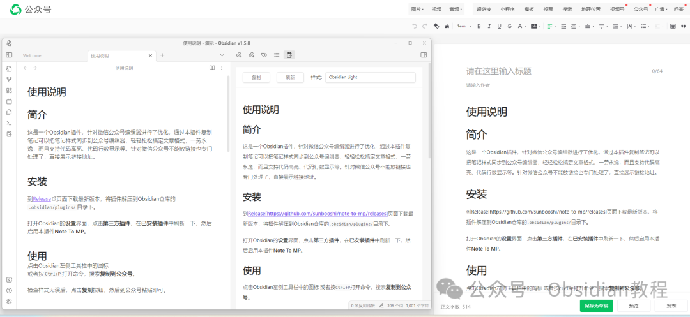

# 用Obsidian插件轻松打造专业公众号文章！

你是不是常常在Obsidian里写完笔记，想要把它无缝对接到微信公众号上，但格式总是乱七八糟？  
有了这个Obsidian插件，这一切都变得轻而易举啦！  
这个插件专门为微信公众号编辑器进行了优化，支持代码高亮、代码行数显示、主题背景颜色等等。  
不仅如此，它还能解决公众号不能直接插入链接的问题，让你可以选择在文中直接展示链接地址或在文末以脚注形式呈现。  
插件的核心目标就是让你在Obsidian和微信公众号之间的笔记转换变得简单高效，保证格式的一致性，让你从此告别格式混乱的烦恼。  

### **  
**

### **安装方法**

####   

#### **离线安装**  

###   
很多同学无法直接在线安装obsidian插件，这里我已经把obsidian所有热门插件下载好了  
只需要关注下方公众号，后台回复：插件 即可获取  

#### **3\. 主题和代码高亮下载**

#####   

##### **3.1 通过设置下载**

  

从1.0.4版本开始，主题和代码高亮需要在插件设置中手动下载，以保证符合官方规范。

  

##### **3.2 手动下载**

  

  * 直接在Release页面下载assets.zip文件。
  * 解压后，把内容放到.obsidian/plugins/note-to-mp/assets目录下。

  *   *   *   *   *   *   *   *   *   *   *   *   *   *   *   * 

    
    
    插件的完整目录结构如下：.obsidian/plugins/note-to-mp/├── assets│   ├── themes.json│   ├── highlights.json│   ├── themes│   │   ├── maple.css│   │   ├── mweb-ayu.css│   │   └── ...│   └── highlights│       ├── a11y-dark.css│       ├── a11y-light.css│       └── ...├── main.js├── manifest.json└── styles.css

  

### **使用方法**

  
一旦安装完成，你就可以开始使用这个插件啦！  

  * 在Obsidian左侧工具栏中找到插件图标，或者按Ctrl+P打开命令面板，搜索“复制到公众号”。
  * 确认样式没有问题后，点击复制按钮，然后到微信公众号编辑器中粘贴即可。

###   

### **插件配置**

####   

####  行号显示

  * 默认情况下，代码块会显示行号。如果你觉得行号不必要，可以在设置界面的“第三方插件”部分找到“Note to MP”，取消勾选“显示代码行号”。

####   

#### 链接样式

  * 由于微信公众号限制，文章中的链接无法点击。插件默认将链接地址直接展示出来，方便读者复制链接访问。如果你希望链接在文末统一展示，可以在设置界面中将“链接展示样式”改为“脚注”。

####   

#### 获取更多主题

  * 想要更多的主题和代码高亮样式？你可以通过插件设置下载更多的主题。

####   

#### 清空主题

  * 如果你需要清空已下载的主题及代码高亮，可以在设置中进行操作。

###   

### **主题**

  
通过移植imageslr/mweb-themes，插件总共支持30多款主题，总有一款适合你的审美。  

#### **自定义主题**

  
如果你想要更多个性化的样式，插件也支持自定义主题：  

  1. 在themes.json文件中新增一个样式配置：

      
      *   *   *   *   *   *   *   *   *   *   *   * 
    
    
    
    [    {          // 已有样式定义 ...    },        {        "name": "NewStyle",         "className": "new-style",        "desc": "关于样式的描述",        "author": "sunbooshi"    }]

  

  * name：样式的名称，用于展示。
  * className：CSS类名，不能包含空格。
  * desc：样式的介绍。
  * author：样式作者。

  

  2. 在themes目录下新增样式文件，文件名需与className一致。

  

  * 例如，上述样式应在themes目录下新增new-style.css文件。

  

  3. 在new-style.css中定义样式：

      
      *   *   *   *   *   *   *   *   *   *   *   *   * 
    
    
    
    .new-style strong {  font-weight: 700;}.new-style a {  color: #428bca;  text-decoration: none;  background: none;}.new-style p {  margin: 10px 0;  line-height: 1.7;}  
    

  

通过这些简单步骤，你就可以创建自己的主题，完全符合你的需求！这个插件真的是Obsidian用户的好帮手，快来试试吧！  
最后，如果你对写作感兴趣，**可以链接我微信：sisixuejie6 拉你进入obsidian交流社群和写作社群****  
****热门推荐**  
**  
**

  * [轻松管理多媒体文件！解锁 Ozan's Image in Editor 插件的强大功能](http://mp.weixin.qq.com/s?__biz=MzkyMDUyMDM2Mg==&mid=2247485967&idx=1&sn=1a9f201769cd18f7fdba929e44e7b2a9&chksm=c190d9caf6e750dcc9d6080538e7a0bbfeeed137f625c2fa72e50d62391cc5c2a5560499647e&scene=21#wechat_redirect)

  * [告别枯燥笔记，Highlightr让你的笔记瞬间高亮！](http://mp.weixin.qq.com/s?__biz=MzkyMDUyMDM2Mg==&mid=2247485959&idx=1&sn=9d9c4293bdf6cbbfecffdbf32181f8c1&chksm=c190d9c2f6e750d4147e8bb6a95e3aad07ee677a04384a18d827f55edff6ed8744108b9a0f7a&scene=21#wechat_redirect)

  * [告别混乱，拥抱高效！Obsidian Projects让你的笔记管理更上一层楼。](http://mp.weixin.qq.com/s?__biz=MzkyMDUyMDM2Mg==&mid=2247485949&idx=1&sn=f967bcb184d1b9d9340c8a553e3f7153&chksm=c190da38f6e7532e5e50fdece0947e600be5ab90d16b199e1308b09d232bbf166157d513a699&scene=21#wechat_redirect)  

