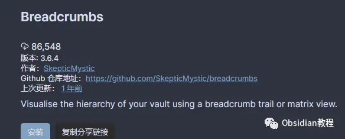
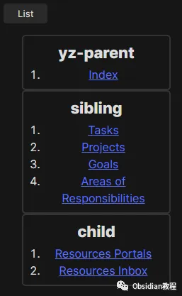

# 用Obsidian的Breadcrumb插件轻松构建笔记层级和关联关系

嗨，大家好，我是何老师。

  

笔记管理是一个至关重要的环节，毕竟，我们的大脑容量有限，总得靠点外部工具来保持井井有条。

  

而在众多笔记软件中，Obsidian绝对是我的心头好。它不仅轻量，而且插件丰富，几乎可以满足你对笔记管理的所有幻想。

  

今天，我就想和大家聊聊Obsidian的一个超强插件——Breadcrumb。

  

**Breadcrumb插件简介**

  

如何在这些笔记之间建立清晰的层级和关联关系，就显得格外重要了。Breadcrumb这个插件的出现，简直就是为这种需求量身定做的。

  

Breadcrumb插件能够帮助你在Obsidian里建立笔记的层级关系，不管是上级笔记、同级笔记，还是下级笔记，它都能轻松搞定。

  

而且，它的视图功能还让你能直观地看到笔记之间的关系链，真是让人爱不释手。

  

**安装与设置**

**  
**

**1.在线安装**

  

说到这里，你可能会问：“这么厉害的插件，我该怎么装呢？”好问题！对于那些已经科学上网的小伙伴来说，直接在线安装就好了。

  

只需要在Obsidian的“社区插件”里搜一下“Breadcrumb”，一键安装、启用，就可以直接用了。

**2.离线安装** 很多同学无法直接在线安装obsidian插件，这里我已经把obsidian所有热门插件下载好了

### 只需要关注下方公众号，后台回复：**插件** 即可获取

### 

### 装好插件后，你需要配置一些元数据，简单来说，就是在笔记的开头加上一些特定的标记，比如：

### 

Frontmatter字段：在笔记顶部以YAML格式添加，如下例所示：

  *   *   *   *   * 

    
    
    ---parent: [[上级笔记]]sibling: [[同级笔记]]child: [[下级笔记]]---

这样，Breadcrumb就知道这些笔记之间的关系了。想要再高阶一点，你还可以利用内联元数据，不过这就得搭配另一个插件——Dataview。

  

听上去有点复杂？其实上手一试就明白了，设置起来一点也不麻烦。  

  * 

    
    
    这是一篇关于金融的笔记。（parent:: [[金融基础]]）

  

**Breadcrumb的实用功能**

  

这个插件最让我觉得牛逼的地方，就是它的层级关系视图。你可以直接看到当前笔记的上下级关系，甚至还能通过Breadcrumb Trail视图，追溯到你知识库的最顶端，简直像是为笔记装上了一条导航线。

  

而且，它还和另一个叫Juggl的插件可以无缝集成，帮你生成一个笔记关系的图谱，仿佛在看星际地图。

  

**Breadcrumb的实际应用**  

**  
**

接下来聊聊实际应用，假设你和我一样，正在学习一门复杂的课程，比如金融学。你可以把这门课分成不同的模块，比如“金融基础”、“金融高级”之类的，每个模块再细分成更具体的内容，比如某次讲座、某个小组作业等等。

  

有了Breadcrumb，你就可以轻松构建这些笔记之间的层级关系，再也不会出现找不到笔记的情况。

  

再举个例子，假如你正在管理一个项目，项目的不同阶段，比如设计、开发、测试，都可以用笔记来记录下来。通过Breadcrumb，这些阶段的先后顺序和依赖关系就会一目了然，谁再敢说程序员不懂项目管理，我第一个不答应！

  

当然，Breadcrumb也非常适合构建知识框架。比如，你要学习某个编程语言或者历史事件，通过Breadcrumb，你可以把这些知识点的前后关系理得清清楚楚，知识点之间的关联性也一览无余，学习起来会轻松许多。

  

**总结**  

  

其实Breadcrumb的价值就在于它能把你脑子里那些复杂的、模糊的知识和信息，通过层级结构变得清晰明了。

  

学习、工作、项目管理——无论在哪个场景下，Breadcrumb都能帮你更好地组织和管理信息，真是Obsidian用户必备的一大利器。

  

所以说，如果你还没有试过Breadcrumb，赶紧行动吧，体验一下这种条理清晰的快感！

  
  

# **Obsidian交流社群来了**

[**我们搞了一个专门分享笔记工具的社群：**](http://mp.weixin.qq.com/s?__biz=MzkyMDUyMDM2Mg==&mid=2247485997&idx=1&sn=9a528871be62e4c74a1df3807b28f2bd&chksm=c190d9e8f6e750fe9df7a333b666fdd8561fdeb928d1df1f367d2374742efa34727a3f91cbc0&scene=21#wechat_redirect)****[**玩转效率笔记**](http://mp.weixin.qq.com/s?__biz=MzkyMDUyMDM2Mg==&mid=2247485997&idx=1&sn=9a528871be62e4c74a1df3807b28f2bd&chksm=c190d9e8f6e750fe9df7a333b666fdd8561fdeb928d1df1f367d2374742efa34727a3f91cbc0&scene=21#wechat_redirect)，社群的主要内容包括**使用技巧、模板主题和插件** 等，帮助更多人提升效率，实现自我管理的目标。  
如果你对Notion、Obsidian有热情、对知识有渴望，这个社群绝对不容错过！
