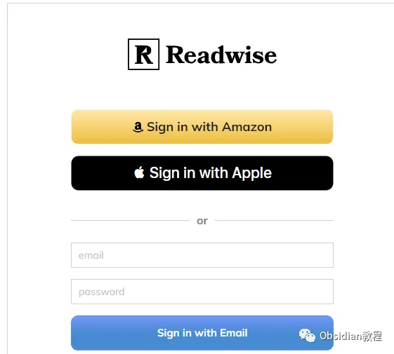
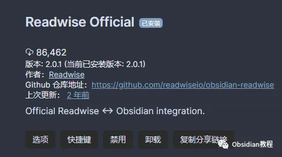
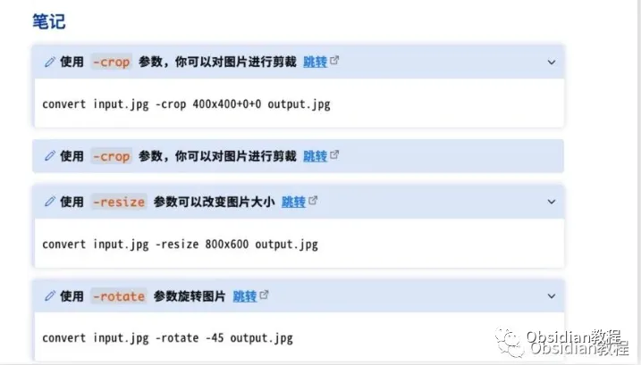
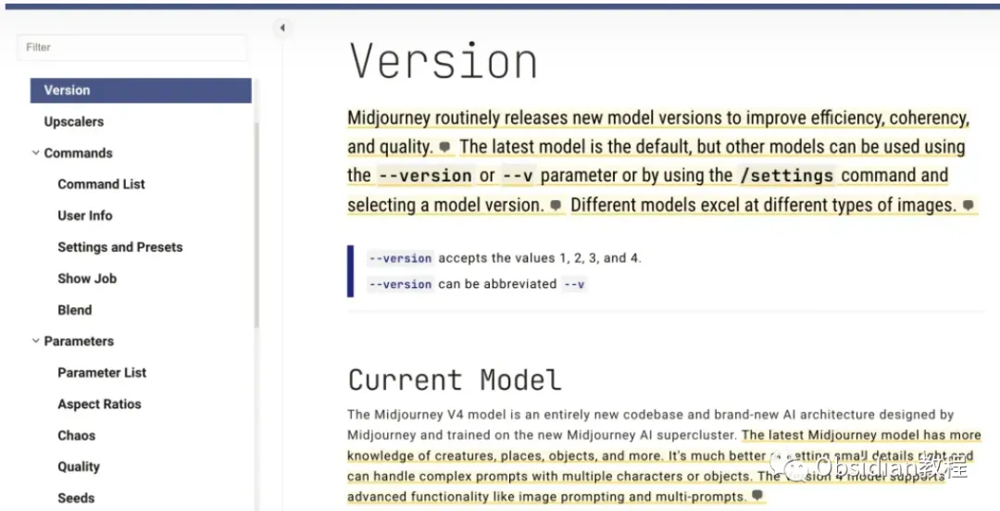

# 用Readwise Official插件，Obsidian笔记高效整理攻略

嗨，我是何老师。

  

今天，我想和大家聊聊一个我最近非常喜欢的工具——Obsidian中的Readwise Official插件。

你有没有试过在多个平台上阅读，做了一堆高亮标记，最后却发现这些标记根本无法有效整合？

  

每次你想要回顾这些内容时，总是得在不同的应用之间来回切换，搞得你头疼。

  

这时候，你可能会想：“要是有个工具能把这些分散的内容统一管理起来就好了。”恭喜你，找到了！那就是我们今天的主角——Readwise Official插件。一款能帮高效管理学习笔记的工具，真的是再好不过了。

  

**Readwise Official插件简介**

  

这个插件简直就是个全能收集器，它能自动同步你在各大平台上做的高亮标记，比如Amazon Kindle、Apple Books、Instapaper、Pocket、Medium、Twitter、甚至是PDF！

  

它的主要功能就是把这些高亮内容整合到Obsidian中，让你可以随时随地回顾和管理你的阅读精华。

注意的是，想要使用这个插件，你得先订阅Readwise服务，这是一个付费服务。毕竟，这服务能帮你把所有阅读数据汇总到一个地方，让你随时可以复习，就像你每天写的代码一样，回过头看看总是有好处的。

  

**插件功能特点**

  

**1.连续自动同步：** 你在哪个平台上做的标注，这个插件就能把它们自动同步到Obsidian。相当于你写了一段代码，它会自动保存并推送到云端，真的很省心。  

**2.灵活的模板定制：** 如果你有点代码洁癖，喜欢所有东西都按你的方式排列，那这个插件的模板定制功能一定会让你满意。你可以用Jinja2模板语言自定义导出的格式，按照自己的笔记习惯来组织这些高亮内容。

**3.丰富的元数据：** 导出的内容不仅仅是你高亮的文字，它还能带上封面图片、原始URL、作者名称、章节标题，甚至是你在阅读时添加的标签。这样你在Obsidian中管理这些内容时，信息是非常完整的。

**4.优质的客户支持：** 作为一个付费产品，Readwise的客户支持还是很给力的。有什么问题，你都可以迅速得到解答，而且插件还会根据用户反馈不断升级，就像你写了一个新功能，不断收到用户的PR一样，持续迭代。

  

**使用方法**

  

**1.在线安装：**

  

如果你科学上网没有问题的话，直接在Obsidian的“社区插件”里搜索“Readwise Official”，然后点击“安装”按钮就行了。

  

启用插件：安装成功后，点击“启用”以启用插件。

**2\. 离线安装：**

**  
**

### 很多同学无法直接在线安装obsidian插件，这里我已经把obsidian所有热门插件下载好了  
只需要关注下方公众号，后台回复：**插件** 即可获取

接下来，就是连接你的Readwise账户，这个步骤很简单，按照插件设置中的指引操作即可。

  

然后，你可以根据自己的需求定制导出设置，比如选择哪些元数据需要导出，怎么组织这些内容等等。

  

最后，启动首次同步。从此之后，你所有的阅读标注都会自动同步到Obsidian。你可以根据自己的喜好设置同步频率，想实时同步还是手动同步，全看你自己。

  

**实际应用案例**

**  
**

**1.阅读笔记整理：** 假设你在Kindle上读了一本书，做了一些高亮标记，这些标记会自动同步到Obsidian。

  

你可以为每本书创建一个单独的笔记文件夹，这样在Obsidian中形成一个有序的阅读笔记体系。

**2.研究资料汇总：** 对于研究人员来说，这个插件简直是个福音。你可以将在不同平台上标记的重要内容汇总到Obsidian，然后利用Obsidian的链接和标签功能，把这些内容与其他相关笔记连接起来，形成一个互联的知识网络。

这样当你需要分析或整理这些资料时，就像在脑海中进行一次知识回顾，所有信息都一目了然。

  

**3.日常学习跟踪：** 如果你是学生或终身学习者，通过这个插件，你可以轻松跟踪和管理在各个平台上的学习进度和重要内容。

  

你可以利用Obsidian的强大搜索和过滤功能，快速找到特定主题或关键词的相关标记。

**小贴士**

  

**1.定期检查同步状态：** 确保你的阅读高亮内容能够顺利同步到Obsidian。像检查代码版本一样，时不时确认一下是否一切正常。

**2.充分利用模板功能：** 根据你的笔记习惯定制导出模板，以获得最佳的使用体验。就像你调试代码时，总想让代码风格更符合自己的习惯。

**3.结合其他Obsidian插件使用：** 比如与Graph View、Dataview等插件结合，可以更有效地管理和展示同步的内容。这就像用不同的工具链来管理项目一样，组合起来才能发挥最大效用。

  

**结语**

  

总结下来呢，Readwise Official插件确实是一个极为实用的工具，特别是对那些希望把阅读高亮内容整合到Obsidian中的用户来说。

  

无论你是学习、研究，还是进行个人知识管理，这个插件都能帮你把一切搞定。只要你合理利用它的功能，我相信你的阅读和笔记体验一定会更加高效和有序。

  

所以，各位还在等什么呢？赶紧去试试吧！

### 

# **  
**

# **Obsidian交流社群来了**

[**我们搞了一个专门分享笔记工具的社群：**](http://mp.weixin.qq.com/s?__biz=MzkyMDUyMDM2Mg==&mid=2247485997&idx=1&sn=9a528871be62e4c74a1df3807b28f2bd&chksm=c190d9e8f6e750fe9df7a333b666fdd8561fdeb928d1df1f367d2374742efa34727a3f91cbc0&scene=21#wechat_redirect)****[**玩转效率笔记**](http://mp.weixin.qq.com/s?__biz=MzkyMDUyMDM2Mg==&mid=2247485997&idx=1&sn=9a528871be62e4c74a1df3807b28f2bd&chksm=c190d9e8f6e750fe9df7a333b666fdd8561fdeb928d1df1f367d2374742efa34727a3f91cbc0&scene=21#wechat_redirect)，社群的主要内容包括**使用技巧、模板主题和插件** 等，帮助更多人提升效率，实现自我管理的目标。  
如果你对Notion、Obsidian有热情、对知识有渴望，这个社群绝对不容错过！
