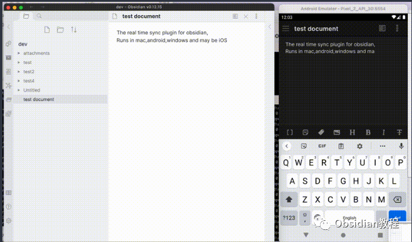
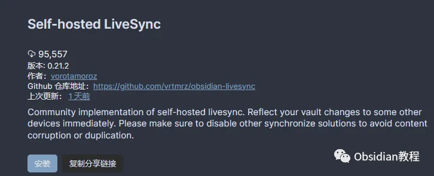

# 用Self-hosted LiveSync插件让你的笔记同步更安全！

嗨，大家好，我是何老师。

  

我觉得同步笔记这事儿，简直是头等大事。毕竟，谁也不想自己的灵感和思路被莫名其妙地丢掉，对吧？

  

所以，今天咱们就聊聊一个能让你安心的Obsidian同步插件——Self-hosted LiveSync。

  

首先，这个插件是由社区开发的，完全独立于官方的Obsidian Sync，专门为那些对隐私和安全有极高要求的用户设计的。

  

简单点说，如果你不想把自己的笔记托管在第三方云服务上，这个插件就是你的救星。

它使用CouchDB作为中间服务器，支持所有Obsidian平台，特别适合那些研究人员、工程师以及开发者——当然，也包括任何一个对隐私特别上心的人。

  

**这个插件都有哪些特点呢？**

  

你可能会问，这个Self-hosted LiveSync到底有什么过人之处？别急，我来给你盘盘。

  

**1. 可视化冲突解决器**

  

首先，它有个可视化冲突解决器。你知道，有时候不同设备之间的笔记内容会有冲突，比如在手机上改了一下，在电脑上也改了一下。

  

这时候就容易打架，Self-hosted LiveSync能帮你轻松搞定这些冲突。

  

**2. 几乎实时的双向同步**

  

其次，几乎实时的双向同步，这可不是吹的。写完一段代码，直接在手机上查看修改，基本上就是分分钟的事儿。再也不用担心在不同设备上切换时内容不一致了。

  

**3.兼容服务**

  

再者，它支持CouchDB或者其他兼容CouchDB的服务，比如IBM的Cloudant，甚至还有端到端加密，这就更厉害了。对于那些真正担心数据安全的朋友，选择这个插件真是再合适不过了。

**重要提示**

不过，有些地方还是需要注意的。比如，你千万别想着同时启用Obsidian的官方同步和这个插件，那绝对会把你的笔记搞得一团糟。

另外，最好别把笔记库放在iCloud或者Dropbox这样的云同步文件夹里，否则数据混乱也是迟早的事儿。

**使用方法**

别看Self-hosted LiveSync功能强大，但用起来其实也不算复杂。你只需要准备好一个CouchDB服务器，甚至可以选择用Fly.io或者IBM Cloudant这些现成的服务。

当然了，你也可以自己搭建一个。只要配置好数据库，按照插件的快速设置指南一步步来，很快就能搞定。  

**提示：**

如果你遇到数据库损坏的问题，别慌，插件里有应对的方法。比如，如果本地数据库出问题了，你可以选择不保留它，然后让远程数据库的数据重新同步过来。反之亦然。不过如果两边都不保留，那就是重新来过的节奏了。

**需要注意**

说实话，Self-hosted LiveSync的同步能力确实牛，但它也有些小毛病，比如有时候文件夹复制后会变空，然后自动被删除了。

虽然这个行为可以在设置中关闭，但还是有点让人头疼。还有一点要特别注意的是，移动设备上的同步耗电量确实挺高的，毕竟要一直保持连接嘛。

所以，建议你可以手动控制一下同步频率，避免电量被迅速耗光。  

另外，移动版Obsidian如果连接的是非安全的HTTP服务器，可能会碰壁，这点一定要注意。

为了避免文件被错误覆盖或者丢失，插件会根据文件的修改时间进行比较，但有时候可能会打开冲突对话框让你决定如何合并内容。  

最后提醒一下，这个插件不是备份工具！不是备份工具！不是备份工具！重要的事情说三遍。

如果你本地设备存储空间不足，数据库可能会损坏，所以一定要定期检查，避免出现问题。

**插件安装指南**

**1.在线安装**

要在 Obsidian 里使用 Self-hosted LiveSync 插件，首先你得先安装好它。具体步骤如下：

  1. 打开 Obsidian 的设置：点击左下角的小齿轮图标，进入设置界面。

  2. 进入社区插件：可以直接通过Obsidian社区插件浏览器搜索“Self-hosted LiveSync”并安装。

  3. 启用插件：安装完毕后，点击 "启用" 以启用插件。

  

**2.离线安装**

###  很多同学无法直接在线安装obsidian插件，这里我已经把obsidian所有热门插件下载好了  
只需要关注下方公众号，后台回复：**插件** 即可获取**总结**  
总的来说，Self-hosted LiveSync是个非常强大的插件，适合那些对数据安全有极高要求，或者喜欢折腾的技术控们。  
它能帮你把笔记同步的更安全、更私密。只要按照指南一步步操作，你就能体验到它带来的便利。  
如果你还在犹豫要不要试试这个插件，趁早行动吧！  

# **Obsidian交流社群来了**

[**我们搞了一个专门分享笔记工具的社群：**](http://mp.weixin.qq.com/s?__biz=MzkyMDUyMDM2Mg==&mid=2247485997&idx=1&sn=9a528871be62e4c74a1df3807b28f2bd&chksm=c190d9e8f6e750fe9df7a333b666fdd8561fdeb928d1df1f367d2374742efa34727a3f91cbc0&scene=21#wechat_redirect)****[**玩转效率笔记**](http://mp.weixin.qq.com/s?__biz=MzkyMDUyMDM2Mg==&mid=2247485997&idx=1&sn=9a528871be62e4c74a1df3807b28f2bd&chksm=c190d9e8f6e750fe9df7a333b666fdd8561fdeb928d1df1f367d2374742efa34727a3f91cbc0&scene=21#wechat_redirect)，社群的主要内容包括**使用技巧、模板主题和插件** 等，帮助更多人提升效率，实现自我管理的目标。  
如果你对Notion、Obsidian有热情、对知识有渴望，这个社群绝对不容错过！
