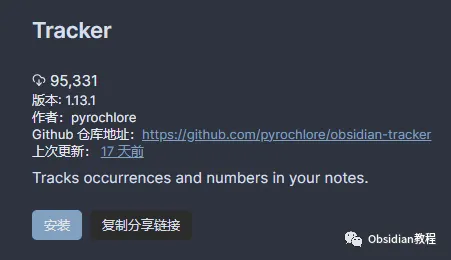
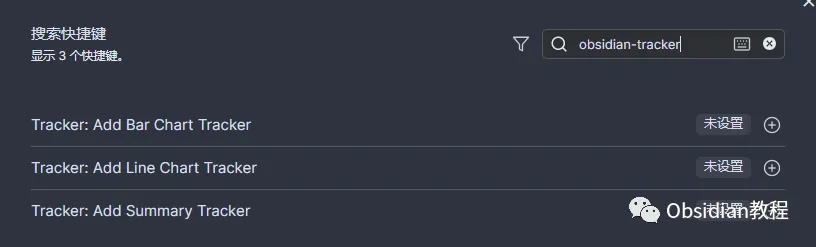
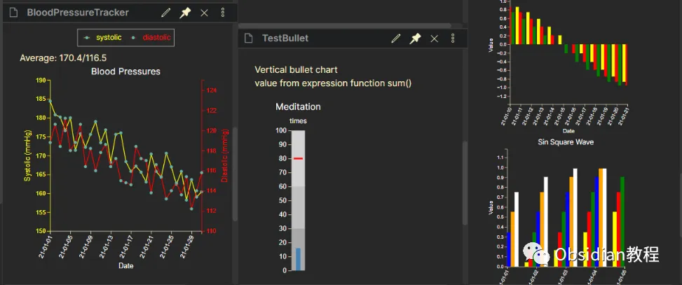

# 用Tracker插件， 解锁生活数据，轻松追踪，发现隐藏规律！

嗨，大家好。

  


我觉得这两年知识管理工具真是百花齐放，特别是 Obsidian——可以满足各种花样的需求。

  


而且，这个软件不仅让你可以随意组织笔记，还支持各种插件扩展，让它变得更加强大。

  


今天呢，我就想聊聊 Obsidian 的一个“神器”——Tracker 插件，绝对是那种用上了就放不下的工具。


**插件概述**

  


首先，啥是 Obsidian Tracker 呢？它就是一个从你笔记中抓取数据、然后用各种图表展示的工具。

  


你可以把它当作一个小型数据分析师，专门帮你追踪你关心的各种指标，比如习惯、任务进度、心情波动啥的。

  


**插件功能**

  


Tracker 插件的核心功能其实挺简单：它能从你的笔记中提取数据，然后给你画出一个图。

  


支持的输入类型也特别丰富，什么复选框啦、表情符号啦、文本啦，统统搞得定。

  


换句话说，只要你笔记里有点数据，它就能找到办法把这些数据弄成图表展示。

  


我曾经在每天的笔记里加了一些复选框，标记自己当天读了多少书、喝了几杯咖啡，然后 Tracker 插件就帮我生成了一个阅读进度的折线图。

  


**安装和配置**

**  
**

说到这里，大家可能会想，“这么好用的插件，怎么安装啊？”

  


**1.在线安装 （需要科学上网）**

  


只要在Obsidian的“社区插件”里搜索“Tracker”，点一下“安装”，再启用，搞定。



### **2.离线安装**  
**很多同学无法直接在线安装obsidian插件，这里我已经把obsidian所有热门插件下载好了**  
只需要关注下方公众号，后台回复：**插件** 即可获取

**3.配置插件**

**  
**

安装后，你需要配置插件。 配置这个插件可不是为了搞复杂，而是让它更好地为你服务。

  


通过 Obsidian 的设置菜单访问 Tracker 的设置选项，您可以调整如图表类型、数据源、样式等多种设置。



比如说，你可以在设置菜单里调整图表的样式、数据源之类的东西，弄得它完全符合你的需求。

**  
**

**使用方法**

  


**1.数据跟踪设置**

装好插件后，你需要做的第一步就是决定你要追踪啥。

  


我一般喜欢在每日笔记里记录一些习惯，比如读书、跑步、学习时长等等，然后用标签（tag）把这些内容标记出来，方便 Tracker 插件去抓取。

  


比如说，你可以在笔记里这样记录你的习惯：

  *   *   * 

    
    
    - 读书时间：1小时 #读书- 跑步：30分钟 #锻炼  
    

**2.创建跟踪笔记**

**  
**

然后呢，打开 Tracker 插件，在新建的笔记里手动加上追踪代码块，像这样：

  *   *   *   *   *   * 

    
    
     ```trackersearchType: tagsearchTarget: #读书folder: Daily NotesoutputType: line  
    

这样做的结果就是，Tracker 会去抓取所有带有 `#读书` 标签的笔记内容，并用线形图展示出来。

  


### **3.查看跟踪结果**

###   


### 将文档视图模式切换到“预览”，代码块就会被渲染成图表。



**实用示例**  


**  
**

其实这插件的使用场景挺多的，除了追踪习惯之外，还能用来做一些别的事情。

  


比如，你可以追踪自己的任务完成情况。举个例子，如果你用 Obsidian 管理待办事项，每完成一个任务就打个勾。

  


那 Tracker 就可以帮你统计有多少任务完成了，画个漂亮的饼图。

  


说到这里，我忍不住分享一个我自己的经历。有一阵子我想追踪自己每天的心情波动，于是我每天在笔记里记录下自己当时的心情状态。

  


用了不同的表情符号表示心情好坏（🌞：好；🌧️：一般；⚡：差）。

  


结果 Tracker 一统计，我发现某个时间段内，我的心情特别容易受天气影响，一周里有三天雨天，心情全都掉到了“⚡”那边，看来我还真讨厌下雨。

  


**总结**

  


如果你也是个数据控，喜欢对自己的生活各方面进行分析，那这个插件简直就是为你量身打造的。

  


不妨试试看，配置好 Tracker，追踪一下自己每天的点滴，看看有没有什么新发现。用上几天，说不定你也会像我一样爱上它。

  


好了，今天就聊到这，大家有什么关于 Obsidian Tracker 的问题，欢迎留言交流啊！

  


# **Obsidian交流社群来了**  


[**我们搞了一个专门分享笔记工具的社群：**](http://mp.weixin.qq.com/s?__biz=MzkyMDUyMDM2Mg==&mid=2247485997&idx=1&sn=9a528871be62e4c74a1df3807b28f2bd&chksm=c190d9e8f6e750fe9df7a333b666fdd8561fdeb928d1df1f367d2374742efa34727a3f91cbc0&scene=21#wechat_redirect)****[**玩转效率笔记**](http://mp.weixin.qq.com/s?__biz=MzkyMDUyMDM2Mg==&mid=2247485997&idx=1&sn=9a528871be62e4c74a1df3807b28f2bd&chksm=c190d9e8f6e750fe9df7a333b666fdd8561fdeb928d1df1f367d2374742efa34727a3f91cbc0&scene=21#wechat_redirect)，社群的主要内容包括**使用技巧、模板主题和插件** 等，帮助更多人提升效率，实现自我管理的目标。  
如果你对Notion、Obsidian有热情、对知识有渴望，这个社群绝对不容错过！
