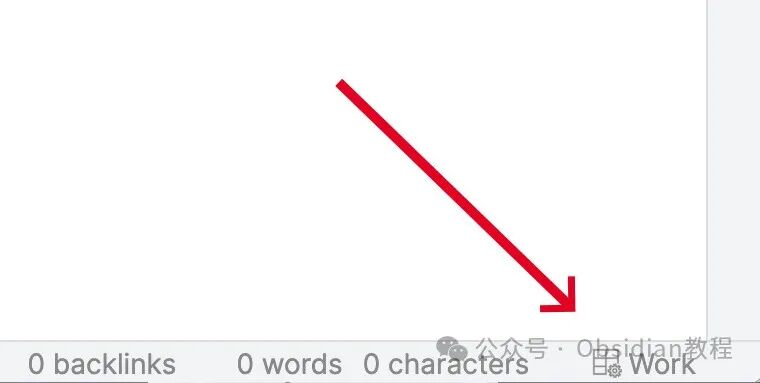
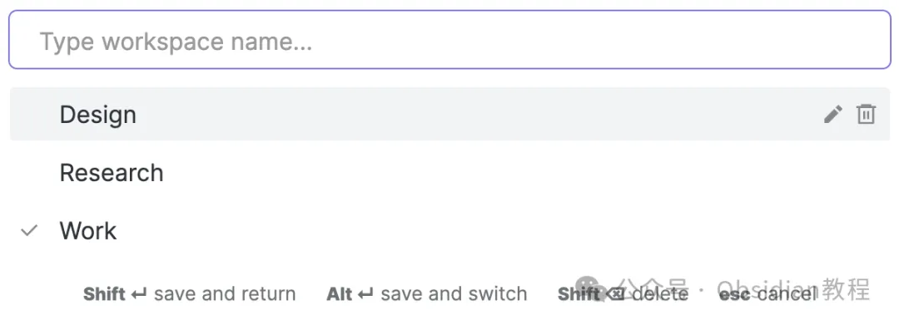
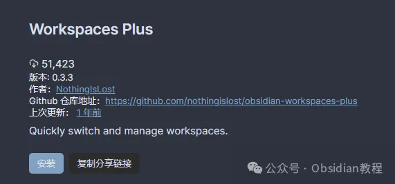

# 用Workspaces Plus插件，为Obsidian工作区管理带来高级功能！

嗨，大家好。我是何老师。

  

在日常使用Obsidian的时候，你是不是经常会面临工作区的管理问题？默认的工作区管理功能虽然足够基础，但总感觉有点不够“顺手”，特别是当你在多个项目间来回切换的时候。

  

别担心，今天我们就来聊聊一个非常实用的插件——Workspaces Plus，它能大大提升你在Obsidian中管理工作区的灵活性和效率。

  

**Workspaces Plus的主要功能******

  

这个插件让Obsidian的工作区管理功能更加直观和方便，提供了许多高级选项。简单来说，它的功能可以分为以下几个部分：

**1\. 工作区指示器**

  

状态栏里可以直接看到当前活跃的工作区名字，一眼就能知道你正在哪个工作区。点击这个指示器，还能快速切换到其他工作区，省时省力。

**2\. 工作区选择器**

  

不仅能切换工作区，还能直接通过选择器界面来重命名、删除或新建工作区。这个界面还可以通过快捷键打开，方便你快速操作。

**3\. 热键支持**

  

想快速切换工作区？你可以设置热键，通过名称直接打开某个工作区，再也不用频繁点菜单了。

**4\. 主题定制**

  

这个功能非常适合有美学需求的小伙伴。你可以给不同的工作区设置不同的主题样式，工作时更加赏心悦目。

  

**5\. 工作区覆盖**

  

如果你需要在不同的工作区中加载不同的页面内容，那么这个功能非常方便。通过模板变量，可以自动覆盖页面的显示内容。

  

**如何安装 Workspaces Plus 插件**

  

**1\. 在线安装**

  

如果你的网络环境良好，可以直接在线安装插件：

  

-打开Obsidian，点击左下角的“设置”图标。

-在设置菜单中选择“第三方插件”选项，点击“浏览”按钮。

-搜索“Workspaces Plus”，找到后点击“安装”。

-安装完成后，别忘了启用插件哦！

**2\. 离线安装**

  

### **很多同学无法直接在线安装obsidian插件，这里我已经把obsidian所有热门插件下载好了**  
只需要关注下方公众号，后台回复：**插件** 即可获取下载好 main.js、styles.css 和 manifest.json 文件。将这些文件复制到你的Obsidian仓库的 `.obsidian/plugins/obsidian-workspaces-plus/` 目录下。然后在Obsidian中启用插件即可。**  
****使用 Workspaces Plus 插件**  
**启用插件**  
在Obsidian的设置菜单中，找到“Workspaces Plus”并启用它。要注意的是，Obsidian的核心工作区插件也需要同时激活，才能保证“Workspaces Plus”正常运行。  
**创建工作区**  
要创建新的工作区，可以使用工作区选择器或者通过快捷键打开工作区切换模态框。在其中输入新工作区的名称，然后按 `Shift + Enter` 即可创建一个新的工作区。  
**重命名和删除工作区**  
想要重命名工作区？很简单，点击选择器旁边的铅笔图标即可修改名称。想删除某个工作区？直接点击垃圾桶图标或者按 `Shift + Delete` 快速删除。  
**切换工作区**  
通过状态栏里的工作区指示器或使用热键可以快速切换工作区。你可以通过鼠标点击，也可以用键盘上的上下箭头导航，选择好后按 `Enter` 切换。  
**保存工作区**  
默认情况下，切换工作区不会自动保存。如果你想保存当前工作区的状态，可以 `Shift + 点击` 工作区图标来进行保存。  
**工作区页面覆盖**  
在设置中，你可以为每个工作区指定不同的页面内容。通过模板变量，可以让每个工作区加载特定的页面，这对那些需要多项目并行处理的用户非常有用。**  
****小技巧****  
****紧凑型工作区选择器CSS片段**  
如果你觉得默认的工作区选择器太占地方了，可以通过自定义CSS片段来压缩选择器的尺寸。这样既可以让界面更加紧凑，也有助于提升使用效率。**  
****总结**  
Workspaces Plus插件为Obsidian用户提供了非常强大的工作区管理工具，不仅操作方便，还大大增强了工作区的灵活性。  
如果你经常在多个项目之间切换，或者希望为不同工作区定制个性化的界面，那么这个插件绝对是个好帮手。  
我个人在使用这个插件后，感觉整个Obsidian的工作流变得更加流畅，特别是热键和工作区覆盖的功能，大大提高了我的效率。  
现在，你也可以尝试安装一下，体验这款插件带来的便捷和高效吧！

  

# **Obsidian交流社群来了**

[**我们搞了一个专门分享Obsidian的交流社群：****玩转效率笔记****社群的主要内容包括使用技巧、模板主题和插件等，** 帮助更多人提升效率，实现自我管理的目标。](http://mp.weixin.qq.com/s?__biz=MzkyMDUyMDM2Mg==&mid=2247485997&idx=1&sn=9a528871be62e4c74a1df3807b28f2bd&chksm=c190d9e8f6e750fe9df7a333b666fdd8561fdeb928d1df1f367d2374742efa34727a3f91cbc0&scene=21#wechat_redirect)

  
如果你对Obsidian有热情，这个社群绝对不容错过！  

