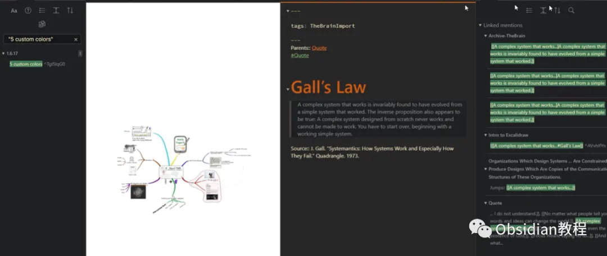
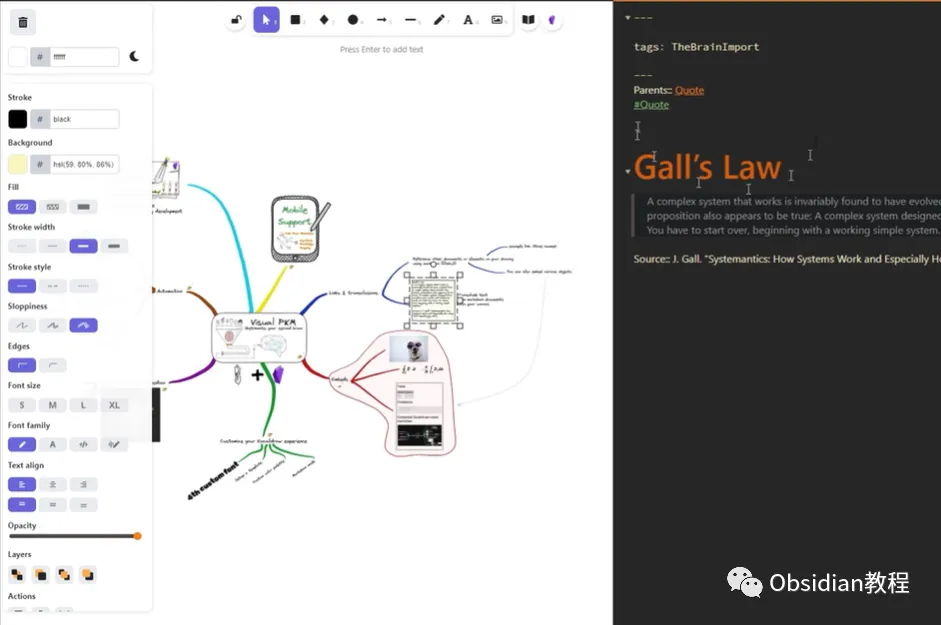
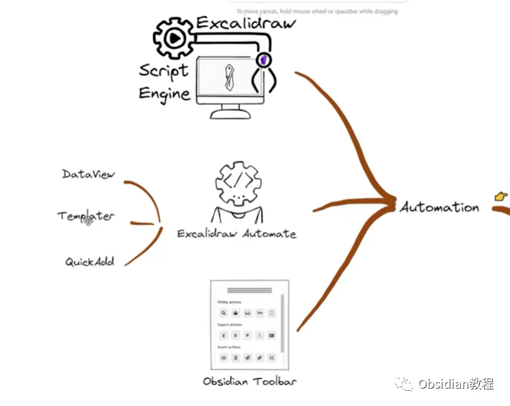
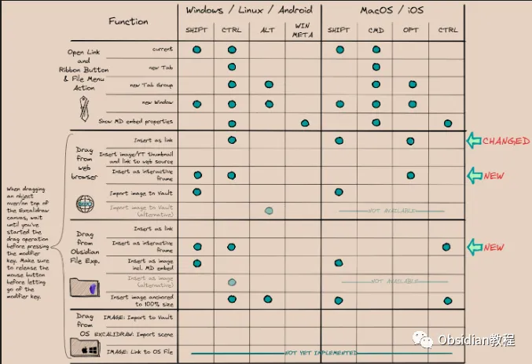

# 解锁Obsidian隐藏技能：用Excalidraw让你的笔记会手绘！

嗨，大家好。

  

可能不少人对Obsidian这款笔记工具有所耳闻，尤其是喜欢用Markdown来记录各种信息的人。

  

要说Obsidian，那可真是个生产力神器。而今天我要聊的，就是其中的一个手绘神器——Excalidraw插件。

  

我觉得这个插件简直就是福音，尤其对那些喜欢在笔记里加点图表、思维导图，或者就是想画个小涂鸦的人来说。

  

别说，你要是个画图小白，靠这个插件，瞬间也能画出一副像模像样的“手绘风”作品。

  

Excalidraw的厉害之处就在于，它模仿了纸上的手绘风格，整个画面看起来就是随手一笔一划画出来的，特别有那种“艺术范儿”。

**插件概述**

  

Excalidraw是一个开源手绘式设计工具，帮你把脑袋里的那些碎片信息变成一个清楚的“图表”，一目了然。

  

它的操作界面非常直观，哪怕你从来没用过设计软件，上手也是分分钟的事儿。你可以选择几何图形，也可以自由发挥画点什么。

  

再加上可以自定义颜色、线条粗细、填充样式，完全可以根据自己的风格和需求来调整。这是不是比那些死板的绘图软件灵活多了？

  

而且，画出来的东西还能直接嵌到笔记里，想象一下，在一篇严肃的学习笔记里突然看到一个手绘风格的图表，是不是感觉轻松多了？

**Folder Note插件到底能干啥？**

  

****这就好比有人问你，为什么手机要装微信？ 因为大家都在用，方便呗！

  

同理，Excalidraw就是这样一个工具，它帮你解决了某些特定场景下的需求，比如画图，比如可视化思路。

  

尤其是对于那些喜欢在笔记里整理思维导图、流程图的人，这个插件简直就是为你量身定做的。

你要是从事教育工作或者经常需要做演讲，那就更不用说了。教学时拿出这个插件，边讲边画，现场制作思维导图，学生肯定爱得不行。

  

还有项目管理时，也可以通过绘图来梳理工作流程，效果事半功倍。

  

说到这里，我不得不提一句，这插件还是开源的，真是业界良心。

  

毕竟现在稍微功能多一点的绘图工具都开始收费了，而Excalidraw的免费加上强大功能，可以说是给了广大用户一颗定心丸。

  

你只需要Obsidian这款应用，再加上这个插件，就能实现文本、绘图的完美结合，搞定各类笔记场景。

**  
**

**下载和安装**

####   

### **1.在线安装**（需要科学上网） ：****

###   

### 在Obsidian中安装插件是一个简单直接的过程：

###   

  1. ### 打开Obsidian，点击左下角的“设置”图标。

  2. ### 在设置菜单中，选择“第三方插件”选项。

  3. ### 点击“浏览”按钮，搜索“Excalidraw”。

  4. ### 找到插件后，点击“安装”。

  5. ### 安装完成后，切换插件的“启用”开关。

### **2.离线安装：****  
****很多同学无法直接在线安装obsidian插件，这里我已经把obsidian所有热门插件下载好了****  
**

### 只需要关注下方公众号，后台回复：**插件** 即可获取

****

**如何使用**

  

使用Excalidraw简直就是跟Obsidian“天作之合”，特别是对我们这些习惯用文字来处理一切问题的程序员来说。

  

安装完插件之后，直接新建一个Excalidraw文件，动动手指就可以开始画图了。你可以画流程图、思维导图，甚至来个简单的草图展示一些逻辑。

画完保存，它就像一个普通笔记一样，可以随时在其他笔记里调用或嵌入。

  

别忘了，Excalidraw还可以跟Obsidian的内部链接、标签功能结合使用，这意味着什么呢？

  

举个例子，如果你有一个关于学习路线的笔记，通过手绘图标示出关键节点，再用Obsidian的内部链接功能让每个节点都可以跳转到相关的笔记。

  

这不仅是对内容管理的提升，也是对信息逻辑的极大优化。

**使用体验**

  

其实一开始我用这个插件也只是出于好奇，觉得手绘图能玩出什么花样呢？结果没想到，这个插件越用越香，尤其是在一些复杂的项目笔记中。

  

我曾经有个项目需求特别绕，一段逻辑分了好几层，光用文字和代码解释根本讲不清楚。

  

后来我直接用Excalidraw画了个图，结果那叫一个豁然开朗——几个层级的逻辑关系，图里一画就清清楚楚了，团队沟通效率都提升了好几倍。

  

所以说，Excalidraw不仅仅是个“手绘神器”，它更是一种思维的表达工具。用图形来补充信息表达，真的是解决了不少沟通上的困扰。

**  
**

**总结**

  

最后我想说，如果你还没用过这个插件，那你真该试试了。

  

用Excalidraw，画个思维导图、流程图，甚至只是画个简单的草图，都能让你的笔记更生动、更直观。

  

总之，Obsidian加上Excalidraw，这组合就像是代码里的“黄金搭档”，无论是程序员、设计师、学生还是普通用户，都能从中找到乐趣与实用性。

  

  

# **Obsidian交流社群来了**

[**我们搞了一个专门分享笔记工具的社群：**](http://mp.weixin.qq.com/s?__biz=MzkyMDUyMDM2Mg==&mid=2247485997&idx=1&sn=9a528871be62e4c74a1df3807b28f2bd&chksm=c190d9e8f6e750fe9df7a333b666fdd8561fdeb928d1df1f367d2374742efa34727a3f91cbc0&scene=21#wechat_redirect)****[**玩转效率笔记**](http://mp.weixin.qq.com/s?__biz=MzkyMDUyMDM2Mg==&mid=2247485997&idx=1&sn=9a528871be62e4c74a1df3807b28f2bd&chksm=c190d9e8f6e750fe9df7a333b666fdd8561fdeb928d1df1f367d2374742efa34727a3f91cbc0&scene=21#wechat_redirect)，社群的主要内容包括**使用技巧、模板主题和插件** 等，帮助更多人提升效率，实现自我管理的目标。  
如果你对Notion、Obsidian有热情、对知识有渴望，这个社群绝对不容错过！
