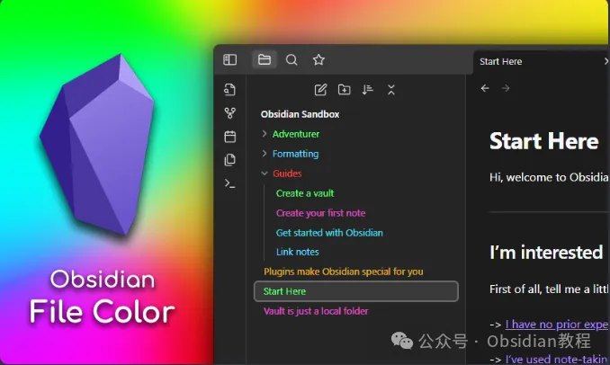
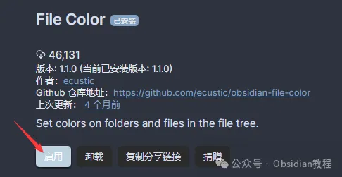
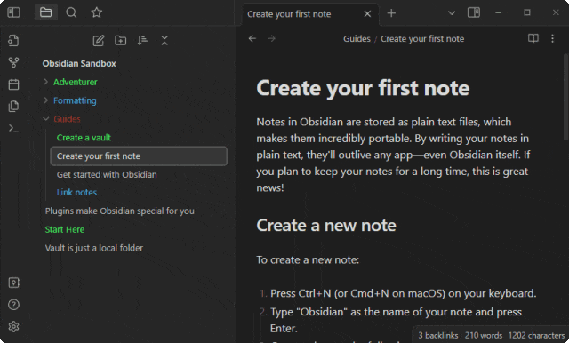

# 让你的Obsidian更出彩：File Color插件详解

嗨，大家好，我是何老师。

  

今天想跟大家分享一个能够让Obsidian更加个性化、易于管理的插件——Obsidian File Color。

  

相信很多小伙伴在使用Obsidian管理大量笔记时，都会遇到这样的问题：当文件和文件夹数量多了以后，很容易“迷路”，找不到某个重要文件或者特定笔记的位置。这时候，如果能够用不同的颜色对文件或文件夹进行区分，就能大大提升检索效率。

  

File Color插件正是为了解决这个问题而生的，它允许你为Obsidian文件浏览器中的文件和文件夹设置颜色，让你能一眼就找到目标文件。这种视觉上的差异化，特别适合用来标记重要项目、区分笔记类型或整理复杂的文档库，既美化了界面，又提升了使用效率。

  

  

## **File Color插件的核心功能  
  
**

File Color插件的设计初衷是通过色彩编码来优化Obsidian的文件管理。它可以为每个文件和文件夹指定独特的颜色，让你能够更直观地识别和定位特定的文档。其主要功能包括：  
  

  1. **文件和文件夹颜色管理：** 为任意文件或文件夹指定颜色，可以根据个人喜好或管理需求创建自己的颜色体系。  
  

  2. **调色板自定义：** 插件内置了一个调色板，可以在插件设置中添加或修改颜色，灵活地管理你的配色方案。  
  

  3. **级联颜色设置：** 允许你为某个父级文件夹设置颜色，并让子文件自动继承这个颜色，减少了重复操作的麻烦。  
  

  4. **个性化CSS样式支持：** 你可以使用CSS片段进一步定制颜色效果，比如修改下划线样式或背景色，打造符合个人风格的Obsidian界面。

  
  
  

## **如何安装File Color插件  
  
**

在开始使用File Color插件之前，确保你的Obsidian已经安装并配置好。然后按照以下步骤安装和启用插件：  
  

### **1\. 在线安装**  
  

  1. 打开Obsidian，点击左下角的“设置”按钮。

  2. 进入“第三方插件”选项卡，点击“浏览”。

  3. 在搜索框中输入“File Color”。

  4. 找到插件后，点击“安装”，安装完成后切换“启用”开关。  
  
  
  

### **2\. 离线安装**  
  

如果网络不太稳定，可以选择手动安装插件：  
  

  1. 获取“File Color”的插件安装包。

  2. 将main.js、styles.css和manifest.json文件复制到你的Obsidian库目录下的.obsidian/plugins/obsidian-file-color/文件夹中。

  3. 进入Obsidian设置菜单，启用插件。  
  

### **很多同学无法直接在线安装obsidian插件，这里我已经把obsidian所有热门插件下载好了**  
只需要关注下方公众号，后台回复：**插件** 即可获取

## **使用File Color插件为文件和文件夹设置颜色  
  
**

插件安装好后，就可以开始为你的文件和文件夹配置颜色了。以下是具体步骤：

  

### **1\. 为文件和文件夹设置颜色**  
  

  1. 在文件浏览器中右键点击你想要设置颜色的文件或文件夹。

  2. 从弹出的菜单中选择“设置颜色（Set color）”选项。

  3. 这会打开一个颜色选择模态框，里面包含了插件调色板中定义的所有颜色。

  4. 选择你喜欢的颜色后，点击确认。该颜色就会应用到所选文件或文件夹上。  
  

  
  
这样做的好处是，你能够快速通过颜色找到重点文档或者项目文件，比如用红色标记重要文件，用绿色区分任务清单，用蓝色区分个人笔记等等。  
  

### **2\. 更改调色板**  
  

如果内置的颜色无法满足你的需求，你还可以在插件设置中添加新的颜色到调色板中：  
  

  1. 进入Obsidian的设置页面，找到“File Color”插件的配置项。

  2. 点击“+”按钮添加新颜色。

  3. 使用颜色选择器选择颜色，并为颜色输入一个名称。

  4. 设置完毕后，新颜色会出现在“设置颜色”模态框中。  
  

  
  
你可以根据个人偏好添加任意多的颜色，这样就可以为每个类别的文件设置独特的色彩，形成自己的“色彩标记法”。  
  

### **3\. 级联颜色设置  
**  

File Color还支持“级联颜色”功能，这意味着当你为某个文件夹设置颜色后，它的所有子文件也会自动继承这个颜色。如果你希望所有子文件都能使用同一颜色来表示某个项目的文件层级结构，这个功能会非常有用。  
  

不过，如果你想要某些子文件显示不同颜色，也可以单独为这些子文件重新设置颜色，从而覆盖掉父级颜色的继承效果。  
  

## **插件高级选项与自定义CSS  
  
**

### **1\. 背景颜色设置**  
  

如果你希望着色不仅限于文件名文字，还能对文件背景进行着色，可以在插件设置中启用“背景颜色（Background Colors）”选项。这种方式更适合用来做大范围的分类标记。  
  

### **2\. CSS片段的个性化样式定制**  
  

想让File Color插件设置的颜色应用到Obsidian的更多元素中吗？试试使用自定义CSS片段：  
  

例如，如果你正在使用“Folder Note”插件，并希望文件夹标题下的下划线也反映File Color的颜色，可以在Obsidian的CSS文件中加入以下代码：

  *   *   *   * 

    
    
    .nav-folder.alx-folder-with-note>.nav-folder-title>.nav-folder-title-content {text-decoration-style: dotted;text-decoration-color: inherit;}

这段CSS会使得带有笔记的文件夹标题下的下划线变为点状，并且颜色会继承File Color插件所定义的颜色。通过这种方式，你可以实现更复杂的界面美化效果。  
  

## **使用File Color提升Obsidian的工作效率  
  
**

  1. **快速定位特定文件：** 为重要文档设置颜色标签，可以让你在大规模文档库中一眼就找到目标文件，而不必费力搜索。  
  

  2. **项目分组管理：** 你可以用颜色来区分不同项目的文件夹，比如用不同颜色表示“正在进行中”、“已完成”或“待处理”的项目，从而更直观地了解当前的项目状态。  
  

  3. **美化界面：** File Color不仅能提升效率，还能让你的Obsidian界面变得更加美观。通过不同颜色的搭配，你可以营造出一种更加赏心悦目的工作环境，提升使用体验。  
  

## **总结  
  
**

File Color插件通过简单而有效的颜色编码方式，为Obsidian用户提供了一个强大的文档管理工具。无论你是想更快地定位特定文件，还是希望通过色彩来美化Obsidian的界面，这个插件都能满足你的需求。  
  
希望这篇文章能够帮助你更好地理解和使用File Color插件，让你的Obsidian笔记系统更加直观、高效。快去试试看吧，给你的笔记加点“颜色”！  
  

# **Obsidian交流社群来了**

[**我们搞了一个专门分享Obsidian的交流社群：****玩转效率笔记****社群的主要内容包括使用技巧、模板主题和插件等，** 帮助更多人提升效率，实现自我管理的目标。](http://mp.weixin.qq.com/s?__biz=MzkyMDUyMDM2Mg==&mid=2247485997&idx=1&sn=9a528871be62e4c74a1df3807b28f2bd&chksm=c190d9e8f6e750fe9df7a333b666fdd8561fdeb928d1df1f367d2374742efa34727a3f91cbc0&scene=21#wechat_redirect)

  
如果你对Obsidian有热情，这个社群绝对不容错过！
