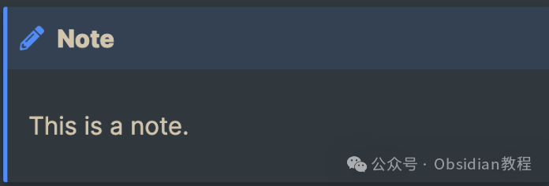
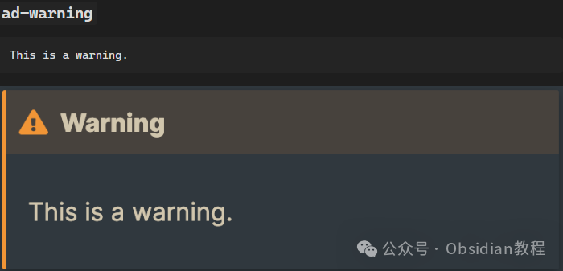
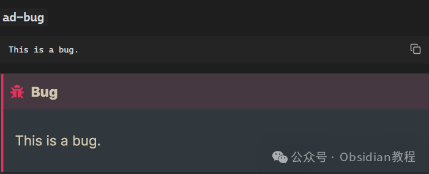
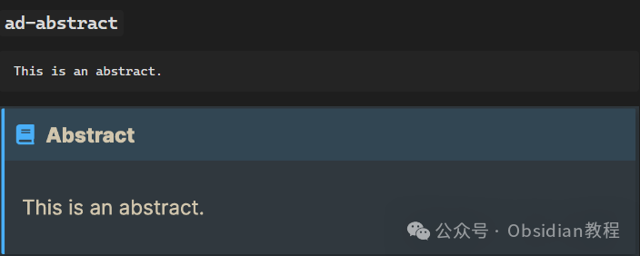
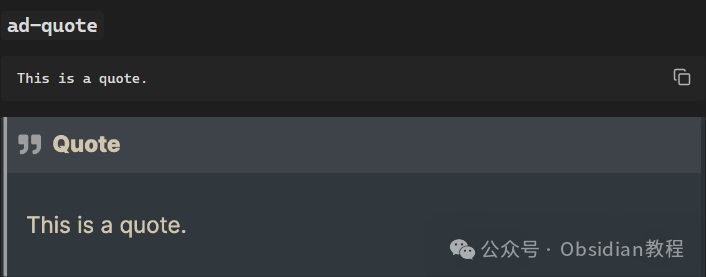
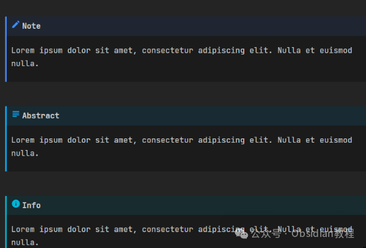

# 让你的笔记更有条理：Obsidian Admonition插件的妙用

嗨，大家好！今天我们来聊聊一个非常实用的 Obsidian 插件——Admonition。这是一个能让你的笔记变得更具层次感、可读性更高的小工具，尤其适合那些需要用到大量文本分类和结构化信息的朋友。如果你是 Obsidian 的老用户，应该已经对这个插件有所了解，但今天我们将更深入地探讨它的用途和功能，以及如何让它在工作和学习中为你提供帮助。  


简单来说，Admonition 插件是一个用来创建“提示框”的插件。通过它，你可以在 Obsidian 中插入不同风格的提示框（如警告、信息、成功、错误等），使你的笔记内容更加有条理，也更易于阅读。

对于那些喜欢在笔记中加入大量细节、说明或者提醒的用户，Admonition 插件无疑是个非常实用的工具。



Admonition 插件的核心功能是通过 Markdown 语法来创建具有不同样式的“提醒框”。

你可以根据需要在笔记中插入警告框、提示框、成功框、错误框等，这些框不仅能增加笔记的层次感，还能帮助你在整理信息时更好地分类，突出重点。



### 插件安装与启用

如果你还没有安装 Admonition 插件，别担心，安装过程非常简单：

  1. 打开 Obsidian，进入设置。
  2. 在插件页面，点击“社区插件”，然后选择“浏览”。
  3. 在搜索框中输入“Admonition”，找到该插件后，点击安装。
  4. 安装完成后，启用该插件，并根据需要调整其设置。


很多同学无法在线下载该插件，这里已经把安装包准备好了，点击下方公众号，回复”**插件** “，即可获取安装包

****

### 使用 Admonition 插件

安装并启用插件之后，使用起来也非常简单。最重要的一步是理解如何使用 Markdown 语法来生成不同样式的提示框。Admonition 插件的语法相对简洁，你只需要按照以下格式进行编写：
    
    
    ```admonition  
    type: info  
    title: 这里是标题  
    内容可以在这里写  
    
    
    
      
    ### 各种类型的提示框  
      
    Admonition 插件提供了多种类型的框，可以根据具体的用途选择不同的类型。这些类型包括：  
      
    1. **信息框（info）**：用于提供一般性的信息，提醒你注意一些细节或有用的提示。例如：  
      
       ```markdown  
       ```admonition  
       type: info  
       title: 记得做备份  
       在你开始使用新设备之前，记得备份数据！  
    
    
    
      
    2. **警告框（warning）**：用于给出警告或提示用户小心。例如：  
      
    ```markdown  
    ```admonition  
    type: warning  
    title: 警告  
    请注意，本教程中涉及的操作可能会导致数据丢失。  
    
    
    
      
    3. **成功框（success）**：用于强调某些成功的结果或重要的成就。例如：  
      
    ```markdown  
    ```admonition  
    type: success  
    title: 恭喜你！  
    你成功完成了 Obsidian 插件的安装，接下来可以开始编辑你的笔记了。  
    
    
    
      
    4. **错误框（error）**：用于提醒错误或不推荐的操作。例如：  
      
    ```markdown  
    ```admonition  
    type: error  
    title: 错误  
    你在代码中使用了过时的语法，请更新为最新版本。  
    
    
    
      
    5. **小提示框（tip）**：通常用于给出一些简单的建议。例如：  
      
    ```markdown  
    ```admonition  
    type: tip  
    title: 提示  
    如果你经常在多个设备间切换，使用云存储可以确保笔记同步。  
    
    
    
      
    ### 自定义样式与高级功能  
      
    Admonition 插件的强大之处不仅仅在于它提供了预设的几种提示框类型，还允许用户自定义样式和内容。例如，你可以使用以下的自定义 CSS 来更改提示框的外观和行为：  
      
    ```css  
    /* 修改警告框的背景颜色 */  
    .admonition.warning {  
     background-color: #ffcc00;  
     border-left: 5px solid #ff9900;  
    }  
    

通过这种方式，你可以为每种提示框设置不同的颜色、边框、字体等，甚至可以为每个框添加特定的图标，让你的笔记更加个性化。

另外，Admonition 插件还支持插入多个块级元素，包括标题、段落、代码块、列表等等，可以让每个提示框中的内容更加丰富。比如，在提示框中插入一个代码块或一张图片：
    
    
    ```admonition  
    type: tip  
    title: 代码示例  
    在 Obsidian 中插入代码块的基本语法如下：  
      
    ```python  
    def hello_world():  
        print("Hello, World!")  
    


### 在实际使用中的应用场景

对于我这种程序员来说，Admonition 插件在我的 Obsidian 笔记中起到了巨大的作用。下面是一些具体的应用场景：

  1. **技术笔记中的问题和解决方案** ：在编写技术笔记时，经常会遇到一些问题或者需要特别注意的地方。我可以使用警告框标出问题，使用成功框记录解决方案。



  2. **教程和指南** ：当我在写教程时，可以利用 Admonition 插件给出步骤提示、操作建议或者一些重要的注意事项，提升整个教程的可读性。



  3. **任务清单与待办事项** ：我也经常把待办事项写在笔记里，使用 Admonition 插件可以把重要的任务用高亮显示出来，避免遗漏。



  4. **总结和反思** ：在学习过程中，往往有一些知识点需要我做总结和反思，成功框或者信息框就很适合用来标记这些内容，让自己回头看的时候更容易找到重要的笔记。


### 插件的优势

Admonition 插件的优势，首先体现在它的可定制性和灵活性上。它不仅提供了几种常用的框类型，允许用户根据需要自定义外观，还能支持丰富的 Markdown 语法，使得插入提示框的操作非常简单。

其次，插件通过添加样式和结构，增强了笔记的视觉效果和层次感，让你的笔记更加有条理，更易于阅读。



此外，Admonition 插件能让我们在笔记中充分利用颜色、图标等元素，将不同类型的信息进行明显区分，帮助我们快速获取关键信息，提高工作效率。

### 结语

Admonition 插件无疑是 Obsidian 中一个非常实用的插件。它通过简单的 Markdown 语法和丰富的自定义功能，帮助用户更好地组织笔记，提升可读性。如果你是 Obsidian 的忠实粉丝，又或者你有大量需要分类和强调的内容，Admonition 插件绝对能为你的笔记增添不少色彩和实用性。

如果你还没有试过这个插件，赶紧装上试试看，看看它如何让你的笔记变得更有层次感和条理性。毕竟，笔记这事儿，不仅要写得好，还要看得清楚，对吧？

  


# **Obsidian交流社群来了**

[**我们搞了一个专门分享Obsidian的交流社群：****玩转效率笔记****社群的主要内容包括使用技巧、模板主题和插件等，** 帮助更多人提升效率，实现自我管理的目标。](http://mp.weixin.qq.com/s?__biz=MzkyMDUyMDM2Mg==&mid=2247485997&idx=1&sn=9a528871be62e4c74a1df3807b28f2bd&chksm=c190d9e8f6e750fe9df7a333b666fdd8561fdeb928d1df1f367d2374742efa34727a3f91cbc0&scene=21#wechat_redirect)


  
如果你对Obsidian有热情，这个社群绝对不容错过！
