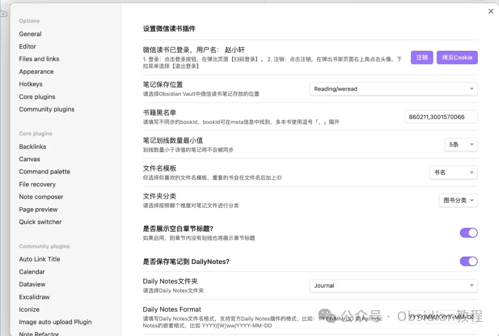

# 让阅读更高效：Obsidian中的Weread插件详解

嗨，大家好，我是何老师。

  

今天我们来探讨一下如何利用Obsidian的Weread插件，将你的微信读书笔记管理提升到一个全新的高度。

  

很多人都喜欢用微信读书来积累知识，但如果仅仅把划线和笔记放在App中，长此以往很容易形成“信息孤岛”。

  

为了解决这一问题，Weread插件应运而生，它可以将你在微信读书中的笔记内容轻松同步到Obsidian中，以Markdown格式保存。这样一来，不但能够更好地管理阅读材料，还可以在Obsidian中进行更深度的知识整理。

  

## **Weread插件简介：Obsidian与微信读书的完美结合  
  
**

Weread插件的核心功能就是将微信读书的内容无缝地整合到Obsidian中。它不仅可以同步书籍的元信息（例如封面、作者、出版社、出版时间等），还能够导入你在微信读书中做的高亮标注和各种笔记（比如章节笔记、页面笔记和书籍书评）。

  

所有这些信息都会以Markdown格式保存在Obsidian的指定文件夹中，方便你进行二次加工、回顾或在后续的笔记中引用。这种跨平台的内容整合，打破了传统阅读和笔记管理的界限，尤其适合那些希望能更有效地管理读书笔记的人。

  

### **核心功能：让笔记更具条理性  
  
**

  1. 同步书籍元数据：Weread插件可以将书籍的封面、作者、出版社、ISBN等信息同步到Obsidian，让你能够在笔记中快速查看书籍的背景资料。这对于那些喜欢研究不同书籍之间关系的人来说非常有用。  
  

  2. 高亮划线与读书笔记：在微信读书中，每次你对某段文字进行高亮或添加批注时，这些内容都能被插件识别并同步到Obsidian。这种实时同步的机制让你不必担心在不同设备之间切换时笔记数据不一致的问题。  
  

  3. 自定义笔记模板：你可以为笔记生成设置自定义模板，满足不同场景下的需求。例如，你可以为不同类型的书籍（如技术类、文学类）设计不同的Markdown格式，从而提高笔记的可读性和条理性。  
  

  4. 文件名格式与FrontMatter自定义：插件支持多种文件命名格式，并允许你在笔记的头部区域添加自定义字段（如阅读状态、标签等），方便检索和整理。这些字段会被添加到每篇同步的笔记中，有助于用户基于标签进行更高效的检索和笔记管理。  
  

### **安装与设置：快速配置无压力  
  
**

Weread插件的安装方式与其他Obsidian插件类似。你可以通过社区插件浏览器进行在线安装，也可以选择离线安装的方式。在插件安装后，第一步需要在设置页面中进行登录。点击“登录”按钮，并使用手机扫码进行微信读书账号的授权。登录成功后，你就可以设置笔记的保存位置以及其他细节，例如最小划线数量、文件夹分类等。  
  

### **  
很多同学无法直接在线安装obsidian插件，这里我已经把obsidian所有热门插件下载好了**  
只需要关注下方公众号，后台回复：**插件** 即可获取

值得一提的是，Weread插件支持多种保存位置的配置，这样你可以根据书籍类别、阅读状态或者个人喜好将不同类型的笔记保存到不同的文件夹中，让笔记管理变得更加井井有条。

  

### **  
使用指南：如何高效管理你的读书笔记  
  
**

在使用Weread插件时，有几点需要特别注意：  
  

  1. 避免直接修改同步文件：Weread插件使用覆盖式更新机制，也就是说每次同步时，插件会用最新的数据覆盖现有的笔记内容。因此，最好不要在同步的笔记文件中直接进行编辑修改，而是使用Obsidian的“Block引用”或创建链接笔记的方式来记录自己的批注和思考。  
  

  2. 初次同步可能需要较长时间：如果你在微信读书中已经积累了大量笔记，初次同步可能需要一些时间来下载和转换这些数据。不过好消息是，后续同步时只会更新有变化的部分，速度会显著提升。  
  

  3. 处理Cookie失效问题：由于微信读书的Cookie有一定的有效期，因此长期不使用该插件时，可能会导致登录状态失效，需要重新登录。建议定期检查插件的状态，以免出现数据不同步的情况。  
  

### **独特优势：与Obsidian生态的深度整合  
  
**

Weread插件最吸引人的地方在于它能够完美融入Obsidian的工作流中。借助Obsidian强大的插件生态，Weread不仅能够独立运行，还可以与其他插件（如Dataview、Calendar等）配合使用，进一步增强笔记管理的能力。举个例子，你可以将每日读书笔记同步至Daily Notes中，或者在Dataview的查询中整合多个笔记本的数据，从而生成复杂的读书报告和统计视图。  
  

另外，Weread插件支持在Obsidian移动端设备（如手机、平板）上进行同步，这意味着你可以随时随地在不同设备上同步最新的读书笔记和思考，不受地点和设备的限制。  
  

### **实际应用场景：从阅读到写作的无缝衔接  
  
**

如果你是一个以研究型阅读为主的读者，Weread插件能够帮助你更好地管理和组织书籍资料。比如，你可以用它来整理学术书籍的读书笔记，将不同书籍中的同类内容进行分类整理，形成自己的知识体系。又或者，如果你是一个喜欢做书籍点评的读者，插件能够自动把你的书籍感想、划线摘录同步到Obsidian中，方便后续撰写长篇书评或个人博客。  
  

此外，在项目管理中，Weread插件还能用于知识积累。你可以把每本书视为一个小项目，把笔记、批注当作项目的进展记录，从而更好地进行项目管理和进度追踪。通过这种方式，Weread插件帮助你将阅读笔记和实际应用场景结合起来，让阅读变得更加高效和有意义。  
  

### **结语  
  
**

Weread插件的出现，为Obsidian用户提供了一种全新的笔记管理方式。它打破了传统阅读应用与笔记软件之间的壁垒，使得微信读书中的内容能够无缝整合到Obsidian的笔记体系中。

  
无论是简单的读书笔记，还是复杂的阅读分析，都能通过这一插件得到更高效的管理和展示。对于所有喜欢微信读书、并希望能更好地整理和管理读书笔记的用户来说，Weread插件无疑是一个值得尝试的强大工具。  
  

# **Obsidian交流社群来了**

[**我们搞了一个专门分享Obsidian的交流社群：****玩转效率笔记****社群的主要内容包括使用技巧、模板主题和插件等，** 帮助更多人提升效率，实现自我管理的目标。](http://mp.weixin.qq.com/s?__biz=MzkyMDUyMDM2Mg==&mid=2247485997&idx=1&sn=9a528871be62e4c74a1df3807b28f2bd&chksm=c190d9e8f6e750fe9df7a333b666fdd8561fdeb928d1df1f367d2374742efa34727a3f91cbc0&scene=21#wechat_redirect)

  
如果你对Obsidian有热情，这个社群绝对不容错过！
