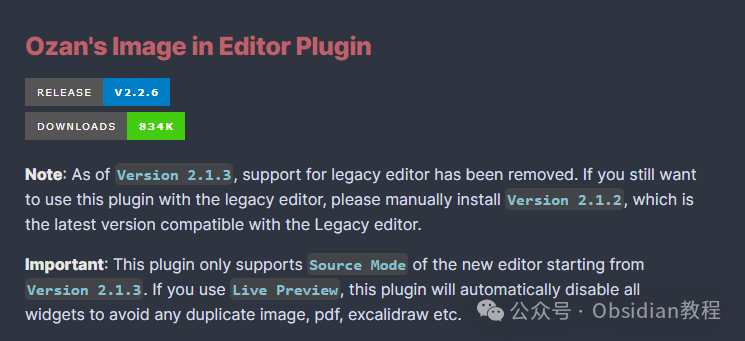
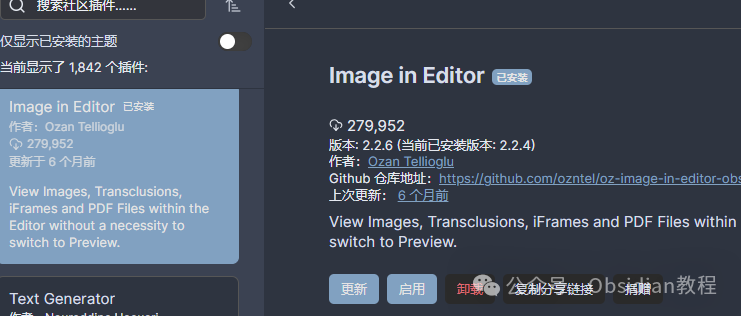

# 轻松管理多媒体文件！解锁 Ozan's Image in Editor 插件的强大功能

今天咱们来聊聊一个在 Obsidian 界引发广泛关注的插件——Ozan's Image in Editor 插件。  
要知道，Obsidian 是一款以 Markdown 为基础的笔记应用，以其强大的插件系统著称。在这个数字信息爆炸的时代，如何高效地管理和呈现各种类型的内容是一项挑战，而 Ozan's Image in Editor 插件正是为了解决这个问题而生的。  

这个插件允许用户直接在编辑器中查看图像、PDF、Excalidraw 绘图以及其他嵌入内容，而无需切换到预览模式。对于那些习惯于在写作过程中即时查看和编辑多媒体内容的用户来说，这个插件无疑是个福音。  

## **Ozan's Image in Editor 插件简介**

  
Ozan's Image in Editor 插件提供了一种全新的方式来管理和呈现多媒体内容。该插件支持本地和网络上的图像，以及 PDF 文件和 Excalidraw 绘图的呈现。

自 2.1.3 版本起，它仅支持新编辑器的源码模式（Source Mode）。如果你使用实时预览（Live Preview），插件会自动禁用所有小部件以避免重复显示。

### 支持的格式

  
Ozan's Image in Editor 插件支持多种格式的文件，包括：  

  * 图像格式：jpg, jpeg, png, gif, svg, bmp, webp
  * PDF 文件：支持从特定页码开始查看，例如：![[myfile.pdf#page=12]]
  * Excalidraw 绘图：支持直接在编辑器中查看
  * iFrame：可以在编辑器中嵌入和查看网页内容

##   

## **如何使用插件**

  
让我们来看看如何在 Obsidian 中使用这个插件，以便更高效地管理和查看内容。  

### **安装和配置**

  

### **安装和使用**

####   

#### **1.在线安装**

  
Highlightr插件可以直接在Obsidian的社区插件商店中找到并安装。具体步骤如下：

  1. 打开Obsidian，点击左下角的设置按钮。
  2. 在设置菜单中选择“Community plugins”。
  3. 点击“Browse”，搜索“ Ozan's Image in Editor”。
  4. 找到插件后，点击“Install”进行安装。
  5. 安装完成后，返回设置菜单，启用该插件。

### **2.离线安装：**  
很多同学无法直接在线安装obsidian插件，这里我已经把obsidian所有热门插件下载好了  
只需要关注下方公众号，后台回复：插件 即可获取

### 

  
你可以通过 Obsidian 的插件市场搜索并安装这个插件。安装完成后，在设置中找到插件的选项，进行必要的配置。  

### **查看图像和 PDF**

  
这个插件支持在编辑器中直接查看本地和网络上的图像文件。你可以使用以下格式来嵌入图像：  

  * Markdown 格式：!(ALT_TEXT)[IMAGE_PATH_OR_NAME]
  * Wikilink 格式：![[IMAGE_PATH_OR_NAME|ALT_TEXT]]

  
示例：
      
      *   * 
    
    
    
     # 使用特定大小显示图像![[myimage.png|#x-small]] # 使用预定义的大小选项

  

PDF 文件也可以直接在编辑器中查看，只需使用以下格式：

  *   *   * 

    
    
    ![[myfile.pdf#page=12]] # 从第12页开始查看  
    Excalidraw 和 iFrame

  
得益于与 Excalidraw 插件的良好合作，用户可以在编辑器中查看和编辑 Excalidraw 绘图。这极大地提升了可视化笔记的能力。你可以使用以下格式来嵌入 Excalidraw 绘图：
      
      * 
    
    
    
    ![[drawing.excalidraw|ALT_TEXT]]

  

此外，插件支持在编辑器中嵌入 iFrame，你可以在设置中启用这个选项：

  * 

    
    
    <iframe width="560" height="315" src="https:/www.youtube.com/embed/L9fJM2jCPlU" title="YouTube video player"></iframe>

  
**本地文件和网络文件**  
Ozan's Image in Editor 插件不仅支持查看 Vault 内的文件，也支持查看不在 Vault 内的文件。只需使用 file:/// 或 app://local/ 前缀即可。

  

例如，查看本地文件：

  * 

    
    
    

  
**渲染切换和样式设置**  
插件提供了选项来切换图像、PDF、iFrame、嵌入内容和 Excalidraw 的渲染功能。你可以在插件设置中启用或禁用这些选项，也可以通过命令面板来切换渲染功能。此外，Ozan's Image in Editor 插件支持通过样式设置插件来调整渲染内容的最大宽度和高度。  

**小结**

总之，Ozan's Image in Editor 插件是 Obsidian 用户不可或缺的工具。它通过在编辑器中直接查看和编辑多媒体内容，大大提高了笔记的编辑效率和视觉表现力。对于那些需要频繁处理多媒体内容的用户来说，这款插件绝对值得一试。通过它，你可以轻松地在 Obsidian 中实现无缝的工作流体验，告别频繁切换预览模式的繁琐。

> **对obsidian感兴趣的同学，可以链接我微信：hls404 拉你进入“obsidian交流社群”。**

  
**热门推荐**  
**  
**

  * [告别枯燥笔记，Highlightr让你的笔记瞬间高亮！](http://mp.weixin.qq.com/s?__biz=MzkyMDUyMDM2Mg==&mid=2247485959&idx=1&sn=9d9c4293bdf6cbbfecffdbf32181f8c1&chksm=c190d9c2f6e750d4147e8bb6a95e3aad07ee677a04384a18d827f55edff6ed8744108b9a0f7a&scene=21#wechat_redirect)

  * [告别混乱，拥抱高效！Obsidian Projects让你的笔记管理更上一层楼。](http://mp.weixin.qq.com/s?__biz=MzkyMDUyMDM2Mg==&mid=2247485949&idx=1&sn=f967bcb184d1b9d9340c8a553e3f7153&chksm=c190da38f6e7532e5e50fdece0947e600be5ab90d16b199e1308b09d232bbf166157d513a699&scene=21#wechat_redirect)

  * [Obsidian 高手必备：Advanced URI 带你解锁 Obsidian 高效新姿势，效率提升100%！](http://mp.weixin.qq.com/s?__biz=MzkyMDUyMDM2Mg==&mid=2247485940&idx=1&sn=7bf6eb6efb4dce6e041f39d4c89bb50b&chksm=c190da31f6e75327958c08cbe56c25001b183478e582b195ea170df1fcbb434e140abbdb893e&scene=21#wechat_redirect)  

