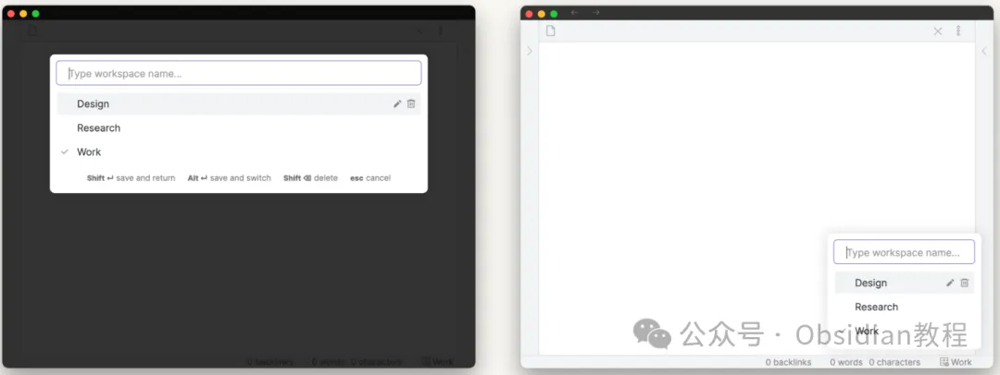
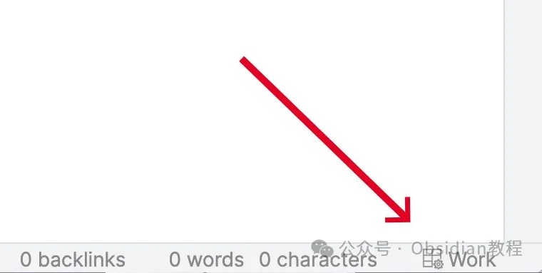
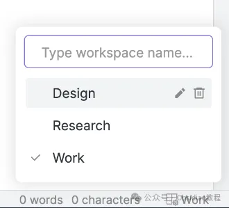

# 高效管理Obsidian工作区：Workspaces Plus插件详解

嗨，大家好，我是何老师。

  

今天来跟大家分享一个能够大大提升Obsidian使用效率的插件——Workspaces Plus。

  

大家都知道，Obsidian的灵活性和可扩展性为复杂的笔记管理和项目管理提供了无限可能，但在频繁切换不同的工作场景（如阅读、写作、项目规划等）时，总是需要手动调整窗口布局、打开相应的文件和侧边栏，这就让人感觉有些繁琐。

  

Workspaces Plus正是为了解决这一痛点而生，它能够帮你快速切换、保存和管理不同的工作区，从而让Obsidian成为一个真正高效的知识管理平台。

  

  

## **什么是Workspaces Plus？  
  
**

Workspaces Plus是一个专为Obsidian设计的插件，能够扩展原生的工作区功能，提供更强大的管理和操作选项。通过这个插件，你可以轻松管理多个工作区配置，并为每个工作区设置特定的布局、打开的文档和侧边栏视图。  
  
此外，插件还提供了便捷的热键、主题定制和工作区模板覆盖等功能，让工作区的切换变得更加直观和高效。  
  

### **主要功能概览  
  
**

  1. **工作区指示器：** 插件在Obsidian的状态栏中显示当前活跃的工作区名称。你可以点击指示器快速切换工作区，或者通过Shift-点击来保存当前工作区配置。  
  

  
  

  2. **工作区选择器与管理：** 提供了一个专门的工作区选择器，可以在其中创建、删除、重命名或切换不同的工作区。这个选择器可以通过鼠标或快捷键打开，并支持通过上下键快速导航。

  
  
  

**3.多种热键支持：** 你可以为工作区切换设置自定义的热键，这样就能够在复杂的工作流中通过键盘一键完成工作区的切换，避免鼠标操作带来的中断。  
  

**4.覆盖工作区模板变量：** 通过使用模板变量，你可以为每个工作区定制不同的页面内容，比如根据不同的工作区加载特定的文档或视图，从而让每个工作区都能完美契合当前的工作需求。  
  

**5.主题定制与样式自定义：** Workspaces Plus支持通过添加自定义CSS片段来调整工作区选择器的样式。对于那些希望优化界面空间或者有特殊主题需求的用户来说，这种灵活的样式自定义功能非常实用。  
  

## **安装与配置  
  
**

### **1\. 在线安装**  
  

对于大部分用户来说，通过Obsidian的社区插件浏览器进行在线安装是最为简单直接的方式：  
  

  1. 打开Obsidian，点击左下角的“设置”按钮。

  2. 在设置菜单中，选择“第三方插件”。

  3. 点击“浏览”按钮，在搜索框中输入“Workspaces Plus”。

  4. 找到插件后，点击“安装”，然后切换“启用”开关。  
  
  
  

### **2\. 离线安装  
  
**

如果网络不太稳定或者希望手动安装插件，也可以选择离线安装的方式。步骤如下：  
  

  1. 获取“Workspaces Plus”插件的安装包（包括main.js、styles.css和manifest.json文件）。  
  

  2. 将这些文件复制到你的Obsidian库目录下的.obsidian/plugins/obsidian-workspaces-plus/文件夹中。  
  

  3. 进入Obsidian的设置菜单，启用“Workspaces Plus”插件。  
  

### **很多同学无法直接在线安装obsidian插件，这里我已经把obsidian所有热门插件下载好了**  
只需要关注下方公众号，后台回复：**插件** 即可获取

## **使用教程：从创建到高效切换  
  
**

### **1\. 启用插件  
  
**

在Obsidian的设置菜单中找到并启用“Workspaces Plus”插件。请注意，要确保Obsidian的核心工作区插件也被激活，因为Workspaces Plus是基于Obsidian核心工作区功能进行扩展的。  
  

### **2\. 创建工作区  
  
**

启用插件后，你可以通过以下几种方式创建新工作区：  
  

  * 工作区选择器：点击状态栏中的工作区指示器，选择“新建工作区”选项，并输入新工作区的名称。  
  

  * 工作区切换模态框：使用预先设置的快捷键（如Ctrl + Shift + W）打开切换模态框，然后通过Shift-Enter创建新的工作区。  
  

创建完新工作区后，Obsidian会自动保存当前的布局、打开的文档和侧边栏状态。这意味着你可以为不同的工作场景设置不同的布局：比如一个用于专注写作的工作区，一个用于阅读研究的工作区，或者一个用于项目管理的工作区。  
  

### **3\. 切换与管理工作区  
  
**

在状态栏中点击当前工作区名称，可以快速打开工作区选择器。在选择器中，你可以执行以下操作：  
  

  * 切换工作区：点击目标工作区名称或者使用上下箭头选择后按Enter键切换。

  * 重命名工作区：点击工作区名称旁边的铅笔图标，输入新的名称后保存。

  * 删除工作区：点击垃圾桶图标，或者在菜单中选择工作区时按Shift-Delete进行删除。  
  

### **4\. 保存与自动保存设置  
  
**

默认情况下，切换工作区时不会自动保存当前工作区的配置。因此，当你进行了一些布局调整或者修改了工作区内容时，需要手动保存：  
  

  * Shift-点击：在状态栏中Shift-点击当前工作区名称即可保存。

  * 使用Shift-Enter：在切换模态框中选择当前工作区时按Shift-Enter进行保存。  
  

你也可以在插件设置中启用“总是保存”选项，这样每次切换工作区时都会自动保存当前的工作区配置。  
  

### **5\. 工作区模板与覆盖变量  
  
**

Workspaces Plus的一个独特功能是支持使用模板变量来覆盖工作区中的页面。通过在插件设置中指定特定的变量，你可以为每个工作区预设不同的内容。比如你可以设置某个工作区在打开时总是加载一组特定的Markdown文件，或者根据日期、文件夹路径等动态更新页面内容。  
  

## **高效管理Obsidian工作区的小贴士  
  
**

  1. **为常用工作区分配快捷键：** 利用Obsidian的快捷键管理功能，你可以为最常用的几个工作区设置特定的快捷键，这样可以大大提升工作流的切换效率。  
  

  2. **使用模板变量进行动态内容加载：** 如果你经常在不同项目之间切换，可以利用模板变量来设置特定工作区的启动行为，比如根据项目类型加载不同的笔记模板。  
  

  3. **利用主题定制选项优化界面：** 通过自定义CSS片段，你可以调整工作区选择器的布局和样式，使其更加紧凑或者契合你的主题。  
  

## **总结  
  
**

Workspaces Plus插件为Obsidian用户提供了强大的工作区管理工具。无论你是需要频繁切换不同的工作场景，还是希望能够快速打开特定的工作环境，这个插件都能够满足你的需求。它的多种热键支持、模板覆盖功能以及主题定制选项，使得Obsidian的工作区管理更加直观和灵活。

  

希望这篇指南能够帮助你更好地利用Workspaces Plus插件，把你的Obsidian使用体验提升到一个新的层次！  
  

# **Obsidian交流社群来了**

[**我们搞了一个专门分享Obsidian的交流社群：****玩转效率笔记****社群的主要内容包括使用技巧、模板主题和插件等，** 帮助更多人提升效率，实现自我管理的目标。](http://mp.weixin.qq.com/s?__biz=MzkyMDUyMDM2Mg==&mid=2247485997&idx=1&sn=9a528871be62e4c74a1df3807b28f2bd&chksm=c190d9e8f6e750fe9df7a333b666fdd8561fdeb928d1df1f367d2374742efa34727a3f91cbc0&scene=21#wechat_redirect)

  
如果你对Obsidian有热情，这个社群绝对不容错过！
