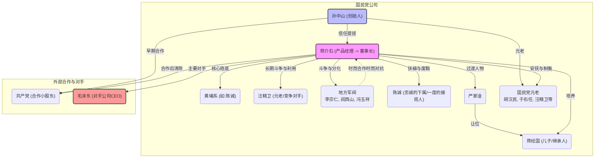

Chen Duxiu is fine too

Chen Duxiu也很好

This Qu Qiubai is fine too

这个Qu Qiubai也很好

Xiang Zhongfa is fine too

Xiang Zhongfa也很好

Wu Pinghai is fine too

Wu Pinghai也很好

Li Yifan is fine too

李Yifan也很好

Wang Ming, Zhang Guotao

王明，张吉奥

Bo Gu, Zhang Wentian

bo gu，Zhang gentian

All previous ceos can be fired by the board of directors

所有以前的首席执行官都可以由董事会解雇

Li Zongren is the representative of all countries

Li Zongren是所有国家的代表

Arrived in Nanjing

到达南京

One person and one car make it here

一辆人和一辆汽车在这里做

There are wealthy people from the Guangxi clique

广西集团有富人

The Kings in our party are all great scholars

我们党的国王都是伟大的学者

Great Scholar

伟大的学者

Our entire Party supports it

我们的整个聚会支持它

Mr. Jiang serves as the president of our Party

江先生担任我们党的主席

Mr. Wang serves as the vice president

王先生担任副总统

Wow! Everyone stood up and applauded

哇！每个人都站起来鼓掌

Sun Ke also rebelled against Chiang Kai-shek

孙子还反抗了清凯·希克

Moreover, someone was sent to assassinate Chiang

此外，有人被派去暗杀chiang

A passer-by took a look

路人看了看

Isn't this the calligraphy of Master Yu Youren

这不是你的书法吗？

Remove it quickly

快速删除它

Don't urinate anywhere.

不要在任何地方小便。

It then becomes that small details cannot be taken lightly

然后变成了不能轻易获取的小细节

Before dying, he even shouted loudly

死前，他甚至大声喊叫

It is not the father and son who can rule the world

可以统治世界的不是父子

How wronged Chen Cheng is

陈成有多好

Then died

然后死了

Chiang Kai-shek

清凯·希克（Chiang Kai-Shek）

The story of Chang Kaishen

Chang Kaishen的故事

His success or failure

他的成功或失败

In fact, it is closely tied to this party

实际上，它与这个聚会紧密相关

So let's talk about their party

所以让我们谈谈他们的聚会

The Kuomintang

kuomintang

For the sake of avoiding boredom

为了避免无聊

Everyone likes to listen to success stories

每个人都喜欢听成功的故事

Start a business and go public.

开展业务并公开。

Let's consider the Kuomintang as a company

让我们将Kuomintang视为一家公司

In this way, many people can understand it at once

这样，许多人可以立即理解

What kind of company is this Kuomintang

这家kuomintang是什么样的公司

First of all, it is an overseas start-up company

首先，这是一家海外初创公司

But the entire market is in China

但是整个市场都在中国

So the first round and the second round of angel investment

因此，第一轮和第二轮天使投资

All of them are overseas funds

他们所有人都是海外资金

This actually leads to one of his genes

这实际上导致了他的基因之一

It's just about trusting returnees from overseas

这几乎是关于从海外的返回者

Trust the elites!

相信精英！

It is indeed a bit far from the common people

确实离普通百姓有点远

Where do you think angel investment will come from at the very beginning

您认为天使投资在哪里开始

The Hongmen overseas

洪门在海外

Overseas Chinese

华侨

Japan

日本

Basically, there are just these three ways

基本上，只有这三种方式

At the very beginning, there wasn't any in Japan

一开始，日本就没有

The very beginning was the Hongmen

一开始就是洪曼人

The Hongmen is actually one

香港人实际上是一个

Let's go to a Mafia organization

让我们去一个黑手党组织

At that time

当时

In fact, it's mainly Chinese people in the United States

实际上，它主要是美国的中国人

Organize such a Hongmen

组织这样的香港人

Hongmen has never been as great as it was back then

香港人从来没有像那时那样出色

One big organization after another

一个大组织

It was as large as hundreds of thousands at that time

当时的数十万

How large is this gang

这个团伙有多大

When the 72 martyrs of Huanghuagang rose up

当黄港的72次烈士站起来

Among the 72 martyrs, 65 were from the Hongmen

在72个烈士中，有65名来自香港人

To what extent has it fallen now

现在它在多大程度上下降了

In San Francisco's Chinatown

在旧金山的唐人街

Take a detour

绕道

It's in the small alley

在小巷里

In a room on the second floor of a small building

在一个小建筑物的二楼的房间里

There is only one room left

只剩一个房间

Then the current leader of the Hongmen Sect

然后是Hongmen教派的现任领导人

It's still here now

现在还在这里

Yes, one!

是的，一个！

Hong Kong!

香港！

Born through hard work

通过辛勤工作出生

Then strive in San Francisco

然后在旧金山努力

Now he has become the current leader of the Hongmen

现在他已成为Hongmen的现任领导人

That display is still there

该显示仍在那里

Everyone, go and have a look.

大家，去看看。

It can be seen that Sun Yat-sen wrote many letters and telegrams

可以看出，孙子写了许多信件和电报

Including a large number of payment collection telegrams from Sun Yat-sen

包括Sun Yat-Sen的大量付款电报

It's about demanding repayment from the Hongmen whenever there's a revolution

每当有革命

Including those who Sun Yat-sen once made a vow to the Hongmen

包括那些曾经向洪曼发誓的人

Angel investment?

天使投资？

That person has to make a profit

那个人必须获利

What is the profit

什么是利润

At that time, Sun Yat-sen wrote in his own hand for the Hongmen, saying

当时，孙森（Sun Yat-Sen）用自己的手撰写了他的文章，并说

If the revolution succeeds

如果革命成功

Then you are the first angel investor

那你是第一个天使投资者

The president is also good.

总统也很好。

Or whatever is fine.

或一切都很好。

These locations are up to you to choose

这些位置由您选择

It comes to this point

到了这一点

That shows how difficult it was at the beginning

这表明了一开始有多困难

But although the Hongmen have declined to such an extent overseas

但是，尽管香港人在海外拒绝了

There is only one hut left

只剩一个小屋

A branch of the Hongmen

香港人的分支

It is still one of our democratic parties

它仍然是我们民主党之一

It's called the China Zhi Gong Party

这就是中国智彩党

The predecessor of the China Zhi Gong Party was this

中国智彩党的前身是这个

Hongmen

香港人

Overseas Chinese

华侨

Overseas Chinese in Southeast Asia

东南亚的海外中国人

Overseas Chinese in Hawaii, etc

夏威夷的海外中国人等

A lot of money has been donated

捐赠了很多钱

Later, Japan began to join in

后来，日本开始加入

Japan thinks so too

日本也这么认为

This company may have hope

该公司可能有希望

So what about the Black Dragon Society in Japan? Wait a minute, huh

那么日本的黑龙社会呢？等一下，嗯

Also began to invest

也开始投资

This is purely an overseas start-up company

这纯粹是一家海外初创公司

But where are the benefits

但是好处在哪里

The market has a very accurate judgment

市场有一个非常准确的判断

What is the market

市场是什么

It is China that needs revolution

需要革命的是中国

All social strata in China

中国的所有社会阶层

Except for Empress Dowager Cixi

除了皇后dowager cixi

Everyone needs the product of revolution

每个人都需要革命的产物

So it's called

所以叫做

An overseas start-up company with a very accurate market positioning

一家海外初创公司，具有非常准确的市场定位

But what about start-up companies

但是初创公司呢

There are two questions.

有两个问题。

The first one has never been powerful enough

第一个从来没有足够强大

All are little angels

都是小天使

No matter how strong the Hongmen are

不管香港人有多强

He is also a little angel investor

他也是一个小天使投资者

He didn't receive particularly strong support

他没有得到特别强烈的支持

In fact, during the fundraising process of angel investment

实际上，在天使投资的筹款过程中

He also has a competing company overseas

他还在海外有一家竞争公司

This competing company

这家竞争公司

It's from the biography of the Deluded we talked about before

这是我们以前谈论过的《欺骗的传记》

Let's talk about this about Kang Youwei

让我们谈谈有关Kang Youwei的

It's called the Great Qing Baohuang Company

这就是称为伟大的清黄子公司

Kang Youwei was holding a forged edict

Kang Youwei持有伪造的法令

And that photo that was photoshopped

那张照片被photoshop

He was with Liang Qichao and Guangxu

他和Liang Qichao和Guangxu在一起

So a large amount of money was raised overseas

因此，海外筹集了大量资金

This leads to overseas funds

这导致海外资金

A large amount of it flowed to Kang Youwei's royal-protecting company

其中大量流向了Kang Youwewe的王室保护公司

So this

所以

So Mr. Sun established this company

所以孙先生建立了这家公司

It's just that the market positioning is relatively accurate

只是市场定位相对准确

But I've never been able to become powerful

但是我从来没有能够变得强大

So throughout the entire expansion process of this company

因此，在该公司的整个扩展过程中

It's always about compromise

总是关于妥协

Merger and acquisition

合并和收购

Make mergers and acquisitions when possible

尽可能进行合并和收购

When mergers and acquisitions are not possible

当不可能合并和收购

Let's all unite together.

让我们团结在一起。

Or I'll join you

否则我会和你一起

It's growing up in such a way as wait and wait

它以等待和等待的方式成长

The Xinhai Revolution

新海革命

Logically speaking, this was successful

从逻辑上讲，这是成功的

What was discovered after achieving success

取得成功后发现了什么

This entire market is not under the control of this company

整个市场不受这家公司的控制

Because in this market

因为在这个市场

A large number of counterfeit and shoddy products have emerged

出现了大量的伪造和伪劣产品

All products are called revolutions

所有产品均称为革命

Then Mr. Sun's revolution

然后太阳先生的革命

Then I say we are the genuine revolution

然后我说我们是真正的革命

But this is an authentic revolutionary product

但这是一种真实的革命性产品

It failed to cover the whole country

它未能覆盖整个国家

Then the provincial governors of each province

然后每个省的省长

Even a braid can be revolutionary

即使是辫子也可能是革命性的

Finally, Yuan Shikai also carried out a revolution

最后，元志审还进行了一场革命

In the end, everyone revolutionized

最后，每个人都革命

The market is filled with all kinds of them

市场充满了各种各样的市场

It's not this genuine revolutionary product

这不是真正的革命性产品

But there was nothing he could do

但是他无能为力

Because it is an important step in its expansion

因为这是扩展的重要一步

Well, it's not going public independently anymore

好吧，它不再独立公开

Since the market share is relatively small

由于市场份额相对较小

So I took a step

所以我迈出了一步

Ask me to join you

让我加入你

What should be added

应该添加什么

Join a huge group

加入一个巨大的团体

It's called the Revolutionary Group.

这就是革命团体。

The biggest shareholder in this revolutionary group

这个革命团体的最大股东

It's actually Beiyang

实际上是贝阳

That's why it happened

这就是为什么它发生

Sun Yat-sen served as the provisional president for only a short period of time

Sun Yat-Sen仅在短时间内担任临时总统

In Nanjing

在南京

So it was said that as long as the revolution could succeed completely

因此，只要革命可以完全成功

Who can make the Qing Emperor abdicate

谁可以使清皇帝退位

Then I'll appoint the president

然后我任命总统

After all, the president is the chairman of the board

毕竟，总统是董事会主席

I'll step down the chairman

我会辞职

Then Yuan Shikai said

然后Yuan Shikai说

Then I'll come

然后我来

Then I have more resources

那我有更多的资源

I also have a lot of funds

我也有很多资金

Do I have everything

我有一切吗

It's nothing more than producing products like Revolution

无非是生产革命等产品

So Yuan Shikai said

Yuan Shikai说

Then I forced the Qing Emperor to abdicate

然后我强迫清皇帝退位

Then I'll do it

那我去做

Be the chairman of the board

担任董事会主席

Then join you

然后加入你

I joined.

我加入了。

The entire Beiyang

整个Beiyang

This big group looks quite good

这个大团体看起来很好

The five-colored flag has risen

五色的旗帜已经升起

Then the sign of the revolutionary product

然后是革命性产品的标志

It was also slightly packaged

它也略包

Originally, this revolutionary product was called "Expel the Tartars"

最初，这种革命性产品被称为"驱逐塔塔尔"

Restore China

恢复中国

Suddenly it became a republic of five races

突然变成了五场比赛的共和国

This is the problem of this party

这是这个聚会的问题

This party has never been any special

这个聚会从来没有特别

Even a particularly firm ideology is fine

即使是特别坚定的意识形态也很好

Or it could be the ideal of the product

或者可能是产品的理想

You want to expel the Tartars all of a sudden

你想突然驱逐塔塔塔

Restore China

恢复中国

Expel the Tartars

驱逐塔塔塔

What is being expelled

正在开除什么

Who are the Tartars

谁是塔塔尔人

They are the two important tribes in the Five-Nation Republic

他们是五个国家共和国的两个重要部落

It's just Manmeng

只是曼蒙

This is full of nobles.

这充满了贵族。

Oh, I've changed

哦，我改变了

Then let's have a republic among the five tribes

然后让我们在五个部落中有一个共和国

That's fine too.

那也很好。

I'll join you.

我会加入你。

Get ready in the board of directors

准备董事会

Take it slow at the shareholders' meeting

在股东会议上放慢速度

The result was that the first step led to a major failure

结果是第一步导致了重大失败

What is it?

这是什么？

The first congressional election

第一次国会选举

The Kuomintang led by Song Jiaoren achieved a great victory

由歌曲Jiaoren领导的Kuomintang取得了巨大的胜利

This was a big victory at the shareholders' meeting

这是股东会议上的巨大胜利

I'm just about to enter the cabinet

我正要进入机柜

I'm ready to become the CEO

我准备成为首席执行官

You, Yuan Shikai, are still the chairman

你们，元凯，仍然是董事长

But let the CEO be from our Kuomintang

但是让首席执行官来自我们的kuomintang

Song Jiaoren was in high spirits

歌曲乔伦（Jiaoren）兴高采烈

I'm preparing to go from Shanghai to Beijing

我正准备从上海到北京

If you form a cabinet here, you'll become the prime minister

如果您在这里形成一个内阁，您将成为总理

As a result, the chairman was not happy

结果，董事长不开心

The major shareholder is not happy

主要股东不高兴

Say oh

说哦

The CEO position should be held by you minority shareholders

首席执行官职位应由您的少数股东担任

Forget it then.

然后忘记它。

That is why the assassination of Song Jiaoren occurred

这就是为什么jiaoren被暗杀的原因

This important turning point

这个重要的转折点

Assassinate Song Jiaoren

暗杀歌曲Jiaoren

At Shanghai Railway Station

在上海火车站

Song Renzheng is getting ready to set off

Song Renzheng准备出发

"Stabbed!"

"刺了！"

What is that equivalent to?

那等同于什么？

The major shareholder expelled the minor shareholder

主要股东驱逐了次要股东

So there was no way out

所以没有出路

Originally, it was said that everyone would join a big group

最初，据说每个人都会加入一个大团体

Take it slow.

慢慢来。

So it started again

所以它又开始了

So the share of the entire market it occupies now is very small

因此，现在所占的整个市场的份额很小

It is said that there are Guangdong and Guangxi

据说有广东和广西

In fact, Guangdong and Guangxi were also in the hands of those warlords

实际上，广东和广西也掌握在那些军阀手中

Lu Rongting from Guangxi is also good

来自广西的Lu rong也很好

These warlords in Guangdong are good too

这些在广东的军阀也很好

Chen Jiongming is fine too

Chen Jiongming也很好

Xu Chongzhi is fine too

Xu Chongzhi也很好

None of the investors really agree with the ideals of this company

投资者都不同意该公司的理想

Rather, I think this company is

相反，我认为这家公司是

It can be used as a cover-up to do a lot of one's own things

它可以用作做很多自己的事情的掩盖

So Mr. Sun brought the hardships of starting a business with the company

因此，孙先生带来了与公司开展业务的困难

This is in Guangdong.

这在广东。

It was just a moment before I was attacked by this rebellion

这只是我被这次叛乱袭击的片刻

Even merchant groups can rebel for a while

甚至商人团体也可以反叛一段时间

It was done there. Yes

它在那里完成了。是的

Be in a complete mess

一团糟

When the merchant syndicate rebelled

当商人联盟叛逆时

This Soong Ching Ling also appeared

这个Soong Ching Ling也出现了

She was already pregnant

她已经怀孕了

As a result, during the rebellion of the commercial groups in Guangzhou

结果，在广州商业团体的叛乱中

Just fire firecrackers in the street and so on

只是在街上的消防鞭炮等等

Wandering and struggling

徘徊和挣扎

It also had a miscarriage.

它也流产。

In all kinds of chaos

各种混乱

The real core team of this company

该公司的真正核心团队

It can be seen that there is a problem

可以看出有一个问题

The core team of this company is all composed of a group of overseas returnees and scholars

该公司的核心团队都由一群海外回归者和学者组成

Then one can truly manufacture products

那么一个人可以真正生产产品

There are very few people who can go out and build their empires

很少有人能出去建造自己的帝国

They are all a group of scholars

他们都是一群学者

Can write poems

可以写诗

Be able to do something serious during the assassination

在暗杀期间能够做一些认真的事情

Wang Jingwei is also good

Wang Jingwei也很好

Hu Hanmin is fine too

胡汉明也很好

Wait a moment

稍等

Including those veteran calligraphers like Yu Youren and so on

包括像Yu Your一样的资深书法家等等

They are all a group of scholars

他们都是一群学者

Then what should be done?

那应该怎么做？

What about the core employees in the company

该公司的核心员工呢

Just start looking.

只是开始寻找。

I've been looking and looking

我一直在寻找

At this time

此时

A rather combat-effective employee emerged

出现了一个相当战斗有效的员工

It was Chiang Kai-shek who appeared

出现的是Chiang Kai-Shek

So Chiang Kai-shek was not the founding father of this company

因此，清凯·希克（Chiang Kai-Shek）不是这家公司的创始父亲

So Chiang Kai-shek was not the Founder.

因此，清凯·希克（Chiang Kai-Shek）不是创始人。

He was just later

他只是后来

A very excellent product has been made

已经制造了非常出色的产品

One of the best products of this company

该公司最好的产品之一

It's called the Whampoa Military Academy

这就是沃莫人军事学院

Even this product

甚至这个产品

To be honest

说实话

At the beginning, he wasn't a product manager either

一开始，他也不是产品经理

This product was what Mr. Sun thought and thought about

这个产品是太阳先生的想法和思考

This company is truly our revolution

这家公司确实是我们的革命

What exactly is the flagship product

旗舰产品到底是什么

It was only at the end that I realized, "Oh.

直到最后我才意识到，"哦。

One should still have one's own armament

一个人应该有自己的军备

Armed forces are the most important flagship product of revolution

武装部队是革命最重要的旗舰产品

So a Whampoa Military Academy was established

因此建立了沃波阿的军事学院

Then how did Jiang become a product manager

那么江如何成为产品经理

This is a crucial moment

这是一个关键时刻

The employees of the company

公司的员工

Be sure to let your boss see your brilliance

一定要让老板看到你的光彩

You must make the boss value you

你必须使老板价值你

Jiang was at this critical moment

江在这个关键时刻

An important thing was done

一件重要的事情

It was to board the Yongfeng warship to accompany Sun Yat-sen

是登上扬冯军舰，陪伴太阳yat-sen

Before, Chiang's status was actually very low

以前，清安的身份实际上很低

Not only can he not compare with these big shots who founded this company

他不仅不能与创立该公司的这些大型镜头进行比较

Even among these soldiers

甚至在这些士兵中

He is also of a very low status

他的身份也很低

He doesn't have an army

他没有军队

He was originally just following Chen Qimei

他最初只是跟随Chen Qimei

Get some suicide squads

获得一些自杀小队

Then the revolution was victorious and they went home again

然后革命取得了胜利，他们又回家了

Then he followed Sun Yat-sen to Guangzhou

然后他跟随太阳森到广州

In Guangzhou, he was only among the Guangdong army

在广州，他仅在广东军队中

Because he is an employee of this company

因为他是这家公司的雇员

So these investors said, "Give me some face.

因此，这些投资者说："给我一些面孔。

Offer Chiang Kai-shek a position that is not very high

为清凯·希克（Chiang Kai-Shek）提供一个不高的职位

At most, he could serve as the chief of staff of the Guangdong Army

最多，他可以担任广东陆军的参谋长

In fact, it's no use.

实际上，这没有用。

People don't trust him either

人们也不信任他

So I was constantly excluded inside

所以我经常被排除在里面

Wait a moment

稍等

Chiang Kai-shek's entire life

清凯·希克（Chiang Kai-Shek）的一生

There are several very significant advantages

有几个非常重要的优势

What we were talking about before was nationalism

我们之前谈论的是民族主义

What? Just put it aside now

什么？现在把它放在一边

These are all major festivals

这些都是主要的节日

It is about one's advance and retreat

这是一个人的进步和撤退

Promotions in the company and so on

公司的促销等等

He has a particularly good sense of advance and retreat in this

他对此有特别好的进步和撤退的感觉

This is an extremely important quality for a person's success

这对于一个人的成功是极其重要的品质

Many people have a poor sense of when to advance and when to retreat

许多人对何时前进和何时撤退的感觉很差

This shouldn't rush up

这不应该急于

Just rushed forward and sacrificed himself

刚匆匆向前牺牲了自己

On that Chongjian Road

在那条钟吉路上

How many entrepreneurial tycoons have sacrificed their lives on the way

有多少企业家大亨在途中牺牲了生命

Many people have a poor sense of enterprise

许多人的企业意识很差

After leaving, we'll be together

离开后，我们在一起

I went to Tianjin to work as a bather

我去天津做了一个bather

Or in the Shanghai concession

或在上海特许权

Finally, it's over.

最后，结束了。

Vanished without a trace

消失没有痕迹

There are such people

有这样的人

On the road of revolution

在革命之路

The timing of each of Chiang's choices of advance and retreat

Chiang的前进和撤退选择的时机

The balance is just right

平衡恰到好处

Chiang's first retreat

清安的第一次静修

At that time

当时

He is still just such a tiny nobody

他仍然只是一个小的人

He is also advancing and retreating.

他也在前进和撤退。

It was he who talked to Sun Yat-sen

是他和太阳森交谈的

I think so.

我认为是这样。

It should be like this.

应该这样。

Expel Chen Jiongming

驱逐陈

It should be like that.

应该那样。

How should this revolutionary product be made

如何制作这种革命性的产品

Sun Yat-sen didn't listen to him

太阳yat森没有听他的话

Sun Yat-sen was a rather generous person

太阳森是一个相当慷慨的人

I think we still need to unite the majority

我认为我们仍然需要团结大多数

Don't make it so intense

不要这么激烈

So he resigned and went home

所以他辞职回家

But he has an excuse

但是他有借口

He is indeed very filial

他确实很符合货币

It's been one year since my mother passed away

我母亲去世已经一年了

I'm going back to Xikou

我要回xikou

Do these things for mother

为母亲做这些事情

So he/she left

所以他/她离开了

This one is going very well

这个进展很好

Sun Yat-sen also tried to persuade him to stay

太阳森还试图说服他留下

But as for whether it is like Chiang Kai-shek or not

但至于是否像Chiang Kai-Shek

Later, I told people everywhere by myself

后来，我一个人告诉别人

How did Mr. Sun earnestly persuade him to stay

孙先生如何认真地说服他留下

I even shed tears

我什至流泪

Of course, he succeeded in the end

当然，他最终成功了

He can tell all his success stories

他可以告诉所有他的成功故事

But at least he withdrew this time

但至少他这次撤回了

Sun Yat-sen went to persuade him to stay

太阳Yat-sen说服他留下

I examined his importance

我检查了他的重要性

Everyone will be in a start-up company in the future

将来每个人都会在一家初创公司中

Such things are often done, too

这样的事情也经常做

I said as long as the boss doesn't listen to me

我说只要老板不听我

I have a suggestion.

我有一个建议。

The boss didn't adopt it.

老板没有收养它。

Then I can resign

那我可以辞职

Make the boss think that I am a person with aspirations

让老板认为我是一个有抱负的人

Rather than just sitting in this position

而不是坐在这个位置

Just a person who just goes through the motions

只是一个只是经历动作的人

Then I won't just muddle through

那我不只是混乱

I'm leaving.

我要离开。

So Chiang Kai-shek left

所以chiang kai-shek离开了

It turns out that heroes are made in such times

事实证明，英雄是在这样的时候创造的

It just so happened that Chiang had left

恰格离开了

Sun Yat-sen has suffered a disaster

太阳森遭受了灾难

As for Chen Jiongming's defection

至于Chen Jiongming的叛逃

Chen Jiongming defected

Chen Jiongming叛逃

Then they chased Sun Yat-sen all over the streets

然后他们在整个街上追逐太阳

Finally, there was nowhere to run

最后，无处可去

Then I got on the warship

然后我去了军舰

The navy has always been rather revolutionary

海军一直是革命性的

Of course, the navy is of higher quality than the army

当然，海军的质量比军队高

It has a lot to do with it

它与它有很多关系

A large number of naval officers have studied abroad

许多海军军官在国外学习

Wait a moment

稍等

High quality

高质量

So Sun Yat-sen fled to the Yongfeng warship of the navy

因此，太阳Yat-Sen逃到了海军的旺芬军舰

This Yongfeng warship is very famous

这项扬港军舰非常出名

It was later the famous Zhongshan warship incident

后来是著名的中山军舰事件

The Zhongshan warship was built because Sun Yat-sen was on the Yongfeng warship

宗山军舰之所以建造，是因为太阳森在扬芬军舰上

It's been over 80 days

已经超过80天了

It was later renamed the Zhongshan warship

后来被更名为中山军舰

But at the critical moment

但是在关键时刻

The boss is in trouble

老板有麻烦

When major problems arise in the company

当公司出现重大问题时

Be sure to step forward.

确保向前迈进。

Don't step forward at this time

此时不要前进

There won't be any chance for you

您没有任何机会

Jiang stepped forward at this time

江目前前进

Of course, this is the second time he has stepped forward

当然，这是他第二次前进

The first time we talked about it before

我们之前第一次谈论

He went to Shanghai to collect Chen Qimei's body

他去上海收集了陈的尸体

Chen Qimei is certainly one of the founding fathers of this company

Chen Qimei无疑是该公司的开国元勋之一

Jiang was a subordinate of Chen Qimei

江是陈的下属

After Chen Qimei was assassinated

陈Qimei被暗杀后

No one dares to collect the body

没有人敢收集身体

Jiang set off alone from the West entrance

江从西入口独自出发

I collected his body in Shanghai

我在上海收集了他的尸体

The first nickname was given

给出了第一个昵称

The second time, I really made a name for myself

第二次，我真的为自己起了个名字

Sun Yat-sen sent a telegram to report to Xikou

孙子森（Sun Yat-Sen）发送了一封电报向Xikou报告

Speak quickly!

快速说话！

Chiang did it without hesitation at that time

蔡安当时毫不犹豫地做到了

Disregarding danger

无视危险

The company wasn't big at that time

当时该公司并不大

The revolution hasn't succeeded yet

革命还没有成功

At this time, you must show your performance

目前，您必须表现出表演

Wait for the company to grow up

等待公司长大

They are all on the market.

他们都在市场上。

It's no use your performance any more

不再使用您的表现

I can no longer be a senior executive

我再也不能成为高级主管

Rush to Guangzhou immediately from Xikou

立即从Xikou赶到广州

Boarded the Yongfeng warship

登机

Stay by Sun Yat-sen's side

留在阳光下

Not only accompanied Sun

不仅伴随着阳光

There aren't any soldiers around anymore, are there

周围不再有士兵

In his eyes, all the soldiers are warlords

在他眼中，所有士兵都是军阀

Only Chiang Kai-shek, this new soldier

只有Chiang Kai-Shek，这个新士兵

A new soldier who is extremely loyal to the revolution

一个非常忠于革命的新士兵

Make him feel deeply trusted

让他感到非常信任

Chiang Kai-shek not only commanded the suppression of the rebellion on the Yongfeng warship

清凯·希克（Chiang kai-Shek

Then do all kinds of crisis public relations and so on and so forth

然后进行各种危机公共关系等等

Be at the forefront

at

And in order to boost morale

为了提高士气

Every day except for battles

每天除战斗

Also lead the entire team

也带领整个团队

The Yongfeng ship on the ship is a small one

船上的扬芬船是很小的

Stop in the inland river

停在内陆河

Not the kind of large warships in the ocean

不是海洋中的大型军舰

Actually, it's very small.

实际上，它很小。

Including Mr. Sun himself

包括太阳先生本人

They all live only in a very small house

他们都只住在一个很小的房子里

A single bed

一张单人床

Two blankets are just like this

两个毯子就是这样

In order to boost morale

为了提高士气

Every day, he personally leads the officers and soldiers on the ship to clean the warship

每天，他亲自带领船上的军官和士兵清洁军舰

Always clean the warship extremely thoroughly

总是非常彻底清洁军舰

Jiang was like this all his life

江一生都是这样

Look at the clothes he is wearing

看他穿的衣服

He is a person with obsessive-compulsive disorder about cleanliness

他是一个关于清洁度的强迫症的人

Then tell a story to everyone on the ship

然后向船上的每个人讲故事

Jiang is a particularly taciturn person

江是一个特别宽容的人

Be taciturn

默许

We talked about the Chongqing negotiations before

我们之前谈到了重庆谈判

Why was Jiang so taciturn

江为什么这么默认

But at this time, in order to boost morale

但是目前，为了提高士气

It's actually on the ship

实际上在船上

Tell everyone the story of Sherlock Holmes solving cases

告诉所有人，夏洛克·福尔摩斯解决案件的故事

And be by Sun Yat-sen's side every day

每天都在孙子身边

I stayed for a total of 40 days

我总共呆了40天

These forty days are extremely important

这些四十天非常重要

But it was when the boss was deserted by all

但是那是老板被所有人抛弃的时候

The investor not only withdrew the funds

投资者不仅退出了资金

And in the case of destroying this company

在销毁这家公司的情况下

A loyal employee is by your side

忠实的员工在您身边

And he even ventured ashore himself

他甚至冒险自己

Go and buy food for Sun Yat-sen

去买阳光的食物

Very important, very important

非常重要，非常重要

This Mr. Sun is looking at the food he bought

太阳先生正在看他买的食物

Tears welling up in the eyes

眼泪在眼中

Very touched

非常感动

said

说

But I won't allow you to take such risks again in the future

但是我将来不允许您再次冒险

Because you are such an important person in the revolution

因为你是革命中的重要人物

This friendship was established

这种友谊建立了

This is better

这更好

In fact, it's much better than how many outstanding achievements you have made in the company

实际上，这比您在公司中取得了多少杰出成就要好得多

How many have you sold

你卖了多少

All of them have to work

他们都必须工作

Even promised Jiang

甚至答应了江

In case something bad happens to me

万一发生不好的事情发生在我身上

Then keep the revolution going

然后继续革命

Then it falls on your shoulders

然后它落在你的肩膀上

But this is not necessarily so.

但这不一定是这样。

There aren't any witnesses here

这里没有证人

This was said by Chiang himself

清那本人说了这一点

Later, Chiang Kai-shek even wrote a long article specifically

后来，Chiang Kai-Shek甚至特别写了一篇长篇文章

It's called the Story of President Sun's Tragic Encounter in Guangzhou

这就是所谓的太阳总统在广州的悲惨遭遇的故事

Was it said there that Mr. Sun was in such a sorry state

有人说太阳先生处于如此遗憾的状态吗

How loyal is he

他有多忠诚

How and how

如何以及如何

And when this was published

当这本书出版时

It was Sun Yat-sen who wrote the preface for him

是孙子森为他写了序言

It's equivalent to the chairman of the board.

这相当于董事会主席。

Endorsement by the boss

老板的认可

You are my most loyal employee

你是我最忠实的员工

So he was able to stand out

所以他能够脱颖而出

Among so many founders of companies

在这么多公司的创始人中

But let him be the manager of this most important product

但是让他成为这个最重要的产品的经理

He was the president of the Whampoa Military Academy

他曾是瓦莫（Whampoa）军事学院的校长

At that time, it was the Whampoa Military Academy

当时是沃莫（Whampoa）军事学院

It should be regarded as the only flagship product of this company

它应该被视为该公司唯一的旗舰产品

Other products

其他产品

They have all been flooded with counterfeits and shoddy goods throughout the market

他们都在整个市场上都充满了伪造和伪劣的商品

The revolutionary products have all been ruined

革命性产品都被毁了

Only the best products of the Whampoa Military Academy

唯一的沃波阿军事学院的产品最好

And inside the Whampoa Military Academy

在瓦莫瓦军事学院内

It gathers the most elite young people from all over China

它聚集了来自中国各地最精英的年轻人

No matter who comes from Shanxi

无论谁来自山西

From Northeast China

来自中国东北部

From Shanghai

来自上海

From all over

来自各地

Come to the Whampoa Military Academy

来到沃波阿军事学院

In fact

实际上

This is the backbone of this company in the future

这是该公司将来的骨干

An iron-like workforce

类似铁的劳动力

This team

这个团队

This product was handed over to Chiang Kai-shek

该产品已移交给Chiang Kai-Shek

This is how Chiang Kai-shek's team came into being in this company

这就是Chiang Kai-Shek的团队进入该公司的方式

It was from then on that Chiang Kai-shek rose to the ranks of senior executives

从那时起，清凯·希克（Chiang Kai-Shek）升至高级管理人员的行列

He began when he became the president of the Whampoa Military Academy

当他成为瓦莫（Whampoa）军事学院的校长时，他开始

He has just become a member of the Central Committee

他刚刚成为中央委员会的成员

Later, he/she became a member of the Standing Committee of the Central Committee

后来，他/她成为中央委员会常务委员会成员

This member of the Central Standing Committee has entered the board of directors

该中央常务委员会成员进入了董事会

This one jumped from a product manager to the board of directors

这个从产品经理跳到董事会

At this time, fate once again helped Chiang Kai-shek

目前，命运再次帮助了Chiang Kai-Shek

How could it be that God is assisting in the lecture

上帝怎么能协助演讲

Mr. Sun also passed away

太阳先生也去世了

You say this is simply about a person's success

你说这仅仅是关于一个人的成功

This is a perfect combination of favorable timing, geographical advantages and human resources

这是有利的时机，地理优势和人力资源的完美结合

This is too important

这太重要了

If Mr. Sun lived for another 20 years

如果太阳先生再过20年

Then Jiang Qi had no chance to rise to prominence

然后江齐没有机会突出

Moreover, if Jiang and Sun spent too much time together

而且，如果江和太阳在一起花了太多时间

Jiang is a person with a relatively narrow mind

江是一个相对狭窄的人

Sun is a very generous person

太阳是一个非常慷慨的人

So gradually, if Sun discovers it

因此，如果太阳发现它

The chairman gradually discovered and said

主席逐渐发现并说

In fact, you are not that ideal

实际上，你不是那么理想

That's actually still problematic

实际上仍然有问题

The result was when he was trusted the most

结果是他最信任的时候

The chairman has passed away.

董事长已经去世。

It immediately became a board of directors

它立即成为董事会

Several big shots manage this company collectively together

几次大型镜头共同管理这家公司

At this time, he happened to be one of them

目前，他碰巧是其中之一

Although the status is not the highest yet

虽然状态还不是最高的

At that time, big shots like Wang Jingwei and Hu Hanmin

当时，像王·琼特（Wang Jingwei）和胡汉明（Hu Hanmin）这样的大镜头

His status is still higher than his

他的身份仍然高于他

The products of that company are in his hands

该公司的产品掌握在他手中

The most important team of that company

该公司最重要的团队

The most important income

最重要的收入

The most important business is his responsibility

最重要的业务是他的责任

So his position in the company is getting higher and higher

因此他在公司中的地位越来越高

At this time

此时

Another interesting company joined in

另一家有趣的公司加入了

What's the name of this company

这家公司的名字是什么

It's called the Communist Party

这就是共产党

This is of course necessary for the Communist Party's entrepreneurship

当然，这对于共产党的企业家精神是必不可少的

It was several decades later than the Kuomintang

比Kuomintang晚几十年

But the timing for starting a business is very good

但是开展业务的时机非常好

What is the name of the entrepreneurial opportunity

企业家机会的名字是什么

This so-called genuine Kuomintang

这个所谓的真正的kuomintang

The products of this company have not been presented yet

该公司的产品尚未介绍

Haven't developed any flagship products yet

尚未开发任何旗舰产品

So what should be done?

那应该怎么办？

Oh, a group of people said oh

哦，一群人说哦

Let's get a patent from Russia

让我们从俄罗斯获得专利

Because there is a revolutionary product that has already succeeded

因为有一个革命性的产品已经成功了

The Russian market has been opened up

俄罗斯市场已经开放

This shook the world

这个震撼了世界

Say oh!

说哦！

It's good to say this.

很高兴这样做。

Let's not develop products by ourselves

让我们独自开发产品

Let's just get a patent directly

让我们直接获得专利

Let's set up another start-up company

让我们建立另一家初创公司

So a new start-up company joined in

因此，一家新的创业公司加入了

What does this start-up company bring

这家初创公司带来了什么

Carrying a revolutionary patent

携带革命专利

It's called the Russian Revolution

这就是俄罗斯革命

The patent of the communist revolution

共产主义革命的专利

This patent?

这个专利？

Just right here.

就在这里。

It has always been impossible to develop good revolutionary products

开发优质革命性产品一直是不可能的

Mr. Sun's

太阳先生的

It has also gained recognition

它也获得了认可

Mr. Sun thinks this patent is quite good

Sun先生认为该专利非常好

Already successful

已经成功了

Take it for use.

使用它供使用。

So this new start-up company is called the Communist Party

因此，这家新的创业公司被称为共产党

What does this company bring

这家公司带来了什么

Take this patent with you

随身携带该专利

It also brought a part of the angel investment from the head office

它还从总部带来了天使投资的一部分

Join this company

加入这家公司

So the company began to expand

因此公司开始扩展

Become quite combat-effective

变得非常战斗有效

It's called a team

这就是一个团队

Some products have a very small market share across the country

一些产品在全国各地的市场份额很小

Probably only Guangdong

可能只有广东

But this company has formed a strong one

但是这家公司已经形成了一个强大的公司

The major shareholder of this company is the Kuomintang

该公司的主要股东是Kuomintang

The minority shareholder is the Communist Party

少数股东是共产党

Everyone, unite

大家，团结

Prepare to start striving for an IPO

准备开始争取IPO

Let's have the negotiation in Chongqing

让我们在重庆中进行谈判

Said a lot

说了很多

It wasn't the first time they met at that time

那不是他们当时第一次见面

At that time, they hadn't seen each other for exactly 20 years

那时，他们已经有20年没有见过

This is the first time they have met

这是他们第一次见面

It was when these two companies merged as shares

正是这两家公司合并为股票

It's an employee among the minority shareholders

这是少数股东的雇员

It belongs to this new company, Communist Company

它属于这家新公司，共产党公司

Entrepreneurial employees!

企业家员工！

It held a slightly higher position in the Kuomintang than Chiang Kai-shek

它在Kuomintang中的位置比Chiang Kai-Shek略高

Chiang was already in the Kuomintang

Chiang已经在Kuomintang

It has been a long time since this company was established

自这家公司成立以来已经很长时间了

I just joined

我刚加入

But what about the wool?

但是羊毛呢？

It was the time when the Communist Party was founded

那是共产党成立的时候

Well, of course he isn't the founder

好吧，他当然不是创始人

founder is a group of big intellectuals

创始人是一群大知识分子

Chen Duxiu is here

Chen Duxiu在这里

Li Dazhao and so on

李·达索（Li Dazhao）等

There was even Chen Gongbo who later became a traitor

甚至还有陈·贡博（Chen Gongbo），后来成为叛徒

Zhou Fohai

周佛

Li Dazhao and Chen Duxiu haven't attended the First National Congress yet

Li Dazhao和Chen Duxiu尚未参加第一次国民大会

Chen Gongbo and Zhou Fohai both joined the First National Congress of the Communist Party of China

Chen Gongbo和Zhou Fohai都参加了中国共产党的第一届国民大会

But not a member of the board of directors

但不是董事会成员

He is equivalent to the time when a company starts to rise

他等同于公司开始上升的时间

There are more than 20 employees

有20多名员工

One of them was having a meeting in this concession

其中一个是在这个特许经营中开会

Stand guard and let go

守卫

Braving the wind

勇敢地风

The last one turned to the boat on South Lake

最后一个转向南湖的船

From now on!

今后！

Sure. That place is too small

当然。那个地方太小了

There is no division in this company

这家公司没有部门

The executive meeting is here

执行会议在这里

Then the employees are here

然后员工在这里

All the employees have all run to the same boat

所有员工都跑到同一条船上

Of course, they were all the senior executives who started the company

当然，他们都是创办公司的高级管理人员

When this company began to collaborate with this Kuomintang

当该公司开始与这个Kuomintang合作时

This big one

这个大

When cooperating with slightly larger companies

与稍大的公司合作时

Those two people met

那两个人见面

How did you meet

你是怎么见面的

Oh, because these two companies are a joint venture

哦，因为这两家公司是合资企业

Then let's share the positions of senior executives

然后让我们分享高级管理人员的职位

Those are some of the boards of directors mentioned above

这些是上面提到的一些董事会

Where is this big executive

这个大管在哪里

The Kuomintang stepped in.

Kuomintang介入。

There are some departments

有一些部门

Including the relatively important departments

包括相对重要的部门

Then this minority shareholder

然后这个少数股东

The Communist Party is here.

共产党在这里。

One of the rather important departments is called the Publicity Department of the Central Committee

一个相当重要的部门之一称为中央委员会的宣传部

This is the Publicity Department of the Central Committee

这是中央委员会的宣传部

Of course it was the Publicity Department of the Central Committee of the Kuomintang

当然，这是Kuomintang中央委员会的宣传部

At that time, it was the Communist Party that joined the Kuomintang

当时，是共产党加入了库恩甘（Kuomintang）

Hello, Acting Minister of the Publicity Department of the Central Committee of the Kuomintang

您好，Kuomintang中央委员会宣传部代理部长

Comrade MAO Runzhi

毛伦兹同志

Let's call him Comrade Runzhi

让我们称他为伦兹同志

Is Comrade Runzhi good at writing

伦兹同志擅长写作

You can give a speech again

你可以再次演讲

Although giving a speech in Guangdong

虽然在广东发表演讲

People may not be able to understand

人们可能无法理解

But at least this one has very good literary talent

但是至少这个具有很好的文学才能

The main work of the Publicity Department of the Communist Party of China Central Committee

中国中央委员会共产党宣传部的主要工作

It's just about being the chief editor of various publications

这只是作为各种出版物的首席编辑

This was when Comrade Runzhi was the chief editor

这是伦兹同志是首席编辑

Acting Central Minister

代理中央部长

Many articles about Jiang have also been published

关于江的许多文章也已发表

Chiang seemed to be a leftist at that time

当时，清似乎是左派

So I wrote all kinds of articles about allying with Russia and the Communist Party

所以我写了各种关于与俄罗斯和共产党的盟友的文章

Articles on assisting workers and peasants

有关协助工人和农民的文章

Then Comrade Runzhi will give it to him

然后伦兹同志将其交给他

One day?

一天？

So we invited this acting minister of the Publicity Department of the Communist Party of China Central Committee

因此，我们邀请了中国共产党宣传部代理部长

Comrade Runzhi, come and give a speech

伦兹同志，来发表演讲

Then what about the Whampoa Military Academy

那沃姆多军事学院呢

Of course, this is the Party's military academy

当然，这是党的军事学院

Executives from all kinds of parties are going to give speeches

各种政党的高管将发表演讲

Give a speech!

演讲！

What was Chiang's position at that time

当时清安的立场是什么

Inside the company

公司内部

Of course, he is much taller than Comrade Runzhi

当然，他比伦兹同志高得多

Jiang is a member of the Standing Committee.

江是常驻委员会的成员。

That is to enter the board of directors

那就是进入董事会

Where is this Comrade Runzhi

这个同志鲁尼在哪里

He/She is an alternate member of the Central Committee

他/她是中央委员会的替代成员

What does a civil servant correspond to as a middle-level cadre

公务员将与中层干部相对应

So although it is this position within the Party

因此，尽管这是党内的职位

But because he is the minister of propaganda

但是因为他是宣传部长

So when he came, Jiang still attached great importance to this

因此，当他来时，江仍然非常重视

jiang

江

I have been wearing very clean clothes since I got up in the morning

自从早上起床以来，我一直穿着非常干净的衣服

Then the whole school lined up.

然后整个学校排队。

Then he went to the school gate in person to greet him

然后他亲自去学校大门打招呼

Comrade Jiang Runzhi, a representative of the Publicity Department of the Communist Party of China Central Committee, is here to give a speech

中国共产党宣传部代表江伦兹同志在这里发表演讲

He began by speaking to everyone in Ningbo dialect

他首先与宁波方言中的每个人交谈

Speaking of everyone!

说到大家！

Now, let's welcome Comrade Runzhi to give a speech

现在，让我们欢迎伦兹同志发表演讲

Then Runzhi went up and gave another speech in Hunan dialect

然后伦兹上升，在湖南方言中发表了另一个演讲

The students of this Huangpu School

这所黄浦学校的学生

It is unknown how many people can understand what these two people are saying

尚不清楚有多少人能理解这两个人在说什么

All in all

总而言之

These two people have met like this before

这两个人以前遇到过这样的人

Then at various expanded central meetings

然后在各种扩展的中央会议上

When you must expand the meeting

当您必须扩大会议时

Especially when the number of central committee members is insufficient

特别是当中央委员会成员人数不足时

When it's time to vote

是时候投票了

The alternate members of the central Committee are of great use

中央委员会的替代成员非常有用

So there were probably three or four times

所以大概有三四次

At the expanded meeting of the central committee

在中央委员会的扩大会议上

This Jiang sat on top as a member of the Standing Committee

这位江部担任常务委员会成员

Then Comrade Runzhi serves as the alternate committee member

然后，伦兹同志是替代委员会成员

I have probably voted once or twice as well

我可能也投票过一两次

good

好的

This combative company has begun to move towards going public

这家好战的公司已开始朝着公开往事

How to set off?

如何出发？

Unite a few more families

团结更多家庭

Those with common ideals

那些具有共同理想的人

In fact, there may not necessarily be a common ideal

实际上，不一定有一个普遍的理想

So everyone can pick up the ball

所以每个人都可以接球

It can go public together

它可以一起公开

The company said, "Let's go on a northern expedition.

该公司说："让我们继续进行北部探险。

Let's make a push towards this national market

让我们推向这个国家市场

So the northern expedition began

所以北部探险开始了

When the northern Expedition began

当北部探险开始

How much equity does Jiang and his Whampoa faction hold

江派和他的沃姆多派有多少平等

Calculate it in this company

在这家公司中计算它

It should be approximately one seventh

大约应该是第七

Why?

为什么？

It was because of the seven armies that led the northern Expedition at that time

正是因为当时领到北部探险队的七个军队

Among these seven armies

在这七个军队中

In fact, it was the so-called Whampoa clique controlled by Jiang Neng

实际上，这是由江南控制的所谓的瓦博亚集团

Of course, the Communist Party is also among them

当然，共产党也在其中

It's the First Army

这是第一军

It doesn't count the eighth army of Tang Shengzhi later on

稍后，它不算唐·尚奇的第八军

In fact, the elite forces of both the Kuomintang and the Communist Party were in the First Army

实际上，Kuomintang和共产党的精英部队都参加了第一军

The Fourth Army, the Guangdong Army, is known as the Iron Army

第四军，广东军被称为铁军

Zhang Fakui, this Fourth Army

张·法库伊（Zhang Fakui），第四军

We often wrote about Ye Ting later on

我们经常写有关你们稍后的文章

Iron Army, etc

铁军等

In fact, the Iron Army was not named Ye Ting's regiment

实际上，铁军没有被命名为Ye Ting的团

The Iron Army is named the Fourth Army

铁军被命名为第四军

Ye Ting's independent regiment was the Independent Regiment of the Fourth Army

Ye Ting的独立团是第四军的独立团

So of course he has his share in the Iron Army

所以他当然有他在铁军中的份额

So when Ye Ting established the New Fourth Army later

因此，当Ye Ting后来建立了新的第四军

Why did the New Fourth Army sing

新的第四军为什么唱歌

The glorious northern expedition to the outskirts of Wuchang City

光荣的北方探险队前往王朝市郊区

Our flag is stained with blood

我们的旗帜被血染色

Glorious Northern Expedition

光荣的北方探险

Under the city of Wuchang

在沃昌市

Blood stained our flag

鲜血弄脏了我们的旗帜

In fact, it was when the Fourth Army attacked Wuchang

实际上，第四军袭击了Wuchang

A famous battle example during the Northern Expedition

北方探险期间的著名战斗例子

That's why it's called the New Fourth Army

这就是为什么它被称为新的第四军

The Seventh Army is from Guangxi

第七军来自广西

It's called the First Army of the Guangxi Clique

这被称为广西集团的第一军

It's people like Li Zongren, Bai Chongxi and Huang Shaohong

像李宗伦（Li Zongren），拜宗（Bai Chongxi）和黄·肖恩（Huang Shaohong）这样的人

Then there is also a part of the Xiang Army

然后还有西安军队的一部分

Cheng Qian's Sixth Army

郑方的第六军

To form such a large company

组成如此大的公司

Start the Northern Expedition

开始北部探险

Prepare for going public

为公开准备

So what about the equity that everyone calculated

那么每个人都计算的公平呢

Jiang is in the entire big company

江都在整个大公司中

Only one seventh of the equity

仅占权益的第七

More than ten percent of the equity

超过百分之十的股权

What about the market share?

那市场份额呢？

Just one Guangdong, one Guangxi and a little Hunan

只有一个广东，一个广西和一个小匈奴

Let's make the most of it

让我们充分利用

About 10%.

约10％。

Jiang holds 7% of the equity

江占权益的7％

This company has started to make an impact

该公司已经开始产生影响

Of course, we won't talk about the process of the Northern Expedition

当然，我们不会谈论北方探险的过程

They advanced all the way to Nanjing with great momentum

他们以巨大的势头一直向南前进

Because your business is expanding rapidly

因为您的业务正在迅速扩展

We have reached Nanjing

我们已经到达南京

The market share is nearly half of the national total

市场份额几乎是全国总数的一半

Then what if the funds are insufficient

那如果资金不足该怎么办

New major investors are needed to come in

需要新的主要投资者来进来

At this time, the entire company underwent a reorganization

目前，整个公司进行了重组

This reorganization

这种重组

The most important ones are the financial magnates from Jiangsu and Zhejiang

最重要的是江苏和千江的金融巨头

You've become a big investor

您已经成为一个大投资者

When the financial tycoons from Jiangsu and Zhejiang saw this Jiang Ke, they were impressed

当来自江苏和千江的金融大亨看到了这个江而言时，他们留下了深刻的印象

Then let's get together with you from now on

然后让我们从现在开始与您聚在一起

So I came to talk to Jiang

所以我来江式交谈

You need so much military expenditure

您需要这么多的军事支出

Monthly military expenditure of tens of millions

每月军事支出数千万

We can subscribe.

我们可以订阅。

The debt you issued

您发行的债务

We can offer you all kinds of financial support

我们可以为您提供各种财政支持

But we ask you to restructure

但是我们要求您重组

We ask you to wash away one that we particularly dislike

我们要求您洗掉我们特别不喜欢的一个

It is also for the future of this company

这也是为了这家公司的未来

A small shareholder that everyone thinks has caused a lot of harm

每个人都认为造成了很多伤害的小股东

It's the Communist Party.

这是共产党。

You must clean it off

你必须清理

That is all companies on the way to going public

那是所有公开途中的公司

Everyone will go through this

每个人都会经历这个

This is a common thing when a company is expanding

当公司扩展时，这是一件普遍的事情

So Jiang took a large sum of money from the financial magnates in Jiangsu and Zhejiang

因此，江从江苏和江苏的金融巨头拿走了大量资金

And, in order to secure this big investor

并且，为了确保这个大投资者

She also married one of the most beautiful women

她还嫁给了最美丽的女人之一

Her name is Soong Mei-ling

她的名字叫Soong Mei-Ling

When it comes to Soong Mei-ling

说到Soong Mei-Ling

We have talked a lot about this before

我们之前已经谈论过很多

I won't say more

我不会再说

To be honest at the beginning

老实说

Love is secondary

爱是次要的

The main reason is that this big investor is too important

主要原因是这个大投资者太重要了

Now both the Kong and Song families are tied up

现在，Kong和Song Family都被捆绑在一起

However, he also fulfilled the requirements of the investors

但是，他还满足了投资者的要求

It's what we always call "412"

这就是我们一直称为"412"的

A counter-revolutionary coup

反革命政变

Qing Gong, wait a moment

清锣，等一下

At that time

当时

Another semicolon is located in a branch company in Wuhan

另一个分号位于武汉的一家分支公司

Of course, it was led by Wang Jingwei

当然，它是由王·金威（Wang Jingwei）领导的

It was also later that he received a large sum of money from the financial magnates in Jiangsu and Zhejiang

后来，他也从江苏和江苏的金融巨头那里收到了大量资金

So the Wuhan branch also began to purge the Communist Party

因此，武汉分支也开始清除共产党

After the Qing Dynasty

清朝之后

It was this that led to holding Russian patents at the very beginning

正是这种导致一开始就拥有俄罗斯专利

And a portion of angel investment

和一部分天使投资

Join the Communist Party of this company

加入该公司的共产党

Start the road of independent entrepreneurship

开始独立创业的道路

But the path of independent entrepreneurship of the Communist Party

但是共产党独立创业的道路

It's completely different from the Kuomintang

它与kuomintang完全不同

The Communist Party is determined to start its own business

共产党决心开展自己的业务

Be firm in the market

firm

Defeat all the opponents little by little

一点点击败所有对手

Finally, it became one

最后，它变成了一个

A big company that I can fully control myself

我可以完全控制自己的大公司

It was finally listed.

终于列出了。

And it has obtained a market share of 99.9%

它的市场份额为99.9％

But what about the company of the Kuomintang

但是Kuomintang的公司呢

After the Qing Dynasty

清朝之后

The entire problem became more and more serious

整个问题变得越来越严重

It has never been possible to be like the Communist Party

从来没有像共产党那样

I will resolutely defeat you

我会坚决击败你

All those who compete with me in the market

所有在市场上与我竞争的人

Instead, it keeps diluting the equity

相反，它不断稀释平等

The way of releasing equity or mergers and acquisitions

释放股权或合并和收购的方式

Continue to expand

继续扩展

Equity changes due to economic expansion

由于经济扩张而导致的股权变化

Let me briefly explain it to you all

让我简要向大家解释

The victory of the first stage of this Northern Expedition

这次北方探险的第一阶段的胜利

After the Qing Dynasty's Communist Party

清朝共产党之后

That entire National Revolutionary Army

整个国家革命军

It was reorganized into four large army groups

它被重组成四个大型陆军团体

The First Army Group was led by Chiang Kai-shek

第一军团由Chiang Kai-Shek领导

This big warlord in the north

北部这个大军阀

Feng Yuxiang of the Northwest Army joined

西北军的Feng Yuxiang加入了

Become the Second Army Group

成为第二军团

Yan Xishan

Yan Xishan

We mentioned before that the Jin-Sui Army also joined the revolution

我们之前提到过，金苏军也加入了革命

This revolution seems profitable

这场革命似乎有利可图

Become the Third Army Group

成为第三军团

It expanded in the middle of the Beiyang Sea

它扩展在Beiyang海中间

This share is also getting larger and larger

此份额也越来越大

This Guangxi group used to hold a one-seventh stake as well

这个广西群也用来持有第七股份

The Seventh Army!

第七军！

It expanded into the Fourth Army Group

它扩展到第四军团

In addition, there was the Fengtian clique that was not truly wiped out by the Northern Expedition

此外，还有北部探险队并没有真正消灭的潮流集团

The Fengtian clique eventually emerged from seclusion

狂热集团最终从隔离中出现

They were fighting and saying, "Let's not fight anymore.

他们在战斗，说："不要再打架了。

Wouldn't it be all over if I went back to Northeast China

如果我回到中国东北部

This area within the pass is all yours

通行证中的这个区域就是你的

So the 1234th Army Group plus the Fengtian clique

因此，第1234陆军团体加人类集团

Then later on, they were all called new warlords

然后稍后，他们都被称为新军阀

But they are all from different places now

但是他们现在都来自不同的地方

This basically covers the whole country

这基本上涵盖了整个国家

It has become five major shareholders

它已成为五个主要股东

Where is Jiang's equity

江式公平在哪里

It has changed from over 1/7 percent to 20%

它已从1/7％变为20％

I just said that

我只是说

Jiang Feng, Yan Guifeng

江冯，yan guifeng

It's just one.

只是一个。

There are a total of five big guys

共有五个大个子

There are these five guys on this board of directors

这个董事会上有这五个人

Later on, we talked about Zhang Yang in the Fengxi system

后来，我们谈到了风口系统中的张杨

This flag change in 2008

这个旗帜在2008年变化

Northeast Flag Change

东北旗改变

So basically this company can be regarded as going public

因此，基本上这家公司可以被视为公开

But when it goes public

但是当它公开

This company

这家公司

It's no longer what that start-up company looks like

那家初创公司不再是什么样子

It has turned into a hodgepodge of listed companies

它已变成了上市公司的杂物

Are there all kinds of people inside

里面有各种各样的人吗

Continue to transform this company

继续改变这家公司

Equity changes during the process

股权在此过程中发生变化

It was the Central Plains War in 1930

那是1930年的中央平原战争

The board of directors got into a fight

董事会打架

Everyone has completely different ideals

每个人都有完全不同的理想

And there is definitely a struggle for power and profit within the company

而且，公司内部肯定有一场争取权力和利润

Say this department of the company belongs to me

说公司的这个部门属于我

That department belongs to him

那个部门属于他

If everyone really can't argue

如果每个人都真的不能争论

Then just do it

然后做

There was an internal conflict after this went public

公开之后发生了内部冲突

During the Central Plains War

在中央平原战争期间

It's just that two people in the board of directors have united

只是董事会中的两个人团结一致

It's Jiang and Zhang

是江和张

Defeated the other three directors, Feng (Yuxiang), Yan (Xishan), and Li (Zongren)

击败了其他三位董事，冯（Yuxiang），Yan（Xishan）和Li（Zongren）

Get out of the company

离开公司

More than three years

三年多

What was the equity like after the great war

大战之后的公平是什么样的

Let's take a look at the map again

让我们再次看一下地图

North of the Yellow River

黄河以北

That's because the Zhang family helped Chiang

那是因为张家族帮助了清

So the promise at that time

所以当时的承诺

It's all north of the Yellow River that belongs to Zhang Xueliang

属于张Xueliang的黄河以北

How powerful was Zhang at that time

张当时有多强大

The three northeastern provinces need no introduction

东北三个省份不需要介绍

Chahar!

chahar！

Rehe, Shanxi

Rehe，Shanxi

Hebei, Peiping and Tianjin all belong to him

hebei，Peiping和Tianjin都属于他

To what extent does it belong to him

它在多大程度上属于他

It was he who said to appoint

是他说任命的

It doesn't matter at all who is appointed by the central government

中央政府任命的人根本没关系

Later, that kind of joke emerged

后来，这种笑话出现了

Just Wu Tiecheng

只是Wu Tiecheng

We said at that time that we had been Chiang Kai-shek's lobbyists

我们当时说我们曾经是Chiang Kai-Shek的游说者

Always by Zhang Xueliang's side

总是由张Xueliang的身边

Represent Chiang

代表清

Wu Tiecheng himself wrote about the mayor of Beiping City

Wu Tiecheng本人写了关于烤城市市长的文章

Which provincial governor's list should the mayor of Tianjin give to Chiang Kai-shek

天津市市长应向清凯·希克（Chiang Kai-Shek）的市长列出哪个省长名单

Chiang Kai-shek was directly appointed by the central government

清凯·希克（Chiang Kai-Shek）由中央政府直接任命

This led to internal strife within the Fengtian clique

这导致了人类集团内的内部冲突

Say what's going on?

说发生了什么事？

The mayor of Tianjin!

天津市长！

Zhang Xueliang's jester could become the mayor of Tianjin

张·木油的小丑可能会成为天津的市长

Then Zhang Xueliang also asked who had reported this to the central government

然后张Xueliang还询问谁将其报告给中央政府

I haven't studied what's going on with this yet

我还没有研究过这件事

I have so many old ministers left by my father here

我父亲在这里留下了很多老部长

I haven't made the appointment yet

我还没有约会

Wu Tiecheng said, "Ouch.

吴兴说："哎呀。

I always play mahjong with you

我总是和你一起玩mahjong

I think you quite like this person

我想你很喜欢这个人

I'll sign it up for you

我会为你注册

This will be approved by the central government

这将由中央政府批准

Regarding the mayor of Tianjin

关于天津市长

There was only one person around Zhang Xueliang who played cards with him

张Xueliang周围只有一个人和他一起玩牌

It indicates that the area north of the Yellow River does not belong to Chiang Kai-shek

这表明黄河以北的区域不属于Chiang Kai-Shek

This is GUI Zhang

这是Gui Zhang

So the equity division of this company at that time

因此当时该公司的股权部门

One can think like this.

可以这样思考。

More than 30% of the area north of the Yellow River

超过30％的黄河以北地区

The equity of the whole country belongs to Zhang Xueliang

整个国家的平等属于张Xueliang

The area south of the Yellow River is not all Chiang Kai-shek's

黄河以南的区域并非全部

Because at that time, there were still some who retreated to Guangxi

因为当时，还有一些人撤退到广西

Just a little bit of the GUI family

Gui家族只有一点

There are also a bunch of warlords from Sichuan

四川也有一堆军阀

Then there was the time when Hu Hanmin, who was not obedient to Chiang Kai-shek, was placed under house arrest

然后有没有服从清凯·希克（Chiang Kai-Shek）的胡汉明被逮捕

This Sun Ke who ran back to Guangdong, wait a minute

这个太阳ke跑回广东，等一下

These people are in Guangdong

这些人在广东

So Jiang almost occupied it

所以江几乎占领了它

Let's talk about 40% equity

让我们谈谈40％的股权

This was the time when Chiang had reached the peak of his career

这是蔡安（Chiang）职业生涯达到顶峰的时候

Then came Jiang. How did he manage it

然后是江。他如何管理它

It was later called the Golden Decade

后来被称为黄金十年

It's like the company has stabilized by now, isn't it

就像公司现在已经稳定了，不是吗

The equity structure is like this

公平结构就是这样

Everyone, manage it well.

每个人，都可以很好地管理它。

To be honest

说实话

It lasted until the middle of the War of Resistance against Japanese Aggression

它一直持续到抵抗日本侵略战争的中间

Because everyone has gone through the national crisis together

因为每个人都一起经历了民族危机

There won't be any fighting within this company

该公司内部不会有任何战斗

These are Japanese people from outside

这些是外面的日本人

Of course, Zhang Xueliang was also driven away because of the September 18th incident

当然，张Xueliang也因9月18日事件而被驱逐出境

Then the central government of Sichuan also reached Sichuan

然后四川中央政府也到达了四川

So the warlords in Sichuan have no chance either

因此，四川的军阀也没有机会

It's just that everyone comes out to fight together

只是每个人都一起战斗

At the same time around Jiang

同时在江附近

At this time

此时

Jiang CAI became the true chairman of this company

江蔡成为该公司的真正主席

And be able to basically control this company

并能够基本控制这家公司

But it's not finished yet

但尚未完成

There was still a gap between Chiang's status and his title

清安格的身份和他的头衔之间仍然存在差距

No matter how high the title is

无论标题有多高

You have already become the president

你已经成为总统

You have already become the chairperson

您已经成为主席

It must be that you became the chairman of the board

一定是您成为董事会主席

But you are still here

但是你还在这里

A group of founders of this company were sitting beside them

这家公司的一群创始人坐在他们旁边

A veteran entrepreneur

一位资深企业家

And your investors

和您的投资者

Song Ziwen is fine too

歌曲Ziwen也很好

Kong Xiangxi is fine too

Kong Xiangxi也很好

Oh, the Kuomintang

哦，kuomintang

The internal struggle within this company

该公司内部的内部斗争

It is far less fierce than that of another company

它比另一家公司的凶猛

Just another company

只是另一家公司

It is entirely possible to keep firing the CEO

完全有可能继续解雇首席执行官

From the first CEO

从第一位首席执行官

Every CEO

每个首席执行官

As long as you don't conform to this corporate culture of the company

只要您不符合公司的企业文化

I'll fire you immediately

我会立即解雇你

No matter if you are a returnee from overseas

无论您是否是海外的返回者

You are a native

你是本地人

The CEO of this big intellectual who appeared earlier

这位大知识分子的首席执行官

This Chen Duxiu is also good

这个Chen Duxiu也很好

Qu Qiubai is fine too

Qu Qiubai也很好

Later, there emerged a CEO who returned from overseas

后来，出现了一位从海外返回的首席执行官

It's Bo Gu Wang Ming

是Bo Gu Wang Ming

This Zhang Wentian of Zhang Guotao

张吉塔的张文尼亚人

Later, there was also this worker CEO in the middle

后来，中间还有这个工人首席执行官

This is to Zhongfa

这是对钟法

What about the Louvre and so on

卢浮宫等呢

No matter who you are

不管你是谁

This company has iron-like discipline

该公司有类似铁的纪律

It has a strong corporate culture

它具有强大的企业文化

Then just keep moving forward

然后继续前进

I won't compromise with you outside

我不会在外面和你妥协

You are not allowed to take shares

您不允许您分享

Firmly promote the company's culture inside

牢固地促进公司的文化

Finally

最后

When both the chairman and the CEO are the same person

当董事长和首席执行官都是同一个人时

No way either.

也没有。

Then any of the following department managers

然后以下任何部门经理

Any of the following

以下任何一个

Even the employees

甚至员工

No one is allowed to be disloyal

没有人被允许不忠

In contrast

相比之下

Jiang's operation of this company is really far from satisfactory

江安对这家公司的运营实际上远非令人满意

Absorb shares externally

在外部吸收股票

Mergers and acquisitions!

合并和收购！

Everyone shares the equity together

每个人共享公平

Internally!

内部！

The construction of the team

团队的建设

Jiang: Yes. If I can avoid killing you, I won't kill you

江：是的。如果我能避免杀死你，我不会杀了你

It can give you a seat here

它可以在这里给你一个座位

Just give you a seat

只是给你一个座位

Jiang is actually from Jiangsu and Zhejiang

姜实际上来自江苏和江苏

He believes very much

他非常相信

For example, money

例如，钱

Such things as seats

座位之类的东西

So it's often said, "Ah.

所以经常说："啊。

Give some money.

给一些钱。

Let me offer you a seat

让我给你一个座位

Let's stop making a fuss

让我们停止大惊小怪

If it weren't for Wang Jingwei himself eventually becoming a traitor

如果不是Wang Jingwei本人最终成为叛徒

That dog has always been by Jiang's side

那只狗一直在江的身边

How many times did Wang rebel against Chiang Kai-shek

王反叛了多少次对阵清凯·希克

All the warlords who were against Chiang Kai-shek

所有反对清凯·希克的军阀

All worship Wang Jingwei

所有崇拜Wang Jingwei

A separate center was set up

设置了一个单独的中心

In Peiping

在旋转中

Wang Jingwei is the chairman

Wang Jingwei是董事长

Later, he went to Guangdong to oppose Chiang Kai-shek

后来，他去了广东反对清凯·希克

It's about opposing Chiang Kai-shek in all kinds of places

这是关于在各种地方反对Chiang Kai-Shek

Jiang has always been able to tolerate Wang Jingwei

江一直能够容忍王

It was not until the end that I found myself saying I quit

直到最后，我才发现自己说我退出了

It's gone!

它消失了！

This person just walked past

这个人刚走过去

Of course, the term "anti-Chiang"

当然，"反木"一词一词

It should be said like this.

应该这样说。

From Chiang Kai-shek's perspective, it was called anti-Chiang

从清凯·希克（Chiang Kai-Shek）的角度来看，它被称为反木

From Wang's perspective

从王的角度来看

Wang thinks I'm a veteran entrepreneur

王认为我是一名经验丰富的企业家

I'm the founder of this company

我是这家公司的创始人

You were the former department manager of this company

您是该公司的前部门经理

Wang has always held a relatively high position

王一直保持相对较高的位置

Not only is Fang's status relatively high

方不仅相对较高

This is truly the company's business

这确实是公司的业务

There are many who have lived all the way to Taiwan

有许多人一直活到台湾

Let me tell you a few very interesting little things

让我告诉你一些非常有趣的小事情

Everyone knows Jiang

每个人都知道江

How to operate this company

如何经营这家公司

How to manage this party

如何管理这个聚会

This country

这个国家

And these founding fathers

这些开国元勋

Jiang has always been particularly fond of political tactics

江一直特别喜欢政治策略

Of course, it's also because his status is not high enough

当然，这也是因为他的身份不够高

Isn't this the company you founded

这不是您成立的公司吗

Everything has to be a power game under the table

一切都必须是桌子底下的强力游戏

But Jiang is very good at this

但是江擅长于此

Tell several short stories in succession

连续讲几个短篇小说

The first one is this Wang (Jingwei)

第一个是王（jingwei）

After Song Jiaoren was assassinated

宋乔伦被暗杀之后

When Mr. Sun was rebuilding the Chinese Revolutionary Party in Japan

当太阳先生重建日本的中国革命党时

It is everyone who needs to sign

每个人都需要签名

Say to be loyal to one leader

说忠于一个领导者

To this point

至此

This led to the departure of veteran entrepreneur Huang Xing from the team

这导致了经验丰富的企业家黄宁离开团队

It's just because he is unwilling to sign this

这只是因为他不愿意签名

Everyone else has signed

其他所有人都签署了

But after Mr. Sun's death

但是太阳先生去世后

In fact, there is no true party leader within the Party

实际上，党内没有真正的政党领导人

It must be these few people

一定是这些人

We often go back and forth together

我们经常一起来回

Sit down and drive

坐下来开车

This is to manage this party

这是管理这个聚会

Until this Japan came

直到日本来了

When the War of Resistance is over, we must unite as one

当抵抗战争结束后，我们必须团结起来

There must be a party as hard as iron

必须有一个像铁一样艰难的聚会

That's just the beginning

那只是开始

The Party should have a president

该党应该有总统

Of course, Jiang is going to be the president

当然，江将成为总统

But Jiang just wanted this Wang to be the vice president

但是江只是想让这个王当副总统

Wang definitely can't swallow this humiliation

王绝对不能吞咽这种屈辱

Because Wang said that I think it's good for both of us to be co-presidents

因为王说我认为成为联合主席对我们俩都是有益的

I'm taller than you

我比你高

You and me

你和我

You even made me the vice president

你甚至让我成为副总统

So in this central committee of the Kuomintang

因此，在这个Kuomintang的中央委员会中

When this is electing the president

当这选举总统时

A scene emerged.

一个场景出现了。

Jiang played political tricks

江弹政治把戏

Particularly interesting

特别有趣

Wang had already made up his mind at that time

王当时已经下定了决心

Because Wang presided over this central meeting

因为王主持了这次中央会议

It was made very clear to the secretary

秘书很清楚

Elect Jiang as the president

选举江部担任总统

I raise my hand in agreement.

我同意我的手。

Choose me as the vice president

选择我为副总统

I firmly refuse.

我坚定地拒绝。

I can't be the vice president under Jiang

我不能成为江的副总统

What else can I be

我还能成为什么

What a result

结果是什么

The meeting is coming. Everyone, sit there

会议即将到来。大家，坐在那里

Wang said ahead

王说

Now the conference begins

现在会议开始

I haven't had time to say what to do yet

我还没有时间说该怎么办

Suddenly, a veteran of the Party and the State, Wu Zhihui

突然，党和国家的退伍军人吴齐伊伊

This Wu Zhihui is quite an interesting person

这个吴齐是一个很有趣的人

We'll tell you about it slowly when we have the chance in the future

当我们有机会将来有机会时，我们会慢慢告诉您

The big shots in this Kuomintang Party are all famous scholars

这个kuomintang派对的大镜头都是著名的学者

Great Scholar

伟大的学者

Wu Zhihui is the same

Wu Zhihui是​​一样的

The handwriting is also beautiful, etc

笔迹也很漂亮，等等

Just have no brain for politics

只是没有政治的大脑

But it had already been arranged by Chiang

但是它已经由李安排

Suddenly standing up again, he said

他突然再次站起来。

good

好的

Our entire Party supports Mr. Jiang

我们的整个聚会都支持江先生

Serve as the president of our party

担任我们党的主席

Mr. Wang serves as the vice president

王先生担任副总统

Wow! Everyone stood up and applauded

哇！每个人都站起来鼓掌

Wang Jingwei is standing on the stage

王·金威（Wang Jingwei）站在舞台上

The face turned ashen.

脸变成灰烬。

And according to his secretary

据他的秘书说

Tears were already welling up in my eyes at that time

那时我的眼泪已经在我的眼中涌出

Crying, I felt as if I had been wiped out

哭了，我觉得自己好像已经被消灭了

Because Jiang spoke very well

因为江说很好

This president should be selected first

该总统应首先选择

Then select the vice president

然后选择副总统

But suddenly, Wu Zhihui and the other said it together

但是突然，吴齐和另一个一起说

This is a procedural issue

这是一个程序问题

He said it simultaneously

他同时说

President Jiang

总统江

Vice President Wang

王副总统

At this point, you can't object

在这一点上，你不能反对

As soon as you object

一旦你反对

It was equivalent to even Jiang's president opposing it

这也等同于江式总统反对

As a result, Wang had no choice but to stay

结果，王别无选择，只能留下

Standing there amid thunderous applause

在雷鸣般的掌声中站在那里

There, with tears welling up in her eyes and weeping

在那里，眼泪在她的眼睛里哭泣，哭泣

This happened 38 years ago

这发生在38年前

It sowed a very deep hatred between Wang and Jiang

它在王和江之间播下了非常深刻的仇恨

The incident of Wang being assassinated in the 35th year

王在第35年被暗杀的事件

Wang was not as ruthless as Jiang

王不像江无残酷

Everyone knows that this Walter is unlucky

每个人都知道这个沃尔特是不幸的

In the past three to five years, a regular meeting has also been held

在过去的三到五年中，还举行了常规会议

I was originally going to assassinate Chiang

我最初要暗杀chiang

What happened to Jiang that day

那天江口怎么了

Jiang has an extremely sensitive nose

江的鼻子非常敏感

I just felt something was not quite right

我只是觉得有些不对劲

I won't go out to take photos

我不会出去拍照

This led to the final time when all the central Committee members were taking photos

这导致了所有中央委员会成员拍照的最后一次

There is no Jiang!

没有江！

Wang had no choice but to sit in the middle

王别无选择，只能坐在中间

But what about the assassin?

但是刺客呢？

This is Sun Fengming

这是阳光

This assassin has taken opium

这个刺客服用了鸦片

This has taken opium

这已经服用了鸦片

Just ready to kill everyone and then commit suicide

只是准备杀死所有人，然后自杀

The result can't wait

结果迫不及待

Say Chiang Kai-shek won't come soon

说chiang kai-shek不会很快来

I'm already dizzy

我已经头晕了

I had no choice but to draw the gun

我别无选择，只能画枪

Give Wang Jingwei three shots

给Wang Jingwei三枪

As a result, Wang Jingwei was shot in the head

结果，王·金韦被枪杀了

Get a shot in the back

在后面射击

One shot was taken in the arm

一枪被手臂拍摄

In the end, Wang Jingwei's death was still due to this spine

最后，Wang Jingwei的死仍然是由于这脊

This bullet

这个子弹

At that time, Wang had not yet broken away from Chiang

当时，王还没有脱离清明

But at this time you insulted Wang

但是这时你侮辱了王

You insulted this back then

你那时侮辱了这个

The revolutionary leader who once said, "Drink the sword with vigor and never let down the head of youth," will be your vice president

这位革命领袖曾经说过："用力喝剑，永远不会让年轻人降低"，将是您的副总统

After burying this, Wang left in the end

埋葬在此之后，王最后离开了

The root cause of becoming a major traitor

成为主要叛徒的根本原因

Because of the puppet regime of Wang Jingwei

由于王的木偶政权

It's better to be the head of a chicken than the tail of an ox

比牛的尾巴更好

All the way to Taiwan

一直到台湾

Logically speaking, this is already 100% of the equity yours, right

从逻辑上讲，这已经是您的股权的100％，对

Oh, the mainland has vanished

哦，大陆已经消失了

The market share has shrunk to 1%

市场份额已缩减至1％

The chairman is also you, Jiang

董事长也是你，江

CEO Chen Cheng is all your Jiang

首席执行官Chen Cheng都是您的全部

Your son has also gotten up

你儿子也已经起步了

Finally, it's someone from the Huangpu faction

最后，是黄浦派的人

The age has come

年龄已经来了

Experience has also arrived.

经验也到了。

During the time on the mainland

在大陆上

The people from the Huangpu faction have never risen up

黄浦派的人们从未上升过

Until we got there

直到我们到达那里

Those are all my Jiang men

那是我的江安

Is everything yours

是你的一切

At this time, there was also a group of big shots following

目前，还有一群大镜头

Arrived in Taiwan

到达台湾

Jiang still needs to deal with this group of people

江仍然需要与这群人打交道

Let me tell you two more little stories

让我告诉你两个小故事

Did Chiang Kai-shek not step down in the fourth or fifth year

Chiang Kai-Shek在第四或第五年没有辞职

Li Zongren is the contemporary president

Li Zongren是当代总统

Can't do anything

什么都不做

Order the release of Zhang Xueliang

订购张Xueliang的释放

Yang Hucheng

杨亨钦

Nor release

也不发布

Then say to take the money

然后说拿钱

There is no money.

没有钱。

All the money has been transported to Taiwan by Chiang Kai-shek

所有的钱已被清凯·希克（Chiang Kai-Shek）运送到台湾

When commanding a battle, no one listens to you

指挥战斗时，没有人听你

Jiang set up a bunch of radio stations at the west entrance and was conducting there

江在西入口建立了一堆广播电台，并在那里进行

So when it fails in the end

因此，当它结束时失败

Li Zongren ran away in a huff

Li Zongren逃跑了

Ran to the United States

跑到美国

Running to the United States is equivalent to the time when Emperor Jianwen ran

跑到美国等于江恩皇帝跑步的时间

I took the jade seal away

我把玉密封拿走了

Even Li Zongren is quite ruthless

甚至李宗也很残酷

Just took away all kinds of things

只是拿走了各种各样的东西

This is the legal president

这是法律总统

Then Jiang went to Taiwan

然后江去了台湾

Finally, it had to be during the era of martial law

最后，必须是在戒严时代

The Era of periodical Chaos

期刊混乱时代

A special era

一个特殊的时代

He has to be reinstated

他必须被恢复

But Li Zongren was the vice president elected by the National Assembly

但是李·宗伦（Li Zongren）是国民议会选出的副总统

Then according to the legal tradition

然后根据法律传统

According to this constitution

根据本宪法

Then this vice president has to be re-elected

然后，必须再次当选该副总统

Who to choose?

选择谁？

This is very interesting.

这很有趣。

Of course, Jiang was going to choose Chen Cheng

当然，江会要选择陈成

The most loyal to oneself

最忠诚的

But at this time, there was still a group of big shots

但是目前，仍然有一群大镜头

How to deal with it?

如何处理？

Jiang came up with an idea

江提出了一个主意

Jiang sent the same person to talk to Yu Youren

江派同一个人与你们的交谈

Speaking of Mr. Yu

说到Yu先生

This Mr. Jiang wants you to be the vice president

江先生希望您成为副总统

Then, of course, Yu Youren was extremely happy

然后，当然，你你的你非常高兴

Yu Youren is of much higher seniority than Jiang

Yu Youren比江高得多

I revolutionized along with Sun Yat-sen back then

那时我和太阳的革命一起革新

A founding member of the Party

党的创始成员

So some friends were invited to the family

所以一些朋友被邀请到家人

Then I'm going to run for vice president

那我要竞选副总统

How shall we do it

我们该怎么做

Wait and wait

等待

We are discussing it.

我们正在讨论它。

Suddenly received a phone call

突然接到电话

Wang Chonghui

Wang Chonghui

He is also one of the founding bigwigs of the party

他也是党的创始大wigs之一

When I called, I mentioned this Mr. Yu

当我打电话时，我提到了这个先生

I have a question to ask you

我有一个问题要问你

Mr. Jiang sent someone to tell me

江先生派人告诉我

Have your heart set on me

让你的心放在我身上

Replace Li Zongren as the vice president

取代李宗伦（Li Zongren）担任副总统

Yu Youren was stunned after answering the phone

你your your在接听电话后被惊呆了

Say who told you that

说谁告诉你

Wang Chonghui said so-and-so

王昌伊说某某某人

Yu Youren said, "Then just hang up and go home.

Yu Youren说："然后挂断电话回家。

I'm also preparing to part ways

我也准备分道间

Because this is Jiang Xian's scheme

因为这是江西的计划

He sent the same person to tell both you and me

他派同一个人告诉你和我

I want both of us to be vice presidents

我希望我们俩成为副总统

He clearly knew that we would definitely talk on the phone

他清楚地知道我们一定会在电话上交谈

Then we will know about this

那我们会知道这一点

We both knew this was born to Jiang Xianwan

我们俩都知道这是江江诞生的

One is called

一个被称为

I have respected you

我尊重你

I don't really want you to be either

我真的不想你成为

So everyone broke up

所以每个人都分手了

This is particularly unlucky for You Ren

这对您来说尤其不幸

This 47-year campaign

这项47年的运动

The first one in 1948

1948年的第一个

The first president after the implementation of the constitution

实施宪法后的第一任总统

Of course it was Chiang Kai-shek

当然是Chiang Kai-Shek

Vice President Yu Youren also ran for election

Yu Your副总统也竞选

I was still on the mainland at that time

当时我还在大陆

When in Nanjing

在南京

It's really funny that Yu Youren is running for election

你You Your竞选选举真的很有趣

Yu Youren

你你的

Of course, he is a great calligrapher with clean sleeves

当然，他是一位出色的书法家，袖子干净

Intellectual

知识分子

There isn't a penny for this

没有一分钱

Then they competed to be vice presidents at that time

然后他们当时竞争成为副总统

Who are they

他们是谁

In the 48th year

在第48年

In this Nanjing

在这个南京

Li Zongren

李宗伦

It was something Jiang didn't expect

这是江没想到的

The Guangxi department is here

广西部在这里

Say I want to be the vice president

说我想成为副总统

Li Zongren is a representative of all the National Assembly

Li Zongren是所有国民议会的代表

Arrived in Nanjing

到达南京

One person, one car

一个人，一辆车

It comes to this point

到了这一点

The Guangxi clique is rich

广西集团很丰富

Then Sun Ke

然后阳光

This one is also running for vice president

这也是竞选副总裁

Of course, Chiang Kai-shek wanted Sun Ke to be the vice president

当然，清凯·希克（Chiang Kai-Shek）希望Sun Ke成为副总统

As for Sun Ke?

至于sun ke？

He was Sun Yat-sen's only son

他是孙子森的独生子

Speaking of Sun Ke

说到太阳

One more word

另一个词

Sun Ke also rebelled against Chiang Kai-shek

孙子还反抗了清凯·希克

And they even sent someone to assassinate Chiang

他们甚至派人暗杀了

It was after the Central Plains War 30 years ago

在30年前的中央平原战争之后

Didn't Jiang promise Zhang Xueliang a bunch of things

江（Jiang）并没有承诺张Xueliang一堆事情

The area north of the Yellow River belongs to you

黄河以北的区域属于您

So the area north of the Yellow River came under Zhang Xueliang's control

因此，黄河以北的区域属于张Xueliang的控制

Hu Hanmin didn't agree with this matter

胡汉明不同意这件事

Hu Hanmin was of the same status as Wang

Hu Hanmin与Wang的地位相同

It's all above Jiang

一切都高于江

They were all among the founding bigwigs at that time

他们当时都是成立的大wig

Hu Hanmin said

胡汉明说

How could you call such a provincial governor or mayor

您如何称呼这样的省长或市长

Tianjin Province

天津省

What a national treasure

多么国宝

It could be regarded as a deal with the new warlord Zhang Xueliang

它可以被视为与新军阀张Xueliang的交易

We are the revolutionary Party

我们是革命党

Chiang Kai-shek said you were ill

清凯·希克（Chiang Kai-Shek）说你病了

I don't do business with my family member Zhang Xueliang

我不与我的家人张·木油（Zhang Xueliang）做生意

We'll lose

我们会输

Feng Yanli defeated us

Feng Yanli击败了我们

Let's go back to Guangdong

让我们回到广东

Hu Hanmin said

胡汉明说

Rather return to Guangdong for another revolution

宁愿返回广东进行另一革命

Nor can you be made a new warlord

你也不能成为新军阀

You are not a revolutionary party at all

你根本不是一个革命党

You betrayed the prime minister

你出卖了总理

You go and do business with Zhang Xueliang

您去与张Xueliang开展业务

Deal with people by taking seven or eight provinces of the country

通过占领该国七个或八个省来与人打交道

I don't agree

我不同意

So Jiang said, "OK.

江说："好。

You don't agree.

你不同意。

I'll treat you to a meal

我会给你吃饭

Hu Hanmin was placed under house arrest right after having a meal

胡汉明在吃饭后立即被捕

The well-known period of the Republic of China was called Tangshan House Arrest

中国共和国著名时期被称为Tangshan House逮捕

Hu Hanmin belongs to the entire Guangdong clique

胡汉明属于整个广东集团

The leader of the big shots of the Kuomintang

Kuomintang大镜头的负责人

A large number of central committee members

大量中央委员会成员

Just go back to Guangdong

只是回到广东

Thus, a small government against Chiang Kai-shek was established

因此，建立了一个针对Chiang Kai-Shek的小型政府

Among them was Sun Ke, the son of Sun Yat-sen

其中的是孙子的儿子Sun Ke

And Sun Ke didn't have any great talent or vision

而孙子没有任何伟大的才能或远见

Sun Ke just wants to make some money

孙子只是想赚钱

Say you go and kill Chiang

说你去杀死清

This story can be made into a film in the future

这个故事可以将来制作成电影

I'll just say one or two words about this

我只对此说一两个词

Interesting!

有趣的！

Sun Ke contributed 200,000 yuan

Sun Ke贡献了200,000元人民币

I found this famous axe gang from the Republic of China period

我发现了中国共和国著名的斧头帮派

Or it could be called assassinating the King

否则可能被称为暗杀国王

The name is Wang Yaqiao

名字叫王Yaqiao

Sun Ke gave Wang Yaqiao 200,000 silver dollars

Sun Ke给Wang Yaqiao 200,000银元

Let Wang Yaqiao kill Chiang Kai-shek

让Wang Yaqiao杀死Chiang Kai-Shek

Wang Yaqiao then dispatched several of his most capable assassins

然后，王Yaqiao派遣了他最有能力的刺客

Among them, there is one person whom we have talked about several times

其中，有一个我们已经谈论过几次的人

The one who assassinated Wang Jingwei in 35 years

一个在35年内暗杀Wang Jingwei的人

It's Sun Fengming in this term

在这个学期是阳光

They were dispatched this time as well

他们这次也被派往

It just didn't succeed this time

这次只是没有成功

So he didn't die

所以他没有死

As a result, I ran to Mount Lu

结果，我跑到了lu上

Didn't Chiang Kai-shek love Mount Lu so much

Chiang Kai-Shek不是那么多

Run to Mount Lu to assassinate Chiang Kai-shek

跑到卢山暗杀Chiang Kai-Shek

The result was that the situation was not clear

结果是情况不清楚

Just as the assassination was about to take place

就像暗杀即将发生

It was discovered first by Chiang's guards

它是首先是由清的警卫发现的

So they had no choice but to shoot from a distance

所以他们别无选择，只能从远处射击

I didn't hit Jiang

我没有打江

I was also killed

我也被杀

So it was impossible to assassinate Chiang

因此，不可能暗杀Chiang

So, what should we do about this

所以，我们该怎么办

Sun Ke was still angry when he said this

Sun Ke说这句话时仍然很生气

Well, then how about this?

好吧，那呢？

Kill this Song Ziwen

杀死这首歌Ziwen

Song Ziwen is Sun Ke's uncle

Song Ziwen是Sun Ke的叔叔

Although Sun Ke is not Soong Ching Ling's biological child

尽管Sun Ke不是Soong Ching Ling的亲生孩子

Sun Ke was born to Lady Lu

Sun Ke是卢夫人出生的

But what?

但是什么？

He is also the elder brother of your father's wife

他也是你父亲妻子的哥哥

So I said yes.

所以我说是的。

Then go and kill Song Ziwen

然后去杀死歌曲Ziwen

Another 40,000 yuan was added

再增加40,000元

Song Ziwen is the minister of Finance in Nanjing

Song Ziwen是Nanjing的财政部长

Of course, they were the most important people of Chiang Kai-shek

当然，他们是清凯·希克（Chiang Kai-Shek）最重要的人

But he, Song Ziwen, loves to play

但是他，歌曲Ziwen，喜欢玩

Love luxury

爱奢侈

Is there nothing interesting to do in Nanjing

南京没有什么有趣的

Because he goes back to Shanghai every weekend

因为他每个周末都回到上海

What's so ingenious about this

有什么巧妙的

At that time, the Japanese envoy to China was named Shigemitsu Kui

当时，日本特使到中国被命名为Shigemitsu Kui

This Chong Guangkui later lost one of his legs

这首古广川后来失去了他的一只腿

Run to the Missouri

跑到密苏里州

In 1945, he signed the surrender on behalf of the Japanese government to that guy

1945年，他代表日本政府签署了投降

One leg was missing in the year 45

一条腿在45年失踪

At this time, both legs are still there

目前，双腿仍然在那里

Where is Chongguangkui

Chongguangkui在哪里

Also love to play

也喜欢玩

So I usually work in Nanjing

所以我通常在南京工作

Return to Shanghai on the weekend

周末返回上海

Every weekend?

每个周末？

It's both Song Ziwen and Song Chongkui

这既是Ziwen又是Song Chongkui

Book a separate carriage

预订单独的马车

Just that kind called

只是那种叫

It won't be called a special train anymore, will it

它不会再被称为特殊火车了，会吗

Special carriage

特殊马车

Then Song Ziwen brought along a few of his secretaries

然后Song Ziwen带来了他的一些秘书

Guard!

警卫！

Chong Fangkui has a few with him

Chong Fangkui和他在一起

This action is very regular every weekend

这个动作每个周末很常规

So he followed this pattern and said

所以他遵循了这种模式，说

When Song Ziwen got off the vehicle in Shanghai

当Song Ziwen在上海下车时

Take advantage of the crowded and chaotic situation at the station

利用车站拥挤而混乱的情况

Shoot and kill Song Ziwen

拍摄和杀死歌曲Ziwen

What's so ingenious about this

有什么巧妙的

This Japanese military department has always been trying to stir up trouble

这个日本军事部一直在努力激发麻烦

In China, what should we pick

在中国，我们应该选择什么

Let's just kill this double sunflower

让我们杀死这个双葵花籽

The Japanese themselves

日本人本身

I'm planning to kill Chongguangkui

我打算杀死钟古库

To stir up such a major event like this

激发这样的重大事件

said

说

Look! Your China has killed our Japanese envoy

看！您的中国杀死了我们的日本特使

Then let's do a good job with China

然后让我们在中国做得很好

So Japan also spent money

所以日本也花了钱

Hired the Green Gang

雇用了绿色帮派

The green gang in Shanghai said they would give you money

上海的绿色帮派说他们会给你钱

You go and kill Chongguangkui

你去杀死钟古库

How could this Green Gang be so coincidental

这个绿色帮派怎么会如此巧合

Also that day

也是那天

That bus

那巴士

Kill Chong Kwang-kyu when you are about to get off the car

当您要下车时杀死Chong Kwang-kyu

And he knew that Chong Guangkui would come down with Song Ziwen every time

他知道每次都会唱歌Ziwen

Let's just target that person close to Song Ziwen

让我们只针对那个人靠近歌曲Ziwen

That guy was killed by him

那个家伙被他杀死

These two groups of people are probably the two most powerful groups in Shanghai

这两组人可能是上海两个最强大的群体

We still know each other

我们仍然知道彼此

So that morning, I went there to lie in wait

所以那天早上，我去那里躺在等待

Go to the railway station

去火车站

Look at each other

互相看

Why are Wang Yaqiao and his gang here too

为什么王Yaqiao和他的帮派也在这里

Why did they come

他们为什么来

Then Wang Yaqiao and his gang took a look

然后王Yaqiao和他的帮派看了看

Oh dear, the Green Gang is here too

哦，亲爱的，绿色帮派也在这里

So both sides were extremely nervous

双方都非常紧张

Then let's get our business done quickly

然后让我们快速完成业务

As a result, the train attendant didn't know what was wrong that morning either

结果，火车服务员也不知道那天早上怎么了

I've drunk chicken blood

我醉了鸡血

I woke up Chong Kwang-kyu 40 minutes in advance

我提前40分钟醒了

Chong Guangkui usually wakes him up ten minutes in advance

Chong Guangkui通常会提前十分钟醒来

The result was that it was 40 minutes in advance

结果是提前40分钟

Chong Kwang-kui was particularly angry

Chong Kwang-Kui特别生气

It began to make a fuss on the train

它开始在火车上大惊小怪

After making a fuss for a long time

大惊小怪后

So he left very angrily first

所以他先留下了很生气的

What about when Song Ziwen got off the car

当Song Ziwen下车时怎么呢

Song Ziwen had a secretary by his side

Song Ziwen在他的身边有一位秘书

Also graduated from Harvard University

也毕业于哈佛大学

Secretary Song Ziwen followed him

秘书Ziwen跟随他

Then the axe gang took a look and said, "Oh!

然后斧头帮了一下，说："哦！

Song Ziwen came out

歌曲Ziwen出来了

The person beside is hitting

旁边的人正在击中

Bang bang bang bang bang bang

Bang Bang Bang Bang Bang Bang Bang

Shoot and kill Song Ziwen's secretary

拍摄并杀死Ziwen的秘书

But once this secretary, Song Ziwen, was killed

但是，一旦这位秘书宋·齐文（Song Ziwen）被杀

Song Ziwen, accompanied by six guards, immediately drew their guns to fight back

Song Ziwen在六名后卫的陪同下，立即抽出枪支来反击

As soon as Song Ziwen saw this, he started running

Ziwen看到此事后，他便开始跑步

It turned out that Wang Yaqiao was the leader of the axe gang

事实证明，王Yaqiao是斧头帮的领袖

These people started a little slowly

这些人开始缓慢一点

I originally intended to wait until Song Ziwen came out before fighting

我最初打算等到歌曲Ziwen出来之前才战斗

I never expected that I would be shot first by the Green Gang before that

我从没想到在那之前我会被绿色帮派枪杀

As a result, Song Ziwen ran away

结果，歌曲Ziwen逃跑了

Of course, Chong Guangkui failed to kill

当然，Chong Guangkui未能杀死

Later, the Japanese caused another commotion at the military headquarters

后来，日本在军事总部引起了另一个骚动

What kind of monk's incident occurred in Shanghai

上海发生了什么样的和尚事件

This led to the subsequent December 28th Incident

这导致了随后的12月28日事件

There's no need to elaborate on this

无需详细说明

All in all

总而言之

Such a person as Sun Ke

像sun ke这样的人

Just think about it.

只是想一想。

Jiang actually still tolerated him

江实际上仍然容忍他

Try to make him the vice president

试图让他成为副总统

So it's time to elect the vice president

所以是时候选举副总统了

Forty-eight years!

四十八年！

Li Zongren, let's get a car from each country's representative

Li Zongren，让我们从每个国家的代表那里买车

Sun Ke, every representative who comes has a big meal

Sun Ke，每个来的代表都有一顿大餐

The national representative was too happy

国家代表太高兴了

There is still money to collect.

仍然有钱要收集。

Then everyone sent envelopes and so on

然后每个人都发送信封等等

Our Yu Youren has been talking about this for a long time

我们的Yu Youren已经谈论了很长时间

He said again, "I'm back to Yu Youren.

他再次说："我回到你的你。

He is also running for president

他也在竞选总统

No money and no car

没有钱，没有汽车

Nor is there money to treat people to meals

也没有钱来对待人吃饭

What should I do?

我应该怎么办？

Good calligraphy

良好的书法

Who in all China wouldn't want a calligraphy piece by Yu Youren

谁在中国不想要你的书法作品

Just think.

只是想。

To what extent can you think of Yu Youren's calligraphy

您可以在多大程度上想到您的书法

There is one on the right

右边有一个

A famous joke

一个著名的笑话

Someone was urinating at their doorstep

有人在他们家门口小便

He just wrote "Don't urinate anywhere.

他只是写了"不要在任何地方小便。

Just stick it outside their house

只需将其粘在他们家外面

A passer-by took a look

路人看了看

Isn't this the calligraphy of Master Yu Youren

这不是你的书法吗？

Remove it quickly

快速删除它

As a result, I went back and picked up these words again

结果，我回去再次捡起这些话

It has become

它已经变成了

Small details should not be taken lightly

小细节不应轻易获取

Visible

可见的

How much people pursue Yu Youren's calligraphy

多少人追求你的书法

So Yu Youren had no other choice but to write

所以你你别无选择，只能写

Right at his own home, he opened the door and said, "Who's coming in?

就在自己家里，他打开门说："谁来进来？

Who is going to vote for me

谁会为我投票

I just write.

我只是写。

Write a lot of words to someone

给某人写很多话

The last group of foreign representatives

最后一组外国代表

They are all rich and powerful gentry from all over China

他们都是来自中国各地的富有而强大的绅士

Back then, it wasn't really a case of one person, one vote

那时，这并不是一个人的情况，一票

So I took Yu Youren's calligraphy

所以我拿了你你的书法

I took Li Zongren's car

我坐了李宗伦的车

I had a meal with Sun Ke

我和太阳ke吃饭

Yu Youren was eliminated in the first round

你你的你在第一轮被淘汰

But Yu Youren is still a very upright and honest person

但是你你的你仍然是一个非常正直和诚实的人

During the second round of voting

在第二轮投票中

He was still the first to enter

他仍然是第一个进入的人

Then the whole audience stood up and applauded him for a few minutes

然后，整个观众站起来为他鼓掌几分钟

Then continue to invest.

然后继续投资。

What Jiang Wanwan didn't expect was

江万旺没想到的是

He wants Sun Ke to do it

他想要太阳KE去做

In fact, both of them are his enemies

实际上，他们俩都是他的敌人

As a result, Li Zongren was elected

结果，李·宗恩（Li Zongren）当选

It can also be seen from this one incident

从这个事件也可以看出

It's already 1948

已经是1948年了

Jiang is already the chairman of the board

江已经是董事会主席

Basically controllable

基本上可控制

He can't control even when he has a controlling stake

即使有控制股份，他也无法控制

Say who the vice chairman of this company is

说这家公司的副主席是谁

Finally, Li Zongren was elected

最后，李·宗伦（Li Zongren）当选

Finally, we will still come to this point

最后，我们仍然会到达这一点

The year 1954!

1954年！

According to the Constitution, the term is six years

根据宪法，该术语为六年

Serve at most two terms

最多服务

So it was the first term in 1948

所以这是1948年的第一个学期

Jiang Zhi

江吉

Vice President Li Zongren

副总统李·宗伦（Li Zongren）

What about the year 1954

那1954年呢

Chiang surely has to be re-elected

千肯定必须再次当选

Then the vice president is going to change

然后副总统将改变

That's all I played

这就是我玩的全部

As a result, Yu Youren had a phone call with Wang Chonghui

结果，Yu Youren与Wang Chonghui打了电话

Both of them withdrew at the same time

他们俩同时撤回了

One more word

另一个词

Oh, Wang Chonghui

哦，Wang Chonghui

The features of our program

我们程序的功能

It just started talking non-stop

它刚刚开始不停地谈论

Who was Wang Chonghui

谁是Wang Chonghui

Everyone is not very familiar with each other

每个人都不熟悉

So is Wang Chonghui

Wang Chonghui也是如此

Of course, it's a veteran of the Party and the State

当然，这是党和国家的资深人士

But Wang Chonghui also had a famous one

但是王昌也有一个著名的

He was famous in Beijing during the Beiyang government era at that time

他当时在北京政府时代在北京闻名

It's called the Doctor Group.

这就是所谓的医生组。

What does this doctoral group do

这个博士团体做什么

The Beiyang government had no party

Beiyang政府没有政党

It was only the revolutionaries who came into being with the Party

只有革命者与聚会一起参加

Where does the Party come from those who don't revolutionize

该党来自那些不革命的人

The Beiyang government has only factions

Beiyang政府只有派系

Anhui clique, Zhili clique

Zhili Clique Anhui集团

Fengxi

冯格

What about this faction?

这个派系呢？

As long as there is equity

只要有公平

No such executive.

没有这样的高管。

So every time this happens, no matter if the Anhui clique is in power

因此，每次发生这种情况，无论Anhui集团是否掌权

It's still this direct family in power

仍然是这个直接的家庭

They are just me being the major shareholder

他们只是我是主要股东

But below the CEO, there are all a group of professionals

但是在首席执行官下方，有一群专业人士

This group of people is called the Beijing Doctoral Group

这群人被称为北京博士团体

All of them are PHDS who studied in the United States

所有人都是在美国学习的博士学位

Including Gu Weijun

包括Gu Weijun

Including Wang Chonghui

包括Wang Chonghui

Including people like Yan Huiqing

包括像Yan Huiqing这样的人

And they have all been prime ministers

他们都是总理

That is, we just need to be the major shareholders

也就是说，我们只需要成为主要股东

You are the prime minister

你是总理

It wasn't the later Party-State Party government

这不是后来的政党政府

The Party-State Party government is me

党派政府是我

As long as my party is elected

只要我的政党当选

It all depends on me being a member of the Party

这一切都取决于我成为党的成员

It wasn't at that time.

不是那时。

Anyway, it's all you who will come

无论如何，就是你们所有

He once served as the prime minister of the Republic of China

他曾经担任中华民国总理

Do you think of Taiwan?

你想到台湾吗？

This is also a big shot

这也是一个大镜头

So Jiang used such a trick

所以江使用了这样的技巧

It kills two birds with one stone

它用一块石头杀死了两只鸟

These two

这两个

As soon as these two heard about it

一旦这两个听说

Then let's know something

然后让我们知道一些东西

Since Mr. Jiang has already done this

由于江先生已经这样做

So both of them withdrew from the election

所以他们俩都退出了选举

Then Chen Cheng was successfully elected

然后陈成成功选举了

It can be seen from Chen Cheng's position at that time

从陈成当时的位置可以看出

That's all

就这样

good

好的

Chen Cheng served as the vice president for one term

陈成担任副总统一个学期

I thought to myself, "Then it's my turn to be the president from now on.

我对自己说："然后轮到我现在成为总统了。

Because the Constitution stipulates a term of six years

因为宪法规定了六年的期限

At most two terms

最多两个术语

This is all about learning from the United States

这就是从美国学习

So it was in 1960

那是在1960年

Chen Cheng began to feel restless

陈成开始感到不安

Happy!

快乐的！

The second-in-command can't wait

第二次命令等不及

This matter is a very familiar one within the Party

这件事是聚会中非常熟悉的事情

Originally, you were already the successor

最初，您已经是继任者

Now you can't wait

现在你等不及了

Just start talking

只是开始说话

I'm going to elect the president

我要选举总统

Wait a moment

稍等

Chen Cheng was also thinking about ascending the throne at that time

陈成还在考虑当时登上王位

As a result, Chiang Kai-shek came up with all kinds of tricks

结果，清凯·希克（Chiang Kai-Shek）提出了各种技巧

I won't go into detail about this move

我不会详细介绍这一举动

Oh, it's about political maneuvering

哦，这是关于政治机动

Finally, let's talk about the era of suppressing rebellion and mobilization

最后，让我们谈谈压制叛乱和动员的时代

This constitution is frozen first

该宪法首先是冻结的

Then we are in an extraordinary period now

那我们现在处于非凡时期

Then I still need to be re-elected

那我仍然需要再次当选

There's a particularly funny joke about this re-election

这次连任有一个特别有趣的笑话

Tell everyone

告诉所有人

Of course, this is false

当然，这是错误的

Made up by everyone

由每个人组成

It is a satire on Chiang Kai-shek.

这是Chiang Kai-Shek的讽刺。

said

说

Chiang Kai-shek himself dared not say it

Chiang Kai-Shek本人不敢这么说

Saying this, Chiang Kai-shek is going to undermine the constitution

这样说，清凯·希克将破坏宪法

I want to be there for another term

我想在那里呆一个学期

So everyone asked Jiang,

所以每个人都问江，

Hold a meeting to talk about Mr. Jiang

举行会议谈论江先生

Tell me, please.

请告诉我。

Who will be the next president

谁将成为下一任总统

Jiang looked up at the sky

江抬着天空

said

说

Yu Youren (Yu Youren)

YU Youren（Yu Youren）

this

这

This is false

这是错误的

Yu Youren (Yu Youren

YU Youren（Yu Youren

Everyone, listen up

大家，听着

I understand Yu Youren's meaning

我了解你的意思

That is to say, I'm at it again

也就是说，我又来了

As for me

至于我

Another one

另一个

Oh, everyone understands now

哦，每个人现在都明白

Yu Youren

你你的

Then you'd better take the role yourself

那你最好自己扮演角色

Take on another role

扮演另一个角色

Chiang Kai-shek served as the president for six terms

Chiang Kai-Shek担任总统六个任期

I've been doing it all along

我一直在做

He served for two more terms

他又任职了两个任期

It's no good again.

再也没有好了。

Everyone said again

大家再次说

Then who will be the next one according to the Constitution

然后，根据宪法，谁将成为下一个

Zhao Yuanren (as originally appointed)

Zhao Yuanren（最初任命）

This Zhao Yuanren (as originally appointed)

这个Zhao Yuanren（最初任命）

Let's talk about Zhao Yuanren

让我们谈谈Zhao Yuanren

He went to Tsinghua University in the United States early

他很早就去了美国的Tsinghua大学

The great mentor back then

当时的伟大导师

How to make him the president

如何让他成为总统

Today, follow the original one

今天，遵循原始的

Then I'll continue

然后我继续

So of course this is a joke

所以这当然是个玩笑

But it can be seen that Jiang arrived in Taiwan

但是可以看出江到达台湾

The situation still couldn't be completely controlled

情况仍然无法完全控制

Especially the following little story

特别是以下小故事

Continue as usual

像往常一样继续

This is all in the past

这都是过去

But there still needs to be a vice president

但是仍然需要副总统

Chen Cheng won't be able to defeat the president this time

陈成这次将无法击败总统

And it was also exposed

而且它也暴露了

Chiang Kai-shek had trusted Chen Cheng so much

Chiang Kai-Shek非常信任陈成

Finally, Jiang was in his diary

终于，江在日记中

In that diary from the early 1960s

在1960年代初期的日记中

He kept cursing Chen Cheng

他一直诅咒陈

Ci Xiu (Chen Cheng's courtesy name) is so narrow-minded

CI Xiu（Chen Cheng的礼貌名称）是如此狭narrow

How is the practice of rhetoric

修辞的实践如何

To what extent had Chiang Kai-shek and Chen Cheng broken off relations later on

Chiang Kai-shek和Chen Cheng在多大程度上破裂了关系

That is to say, you, the second-in-command, are going to usurp power

也就是说，您是第二次命中的人要篡夺力量

I'm already very angry about this matter

我已经对这件事很生气

The Kuomintang holds two central standing committee meetings every week

Kuomintang每周举行两次中央常务委员会会议

Just the Standing Committee.

只是常务委员。

They have quite a few standing committee members

他们有很多常设委员会成员

More than ten people

十多个人

They never show up together

他们从不一起出现

They have developed a tacit understanding

他们已经建立了隐性的理解

It was hosted only once by Chen Cheng

它仅由Chen Cheng主持一次

Jiang presided over a central Standing Committee meeting

江主持中央常务委员会会议

It's already opened like this

它已经打开了

Then, of course, Chen Cheng was so angry that he vomited blood and died

然后，当然，陈成很生气，以至于他呕吐并死了

Before dying, he even shouted loudly

死前，他甚至大声喊叫

call

称呼

The world does not belong to the father and son

世界不属于父子

How wronged Chen Cheng is

陈成有多好

Then died

然后死了

But of course the world belongs to the father and son

但是，当然世界属于父子

This was Xiao Jiang at that time

那时是小江

The first is that it is not yet fully developed

首先是它尚未完全发展

Not yet.

还没有。

The point of being able to take over as vice president immediately

能够立即接任副总统的目的

The second one?

第二个？

Xiao Jiang also made a big mistake

小江也犯了一个大错误

So within the Party

所以在党内

At that time, Chiang Kai-shek was not allowed to be the vice president

当时，Chiang Kai-Shek不允许担任副总统

After Chen Cheng died

陈成死后

As for Xiao Jiang's mistake

至于小江的错误

Let's talk about Xiao Jiang separately when we talk about him

当我们谈论他时，让我们分别谈论小江

There's no need to elaborate on this

无需详细说明

Who will be the vice president

谁将担任副总裁

It can smoothly transition to Xiao Jiang again

它可以顺利过渡到小江

This Jiang is very troublesome to think about

这个江口心很麻烦

This story is Jiang's smartest

这个故事是江的最聪明的

When I watched it, I thought it was very funny

当我看着它时，我以为很有趣

At that time, several big shots within the Party were still alive

当时，党内的几枪还活着

Zhang Qun is still alive

张昆还活着

Zhang Qun studied abroad with Chiang Kai-shek

张昆与清凯·希克（Chiang Kai-Shek）在国外学习

Return to the country for the revolution together

返回国家一起进行革命

He has always been a leader of the Party and the state

他一直是该党和国家的领导人

Just think.

只是想。

He Yingqin is still alive

他yingqin还活着

Although He Yingqin also rebelled against Chiang Kai-shek twice

虽然他也两次反抗Chiang Kai-Shek

When Chiang Kai-shek was exiled for the first time

当清凯·希克（Chiang Kai-Shek）第一次被流放

He Yingqin was the commander of the First Army under Chiang

他Yingqin是Chiang领导下的第一军的指挥官

The most direct line of Jiang

江式最直接的路线

As a result, Feng Yuxiang came to persuade everyone

结果，Feng Yuxiang说服了所有人

Oh dear, stop fighting within your party

哦，亲爱的，不要在您的聚会内战斗

Even an outsider like me can't stand it anymore

甚至像我这样的局外人也无法忍受

How could you get Mr. Jiang to step down

你怎么能让江先生下台

I just joined the Kuomintang

我刚加入Kuomintang

After Feng Yuxiang finished speaking

冯Yuxiang结束演讲之后

Unexpectedly, He Yingqin, who was closest to Jiang, said something

出乎意料的是，他最接近江的他说了些什么

It's quite good that Mr. Jiang has gone wild

江先生变得疯狂真是太好了

Then we can love this country

那我们可以爱这个国家

Listen to this sentence

听这句话

How is it managed in this company

该公司如何管理

That means loving Chiang Kai-shek is not patriotic

这意味着爱Chiang Kai-Shek不是爱国

During the Xi 'an Incident

在XI'事件中

He Yingqin actually commanded the central army to pass through Tongguan

他实际上命令中央军队通过汤根

Attack Xi 'an

攻击XI'AN

Isn't it just forcing Zhang Xueliang to kill Chiang Kai-shek

难道不仅迫使张Xueliang杀死Chiang Kai-Shek

But Jiang actually tolerated him as well

但是江实际上也容忍了他

And it has been tolerated all the way to Taiwan

一直以来一直忍受台湾

Sun Ke also went to Taiwan

太阳王也去了台湾

But Jiang was not allowed to reserve him

但是江不允许他保留他

Jiang was going to employ a person with no foundation at all

江将要雇用一个根本没有基础的人

So that it can be smoothly transitioned to Chiang Ching-kuo in the future

这样将来可以顺利过渡到Chiang Ching-Kuo

Who to use?

使用谁？

I found a person named Yan Jiagan

我找到了一个叫Yan Jiagan的人

These are people from Yan Jiagan

这些是Yan Jiagan的人

If one looks at the entire history of the Republic of China during the Continental era

如果人们看大陆时代中华共和国的整个历史

There is no such person

没有这样的人

This person is Chen Yi

这个人是陈

Let's talk about the culprit of 228

让我们谈谈228的罪魁祸首

A minor civil official under Chen Yi

陈伊（Chen Yi）领导下的一名小民事官员

When Chen Yi was the chairperson of Fujian Province

当陈伊（Chen Yi）是福建省的主席

This Yan Jiagan is the director of the Finance Department of Fujian Province

这个Yan Jiagan是福建省财政部的主任

Later, Chen Yi went to Taiwan

后来，Chen Yi去了台湾

So they brought Yan Jiagan to Taiwan

所以他们把Yan Jiagan带到台湾

Didn't Chen Yi get shot later

Chen Yi以后没有被枪杀

So Yan Jiagan became a man without a backer

因此Yan Jiagan成为没有支持者的男人

It has always been in charge of finance

它一直负责财务

Such a civil official

这样的民事官员

Later, Jiang thought and thought

后来，江思想和思想

Of course, he reformed Taiwan's currency

当然，他改革了台湾的货币

What is the New Taiwan dollar?

什么是新台湾美元？

All of this was done by Yan Jiagan

所有这些都是Yan Jiagan完成的

Say about this person

说这个人

First, he is capable.

首先，他有能力。

Secondly, he has no faction

其次，他没有派系

Have no backing

没有支持

No background

没有背景

This is the time when there is internal struggle within large companies

这是大公司内部斗争的时候

It's a very important move

这是一个非常重要的举动

Say I'll bring him up first

说我先抚养他

Then I'm dead

那我死了

In accordance with the Constitution

按照宪法

The vice president succeeded as the president

副总统继任总统

But it doesn't matter if Yan Jiagan becomes the president

但是Yan Jiagan成为总统都没关系

He will surely give it to Chiang Ching-kuo

他肯定会把它交给Chiang Ching-kuo

So Jiang wanted to promote Yan Jiagan

所以江想推广Yan Jiagan

But what did Jiang do at this time

但是江目前做了什么

It's very smart to face this group of big shots

面对这群大镜头非常聪明

Finish dinner in one night

一晚完成晚餐

Jiang called Zhang Qun into the room

江叫张昆进入房间

Look at these two old brothers

看这两个老兄弟

During the Xinhai Revolution back then

在当时的新海革命期间

We went back to the country by the same boat

我们乘同一条船回到乡下

Look at Zhang Qun

看看张Qun

Let out a long sigh and said

发出很长的叹息说

You and I are both old

你和我都老了

Zhang Qun understood upon hearing this

张昆听到此消息时理解

It's just that I'm not allowed to be the vice president

只是我不允许当副总统

Because what does the vice president do

因为副总统做什么

It's just a backup option for the president

这只是总统的备用选择

The president is dead.

总统死了。

Succession of vice president

副总裁的继承

You and I are both old

你和我都老了

That means

这意味着

Why do you still consider me a spare tire

你为什么仍然认为我是备用轮胎

It's possible that we both die

我们俩都可能死了

Oh, then who do you like

哦，那你喜欢谁

You said two people would choose me to listen

你说两个人会选择我听

Let me give you some advice

让我给你一些建议

I'm out

我外出

One sentence

一句话

Zhang Qun was out first

Zhang Qun首先出去

Jiang said that I had three candidates in mind

江说我有三个候选人

Very contradictory

非常矛盾

Zhang Qun said, "Tell me.

张昆说："告诉我。

Jiang said that Yan Jiagan, He Yingqin and Sun Ke

江说，Yan Jiagan，他Yingqin和Sun Ke

Zhang Qun

Zhang Qun

Just think about the old bureaucrats and old party members

只需考虑一下旧官僚和旧聚会成员

I followed Jiang all my life

我一生都跟随江

In the intra-Party struggle

在党内斗争中

Just by hearing this, one can tell that Jiang Xiang is actually Yan Jiagan

只是听到这一点，可以说江江实际上是yan jiagan

Because Yan Jiagan was nothing in front of those two people

因为Yan Jiagan在这两个人面前没有

Even if there are three people

即使有三个人

We also have to talk about He Yingqin first

我们还必须首先谈论他yingqin

Let's talk about Sun Ke again.

让我们再次谈论Sun Ke。

Let's talk about Yan Jiagan again

让我们再次谈论Yan Jiagan

Jiang Xian mentioned Yan Jiagan

江西提到Yan Jiagan

Zhang Qun then understood

张昆然后理解

Say it!

说吧！

I understand.

我明白。

Then this matter is a bit tricky

那这个问题有点棘手

Because we often go up here

因为我们经常在这里

Tell me all three of you

告诉我你们三个

When everyone votes

当每个人都投票时

Let's study this.

让我们研究一下。

Look who it is

看看是谁

Which one?

哪一个？

None of the Standing Committee members of the Central Government are

中央政府的常设委员会成员都不

How can one succeed as the vice president

一个人如何成功担任副总统

So what about tomorrow

那明天呢

You are at the Central Standing Committee meeting

您在中央常务委员会会议上

You said I have three candidates in mind

你说我有三个候选人

Yan Jiagan

Yan Jiagan

You just finished speaking about Yan Jiagan

您刚刚完成了Yan Jiagan

I stood up at once

我立刻站起来

Say we support you

说我们支持你

We support this nomination of the president

我们支持总统提名

Applause! Please don't mention those two names again

掌声！请不要再提及这两个名字

Voting was also waived

投票也被放弃

Wait a moment

稍等

Then I'll go and talk to He Yingqin and Sun Ke

然后我去和他yingqin和sun ke交谈

It is the president who has you all in his heart

总统让你们所有人都充满了心

In fact, he is thinking of both of you in his heart

实际上，他在想着你们两个

He is going to nominate both of you

他将提名你们俩

But I messed it up

但是我把它弄乱了

I suddenly stood up

我突然站起来

He didn't come in time to say

他没有及时说

Your two names

你的两个名字

This sinner

这个罪人

I'll take it.

我要买它。

Jiang said

江说

well

出色地

Nod your head

点了点头

There's no need to say much about Jiang

无需对江说太多

Just be the person of this chairman

只是成为这位主席的人

Those who are leaders

那些是领导者

He doesn't have to understand

他不必了解

Let me tell you this. That's enough for you to understand

让我告诉你。足以让你理解

So there must be such an old minister by one's side

因此，必须有这样的老部长

The central Standing Committee meeting was held the next day

第二天举行了中央常务委员会会议

Speak exactly as the rehearsal did

与排练一样说话

Say um

说嗯

This Ci Xiu has passed away

这个CI Xiu已经去世了

Well, who will succeed as the vice president

好吧，谁将成功担任副总裁

I have three candidates in mind

我有三个候选人

Yan Jiagan

Yan Jiagan

Zhang Qun stood up immediately

张昆立即站起来

Great! Great

伟大的！伟大的

Wise, wise

明智，明智

Then everyone clapped

然后每个人都鼓掌

Yan Jiagan passed

Yan Jiagan通过

There was no further mention of the names of He Yingqin and Sun Ke

没有进一步提及他的名字

Then Zhang Qun went to smooth it out

然后Zhang Qun去平滑

These two

这两个

Jiang really didn't misjudge the person

江真的没有误判这个人

Of course, Jiang Congyi is not a founding member of the company

当然，江君姬不是公司的创始成员

How could one become such a person in the end

最终怎么会成为这样的人

He is still very accurate in judging people

他仍然非常准确地评判人

Yan Jiagan made a smooth transition in the end

Yan Jiagan最终顺利过渡

There was only one minor episode

只有一个小情节

It was when Chiang passed away

恰格去世了

Oh, Chiang has passed away

哦，清已经去世了

This leader, you think

这个领导者，你认为

Then Jiang would be amazing

那江将很棒

When in Taiwan

在台湾时

Portraits of Chiang have been hung everywhere

清楚的肖像到处挂着

Taiwan covers an area of 36,000 square kilometers

台湾占地36,000平方公里

More than 40,000 bronze statues of Mr. Jiang

江先生的40,000多个青铜雕像

So it feels like the sky is falling

所以感觉就像天空倒下了

The leader passed away.

领导人去世了。

Wait and wait

等待

Everyone held the central executive meeting seriously

每个人都认真举行了中央执行会议

Say what to do next

说下一步怎么办

This matter

这个问题

Logically speaking, what should we do?

从逻辑上讲，我们该怎么办？

Constitutional Office

宪法办公室

Not constitutional?

不宪法？

It's the vice president who succeeds

成功的是副总统

Yan Jiagan should succeed him

Yan Jiagan应该继承他

A small incident occurred as a result

结果发生了一个小事件

There was a man named Gu Zhenggang

有一个名叫Gu Zhenggang的人

Of course, they are also big shots of the Party and the State

当然，他们也是党和国家的大镜头

Then I followed to Taiwan

然后我跟随台湾

They are all those veteran figures

他们都是那些老兵的人物

Suddenly standing up, he said sorrowfully and angrily, "Ah!

突然站起来，他悲痛地愤怒地说："啊！

The leader has just passed away

领导人刚刚去世

The country is in this peril

这个国家处于这种危险之中

At this time

此时

We need strong leaders

我们需要强大的领导者

Come and lead our party

来领导我们的聚会

Our country

我们的国家

Say this sentence

说这句话

Everyone was stunned

每个人都惊呆了

Why?

为什么？

The Central Standing Committee of the Kuomintang will hold a meeting at this moment

Kuomintang中央常务委员会将在此时举行会议

For decades on end

几十年来

It's all about bringing up the matters that have already been settled under the table

这一切都是关于提出已经解决的问题

Such a central standing committee of the Party

这样的中央常务委员会委员会

Isn't he like that US Congress

他不是喜欢美国国会吗

Or the current parliament of Taiwan

或当前台湾议会

Everyone just brought up the countertop and talked

每个人都刚提起台面并交谈

Everyone hit each other.

每个人都互相打击。

Wait and wait

等待

But the US Congress has matured

但是美国国会已经成熟

There are also many transactions below

下面还有许多交易

But such an old party as the Kuomintang

但是像kuomintang这样的旧聚会

I'm already used to it

我已经习惯了

Intra-party culture

党内文化

It's just an off-stage transaction.

这只是一项外交交易。

It's an unwritten rule.

这是一个不成文的规则。

When someone suddenly stands up and says such words

当有人突然站起来说这样的话

Everyone was stunned

每个人都惊呆了

Not a single person spoke

不是一个人说话

Because the meaning of this sentence is very obvious

因为这句话的含义非常明显

That is to say, Yan Jiagan is not a strong leader

也就是说，Yan Jiagan不是强大的领导者

It is necessary for Chiang Ching-kuo to come

Chiang Ching-kuo有必要来

Chiang Ching-kuo was already the Premier at that time

Chiang Ching-Kuo当时已经是总理

The vice president is above the Chief Executive

副总裁高于首席执行官

The vice president is the president right from the start

副总统从一开始就成为总统

In accordance with the provisions of the Constitution

按照宪法的规定

If the vice president resigns

如果副总统辞职

The president is dead.

总统死了。

The Chief Executive then ascended the position smoothly

然后，首席执行官顺利提升职位

So when Gu Zhenggang said this

所以当古宗冈这么说

Everyone just wants to say

每个人都只想说

Could this be the last will of the old gentleman before his death

这可能是老绅士去世前的最后遗嘱

Little Sir, you still can't wait any longer

先生，你仍然等不及了

This actually won't wait for two years before you come up, will you

实际上，这不会等待两年，然后您会吗

This session is over

这个会议结束了

You will surely be the next president

您一定会成为下一任总统

But everyone is very magnanimous

但是每个人都很宏伟

Nobody spoke

没有人说话

Fortunately, it was another party and state bigwig that day

幸运的是，那天是另一个聚会和国家比格维格

It's no worse than Gu Zhengang's

这并不比Gu Zhengang的差

His name is Huang Shaogu

他的名字叫Huang Shaogu

During the chairmanship, there is often a regular session

在主席期间，通常会有常规会议

The Central Standing Committee of the Kuomintang is presided over in rotation by the Central Standing Committee members

中央常驻委员会成员旋转主持了库恩坦的中央常务委员会委员会

Huang Shaogu took a look

黄沙古（Huang Shaogu）看了看

Everyone was stunned

每个人都惊呆了

His speech was very useful at this time

他的讲话目前非常有用

Huang Shaogu said that I had already discussed it with Jing Guo before

Huang Shaogu说我之前已经与Jing Guo讨论过

"Jingguo" means to act in accordance with the Constitution

" jingguo"是指按照宪法行动

This turmoil has just passed

这种动荡刚刚过去

Otherwise

否则

Everyone was stunned

每个人都惊呆了

He was so eager to force Yan Jiagan to abdicate on the spot

他渴望强迫Yan Jiagan当场退位

Then, Premier Chiang Ching-kuo ascended the throne directly

然后，总理Chiang Ching-Kuo直接登上了王位

By Huang Shaogu

由Huang Shaogu

It maintained little by little

它略微保持

Although

虽然

A bit of dignity of the constitution that was completely destroyed by Chiang Kai-shek

宪法的一点尊严被清凯·希克（Chiang Kai-Shek）彻底摧毁

In the end, Yan Jiagan was still allowed to ascend the throne

最后，Yan Jiagan仍然被允许登基

But Yan Jiagan successfully completed this term

但是Yan Jiagan成功完成了这个学期

Make way!

让路！

Chiang Ching-kuo

Chiang Ching-kuo

So a smooth transition

所以平稳的过渡

From this, two problems can be seen

从中，可以看到两个问题

It's this person Jiang

是这个人江

Be accustomed to political tactics

习惯政治策略

Of course, being accustomed to political tactics was also forced

当然，也习惯了政治策略

Why?

为什么？

He isn't confident

他不自信

First, let's talk about a lot of people

首先，让我们谈谈很多人

He is not the entrepreneur of this company

他不是这家公司的企业家

He is not the founder.

他不是创始人。

Secondly, there are a large number of people in this company who have studied in the United States

其次，这家公司有很多人在美国学习

Keep this and that

保留这个

Whether it's a doctor or something else

无论是医生还是其他

He himself is a preparatory student

他本人是一名预备学生

He is equivalent to having a pre-university degree

他等同于拥有大学前学位

Because he is just the Zhenwu Academy

因为他只是Zhenwu学院

He didn't even enter the non-commissioned officer school

他甚至没有进入士官学校

So he always has that kind in his heart

所以他总是心里有那种

It seems that I'm not so legitimate

看来我不是那么合法

It seems that I'm not that capable

看来我没有那么有能力

It seems that I'm doing this and that

看来我正在这样做，

It all started with Wang Jingwei and Hu Hanmin

一切都始于王·金威（Wang Jingwei）和胡汉明（Hu Hanmin）

We played all the way to Taiwan

我们一直打到台湾

They are all so old

他们都这么老

I'm in my seventies or eighties

我七十年代或八十年代

Still habitually playing these political tricks

仍然习惯于扮演这些政治技巧

It also belongs to those with relatively low educational qualifications

它也属于那些具有相对较低教育资格的人

It's roughly equivalent to a university preparatory degree

它大致相当于大学预科学位

Then I worked as a librarian at Peking University

然后我在北京大学担任图书馆员

Those founding members of the Party at that time

当时那些党的创始成员

Professor Chen Duxiu

教授陈·杜克西（Chen Duxiu）

Professor Li Dazhao and so on

Li Dazhao教授等

It's all these people

都是这些人

But where is the goodness

但是善良在哪里

Our Party got rid of this very quickly

我们的聚会很快摆脱了

Need returnees from overseas

需要来自海外的返回者

It is necessary for the head office to send someone to parachute the CEO and so on

总部有必要派人降落在首席执行官的地方等等

Money from the head office is needed

需要总部的钱

Get rid of this quickly

迅速摆脱这一点

Moreover, it was discovered that this patent was hoarded from the head office

此外，发现该专利从总部ho积了

This product is not particularly effective in China yet

该产品在中国还不是特别有效

So I began to develop products by myself

所以我开始一个人开发产品

Sure, as mentioned before

当然，如前所述

Our Party has a complete set of its own corporate culture

我们的政党拥有完整的企业文化

It's my own complete set of things

这是我自己的完整事物

A large number of doers have been employed

已经雇用了大量的行动者

The educational qualifications of these doers are not high either

这些行动者的教育资格也不高

Come and take a look at studying and working part-time in Europe

来看看在欧洲兼职学习和工作

This large number of people

这么多人

Including Premier Zhou

包括首屈一指的周

Including Deng Xiaoping

包括邓小平

Including Chen Yi and so on

包括Chen Yi等等

This is truly the large number of people who remain in Europe

这确实是留在欧洲的大量人

Only Nie Rongzhen actually obtained the degree

实际上只有妮·隆肯（Nie Rongzhen）获得了学位

General Nie is alone

妮将军一个人

General Nie really studied frugally while working hard

妮将军在努力工作时确实节俭地学习

Finally, at a technical university in Belgium

最后，在比利时的一所技术大学

Obtained a bachelor's degree

获得学士学位

The others are mainly focused on revolution

其他人主要专注于革命

Part-time jobs as a supplement

兼职工作作为补充

Then read books as a supplement

然后将书籍作为补充书

Then you didn't obtain any academic qualifications

那么您没有获得任何学历

Then in Europe

然后在欧洲

The main job is to develop Party members

主要工作是发展党员

Premier Zhou has developed in Europe

总上的Zhou在欧洲发展了

Zhu De

朱德

In Europe, he even started all kinds of small Communist Party organizations on his own

在欧洲，他甚至自己成立了各种小型共产党组织

What is the central meeting?

什么是中央会议？

I read a telegram

我读了电报

It made me extremely happy

这让我非常高兴

Everyone even sent a telegram back saying

每个人甚至都发了电报说

Our Central Committee of the Communist Youth League held a meeting in France

我们的共产主义青年联盟中央委员会在法国举行了一次会议

After the meeting, we selected several of these

会议结束后，我们选择了其中几个

Important leadership

重要的领导

There is a table fairy.

有一个桌子童话。

Wu Hao

吴豪

Stone man

石头

Nude

裸体

"绝 Slavery"

"绝奴隶制"

I was so happy when I saw that at that time

当时我很高兴

Everyone has their own code name

每个人都有自己的代码名称

Wu Hao always has a code name this week

Wu Hao本周总是有代码名称

There is also one with the code name Naked

还有一个带有代码名称的裸体

It can be seen that the young Party at that time

可以看出当时的年轻党

How radical the young revolutionaries were

年轻革命者有多激进

How interesting!

多么有趣！

Then those who came back to stay in the Soviet Union later

然后那些回来后来留在苏联的人

In fact, the so-called staying in the Soviet Union

实际上，所谓的住在苏联

The vast majority of people

绝大多数人

There was no serious university in the Soviet Union either

苏联也没有认真的大学

What books have you read

你读了什么书

What have only a very few people been to

只有很少的人去过

Frunzhi Military Academy

弗伦兹军事学院

Like Liu Yalou

像刘Yalou

That's not the leader of the Party or the state either

那也不是党派或国家的领导人

The vast majority of people were actually in the Soviet Union

绝大多数人实际上都在苏联

It's called Sun Yat-sen University.

它叫太阳森大学。

Or it can be called Sun Yat-sen University

也可以称为Sun Yat-Sen University

And another one is called Oriental University

另一个被称为东方大学

These two universities

这两所大学

It's a bit like the Zhenwu School that Chiang Kai-shek attended in Japan

有点像Zhenwu学校，Chiang Kai-Shek在日本参加

Zhenwu School has mentioned this before

Zhenwu学校以前提到过

A preparatory course specially designed for Chinese students studying abroad

专为出国留学的中国学生设计的预科课程

Learn languages!

学习语言！

Learn something like this

学习这样的东西

Let's have the training right here

让我们在这里进行培训

Make a quick start

快速开始

Huangpu School is actually a crash course school as well

黄普学校实际上也是一所速成课程

Beside Jiang

在江外

So why do we always use those PHDS who studied in the United States

那么，为什么我们总是使用在美国学习的博士学位

Because of those who graduated from Huangpu School

因为那些从黄普学校毕业的人

To be honest

说实话

Really

真的

Over there

在那边

That crash course is too short

那个速成课程太短了

More than a year has passed since the start of the school term.

自学校学期开始以来已经过去了一年以上。

Everyone has gone to the battlefield to fight

每个人都去战场打架

So Jiang had to rely on those big intellectuals

所以江必须依靠那些大知识分子

Rely on all these people who have grown up through battles

依靠所有通过战斗长大的人

In fact, not many people have a bachelor's degree

实际上，没有多少人拥有学士学位

Like Jiang

像江

It seems that I feel guilty inside

看来我里面感到内gui

Wait a moment

稍等

That week's prime minister

那周总理

Zhou has been one of the top leaders of the Party for many years

周多年来一直是该党的顶级领导人之一

Zhou has always been a standing committee member

周一直是常务委员

It's just like the relationship between Chiang and Wang

就像清和王之间的关系

But Jiang and Wang couldn't tolerate it

但是江和王不能容忍

But

但

Be able to wait all the time to build this country

能够一直等待建立这个国家

All these years until the end

这些年来，直到最后

So it led to this unity

所以这导致了这个团结

And that

那

Everyone thinks they are extremely awesome

每个人都认为他们非常棒

Then Chiang Kai-shek still had to play these political tricks and so on

然后，清凯·希克（Chiang Kai-Shek）仍然必须扮演这些政治技巧等等

It's two very large parties

这是两个非常大的聚会

Different genes

不同的基因

---
### 故事核心脉络

本文将国民党的发展历程比作一家公司的兴衰史：

1.  **初创阶段 (清末)**: 孙中山在海外创立"国民党公司"，依靠洪门、华侨等"天使投资人"起家，其"革命"产品精准地对准了当时的中国市场。
2.  **合并与出局 (辛亥革命后)**: 革命成功后，公司与实力最强的袁世凯"北洋集团"合并，但很快被袁世凯排挤出局，初次扩张失败。
3.  **核心产品确立 (20年代初)**: 孙中山在广州重建公司，并创办了"黄埔军校"这一核心产品。蒋介石通过在关键时刻表现出对孙中山的绝对忠诚，成为该产品的"经理人"，从此崛起。
4.  **引入新股东与北伐 (20年代中期)**: 公司引入了携带"俄国革命"技术和资金的"共产党"作为小股东，进行第一次国共合作，并通过北伐战争迅速扩张，占据了近半个中国市场。
5.  **重组与清退 (1927年)**: 为获得江浙财阀这一新"投资方"的支持，蒋介石发动"四一二政变"，将"共产党"这位小股东清理出公司。
6.  **内斗与股权再分配 (30年代)**: 北伐成功后，公司吸纳了多个地方军阀成为新"股东"，蒋介石的直接"股权"一度被稀释。后通过"中原大战"，他联合部分股东击败其他股东，巩固了自身地位。
7.  **退守与转型 (1949年后)**: 公司在内战中丢失大陆市场，退守台湾。在台湾，蒋介石利用各种政治手腕，摆平了公司内部的"元老派"，并精心布局，最终确保权力平稳地交接到儿子蒋经国手中，完成了公司的代际传承。

### 关键时间节点

*   **1912年前**: 公司在海外创立和募资。
*   **1922年**: 蒋介石在"陈炯明叛乱"中护驾有功，获得孙中山的绝对信任。
*   **1924年**: 黄埔军校成立，国共第一次合作开始。
*   **1925年**: 创始人孙中山逝世。
*   **1926-1927年**: 北伐战争，公司业务迅速扩张。
*   **1927年**: "四一二政变"，国共合作破裂。
*   **1930年**: 中原大战，蒋介石战胜内部竞争对手，巩固权力。
*   **1948年**: 行宪后第一次选举，蒋介石当选总统，但在副总统选举中受挫。
*   **1949年**: 公司退守台湾。
*   **1950s-1970s**: 蒋介石在台湾时期，通过权术平衡各方势力，并为蒋经国接班铺路。
*   **1975年**: 蒋介石逝世。

### 人物关系图

</rewritten_file>