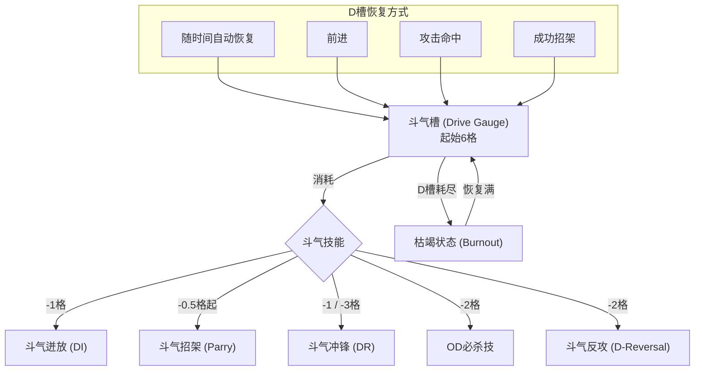

# 街霸6全面解析

> 🔗 原文链接： [https://www.bilibili.com/opus/80961...](https://www.bilibili.com/opus/809619198331322423?utm_source=chatgpt.com)

## 术语总览

本章节汇集了《街霸6》中的常用术语和社区俗称，方便查阅。

### 核心战斗术语

| 术语 | 英文/俗称 | 解释 |
| :--- | :--- | :--- |
| **打康 (Counter)** | Counter Hit (CH) | 在对手攻击或行动的发生帧、持续帧内命中对手。 |
| **确反康 (Punish)** | Punish Counter (PC) | 在对手攻击或行动的收招硬直内命中对手。 |
| **霸体** | Armor | 拥有霸体的技能，在攻击进行中受到攻击不会中断。 |
| **破霸体** | Armor Break | 具有破霸体属性的招式，可以击破对手的霸体状态。 |
| **投** | Throw | 投技，一种无法防御的近距离攻击。 |
| **拆投** | Throw Escape | 在被投的瞬间输入投指令，从而挣脱投技。 |
| **逆向** | Cross-Up | 从对手背后发动的攻击，需要反向防御。 |
| **择** | Mix-up | 利用多种攻击方式（如上中下段、投、逆向）让对手难以防御。 |
| **取消** | Cancel (C) | 在一个招式的特定时机输入另一个招式，从而取消前一招的收招硬直，形成连段或压制。 |
| **连段** | Combo | 一套连续的攻击，一旦第一下命中，后续攻击无法被防御。 |
| **目押** | Link | 不通过取消，而是利用前一招造成的有利帧数，衔接下一个招式形成的连段。 |
| **派生技** | Follow-up | 通常无法单独使用，在使出某一招式后追加输入才会发出的招式。 |

### 斗气系统专门术语

| 中文名 | 英文名 | 简称/别名 | 说明 |
| :--- | :--- | :--- | :--- |
| **斗气槽** | Drive Gauge | D槽 | 游戏核心资源，共6格，用于执行所有斗气系统动作。 |
| **斗气迸放** | Drive Impact | DI, 迸放, D撞 | 消耗1格D槽，带有霸体的强力攻击，可吸收2次攻击。指令是 `HP+HK`。 |
| **斗气招架** | Drive Parry | Parry, 招架/格挡 | 消耗D槽来格挡攻击。分为普通格挡和完美格挡。指令是 `MP+MK`。 |
| - 普通格挡 | Regular Parry | | 按住 `MP+MK`，持续消耗D槽格挡攻击，成功格挡会回复D槽。 |
| - 完美格挡 | Perfect Parry | | 在攻击命中的瞬间（2F内）格挡，会触发慢动作，并提供巨大的有利帧数。 |
| **OD必杀技** | Overdrive | OD/EX必杀 | 消耗2格D槽，强化版的必杀技。 |
| **斗气冲锋** | Drive Rush | DR, 绿冲 | 消耗D槽快速向前冲刺，冲刺后的攻击会获得有利帧数。分为两种： |
| - 裸绿冲 | Parry Drive Rush | PDR | 在格挡姿势中输入 `66`，消耗1格D槽。 |
| - 绿冲取消 | Cancel Drive Rush| CDR | 在可取消的普通技命中或被防时输入 `66`，消耗3格D槽。 |
| **斗气反攻** | Drive Reversal | D反 | 在防御硬直中发动的反击技，消耗2格D槽。指令是 `6+HP+HK`。 |
| **枯竭状态** | Burnout | | D槽为空时进入的危险状态。无法使用任何斗气系统能力，且防御时会被磨血。 |

### 状态与效果

| 术语 | 英文 | 解释 |
| :--- | :--- | :--- |
| **强制倒地** | Hard Knockdown | 特殊的倒地状态，对手只能选择原地起身，无法后起身。 |
| **立即倒地** | Forced Knockdown | 在空中被特定技能击中后，会进入限定浮空状态。 |
| **眩晕** | Stun | 受到过多攻击后进入的无法行动状态。 |
| **墙崩** | Wall Splat / Crush | 在版边，DI击破防御或特定攻击命中，使对手贴在墙上，可以追击。 |
| **腹崩** | Crumple | 特定重攻击P康的效果，对手会膝盖跪地，缓慢倒下，提供追击机会。 |
| **滑地** | Slide | 部分技能造成对手在地上滑行，可以追击。 |
| **浮空** | Juggle | 将对手打至空中，并进行连击的状态。 |

### 基础概念

| 术语 | 英文 | 解释 |
| :--- | :--- | :--- |
| **帧数** | Frame (F) | 游戏的时间单位，1F = 1/60秒。 |
| **发生** | Startup | 从输入指令到攻击判定出现所需的时间。 |
| **持续** | Active | 攻击判定持续存在的时间。 |
| **收招** | Recovery | 攻击判定消失后，到角色恢复正常状态所需的时间。 |
| **有利/不利** | Advantage/Disadvantage| 招式命中或被防后，一方比另一方能更早行动的时间差，以帧数计算。 |
| **通常技** | Normal | 直接按攻击键使出的招式。 |
| **特殊技** | Command Normal | 方向键配合攻击键使出的招式。 |
| **必杀技** | Special Move | 通过特定指令（如 236P）使出的招式。 |
| **超必杀技** | Super Art (SA) | 消耗SA槽使出的强力必杀技。 |
| **临界必杀技**| Critical Art (CA) | 血量25%以下时，SA3会强化为CA，伤害更高，演出更华丽。 |
| **无敌** | Invincibility | 技能发生期间不会被攻击判定的状态，如对投无敌、对打击无敌等。 |
| **攻击判定**| Hitbox | 招式能够攻击到对方的有效范围。 |
| **受创判定**| Hurtbox | 角色能够被攻击命中的范围。 |
| **修正值** | Damage Scaling | 连段中后续攻击伤害降低的系统。 |

### 社区黑话与俗称

| 术语 | 解释 |
| :--- | :--- |
| **J** | Jump，跳跃的缩写。 |
| **TC** | Target Combo，目标连段的缩写。 |
| **Reversal** | 硬直结束（如起身、防御后）立刻出招，通常指无敌技。 |
| **立回** | 指在中远距离，双方通过移动和牵制来寻找机会的博弈过程。 |
| **牵制** | Footsies / Poke | 使用远距离招式限制对手的行动。 |
| **压制** | Pressure | 进攻方通过连续的攻击和指令投等方式，持续给防守方施加压力。 |
| **起攻** | Oki / Okizeme | 在对手倒地起身时进行压制或多择进攻。 |
| **凹** | Wake-up / Yolo | 在不利情况下（如被压起身时）赌博式地使用无敌技反击。 |
| **确认** | Hit Confirm | 在压制中，看攻击是否命中再决定后续是接连段还是继续压制。 |
| **构** | Stance | 角色进入的一种特殊姿态，姿态下会拥有不同的招式。 |
| **偷帧** | Meaty | 利用招式靠后的持续帧命中起身或行动中的对手，以获得更大的有利帧数。 |
| **当身** | Parry/Counter | 摆出特定姿势，如果被对手攻击，会自动进行反击的招式。 |
| **复合输入**| Option Select (OS)| 一种输入方式，可以同时应对对手的多种选择。 |

## 基础系统

### 操作模式

#### 经典模式

*

↖ ↑ ↗ LP MP HP

← ○ →

↙ ↓ ↘ LK MK HK

*

通常习惯用数字表示方向，其对应如下：

| 7 (↖) | 8 (↑) | 9 (↗) |
|:---:|:---:|:---:|
| 4 (←) | 5 (○) | 6 (→) |
| 1 (↙) | 2 (↓) | 3 (↘) |

5即不按任何方向，摇杆回到无人持握/轻握时的状态（回中）。

在书写连续技时，通常情况下可以把5省略，且方向均为1P的方向指令。

*

| 缩写 | 英文 | 中文 |
| :--- | :--- | :--- |
| LP | Light Punch | 轻拳 |
| MP | Medium Punch | 中拳 |
| HP | Heavy Punch | 重拳 |
| LK | Light Kick | 轻脚 |
| MK | Medium Kick | 中脚 |
| HK | Heavy Kick | 重脚 |

*

LP+MP=投

MP+MK=格挡

HP+HK=斗气迸放

6+HP+HK=斗气反击

方向+6个键=挑衅

推荐把格挡和迸放设快捷键。

下文内容均以经典模式的指令为例。

*

#### 现代模式

现代模式是一种简易出招和简易连段的模式。最少需要7个键。

分别是

L M H PA

SP AS DI

L=轻攻击拳/脚

M=中攻击拳/脚

H=重攻击拳/脚

SP=必杀技键

AS=协助键

DI和PA是迸放和格挡的快捷键。

*

以隆为例：

投是L+M。

2HK需要用3H的指令来按。

快捷波：SP

快捷(重)升龙：6+SP

快捷(中)旋风腿：4+SP

快捷(中)踹：2+SP

快捷SA1：SP+H

快捷SA2：SP+4H

快捷SA3：SP+2H

EX技：方向+SP+AS

2L默认是2LK，连打2L会变成连打2LP。

AS键按住，再按L/M/H会有自动的连段，具体可以参考出招表，AS自动连段被防御不会出SA或后面的必杀。

有的角色M+H有功能，比如肯M+H等于KK。

挑衅是SP+L+M+H。

*

用SP/AS出的"快捷必杀"，伤害=手搓伤害的80%。现代模式里也可以手搓必杀。

相比经典模式，现代模式里会少一些招式。如隆的5MK，5HK和一些不同等级的必杀等。

蓄力系不可以直接一键出蓄力必杀，需要稍微蓄力一小会，当然比手搓蓄力快的多。

*

#### 动感模式

线下模式专用，比赛模式禁用。

按一个键，AI根据不同距离自动出招和连段。

比较娱乐，似乎没啥可深究的。

## 游戏机制详解

### 基础攻防与移动

#### 基础移动

街霸6的基础移动分为前走，后走，前冲，后退，原地跳，前跳，后跳。

*

##### 前走/后走

前走，拉6；后走，拉4。每个角色前走和后走速度皆不同。

*

##### 前冲/后退

前冲，66；后退，44。每个角色前冲和后退的距离皆不同。

街霸6中的44，从发生到恢复自由行动是全地面判定；

44发生后1-15F对投无敌；

*

##### 跳跃

后跳/原地跳/前跳分别为拉7/8/9。

*

**起跳准备**

通常角色起跳准备时间为4F，莉莉和老桑5F起跳。

部分角色的特殊技只能前跳出。

*

**落地收招**

正常跳跃后有3F落地硬直。空跳不出招，落地硬直内可以防或拆投；空中出招后，则有3F落地收招（可被P康）。

空中特殊技、必杀技，可能有单独的落地收招。

*

> 44，66，空跳全过程，都没有被康判定。

#### 投技 (Throw)

4+LP+LK ，后投。

5/6+LP+LK，前投。

投发生5F，持续3F，收招23F，全程30F。

*

蹲投和街霸5一样，会站起来投。

街霸6的投可以投康。

版边大部分角色的连投循环还在，大部分角色44版边可以躲投，运气好是有利或确反。

部分角色拥有特别的普通投，如桑吉尔夫、达尔西姆，参考出招表。

*

##### 拆投

拆投受付时间为9F。

拆投后双方互相推开，大概是隆两个身位的距离。

指令投和空投不可拆。

*

##### 投无敌

*   起跳准备动作期间投无敌。
*   44有1-15F投无敌。
*   起身后有1F投无敌。
*   防御和受创硬直后有2F投无敌。

*

##### 空投

普通空投是跳LP+LK。

有空投的角色：

布兰卡

嘉米

春丽

古烈

JP

朱莉

#### 康特系统 (Counter)

Counter Hit: 打康，普康，CH。在对手攻击发生或持续的时候命中对面，屏幕会提示CounterHit字样，硬直差＋2F。

Punish Counter: 确反康，P康，PC。在对手攻击或行动的收招硬直内打中对方，屏幕会提示Punish Counter字样，硬直差+4F。

P康命中声效和特效和普康不一样，有特殊属性，如浮空时间延长，腹崩等。

投P康有特写，2HK P康倒地时间延长等。

通常技/必杀技(DI) 普通康或P康＋20%伤害。

普通投普通康不加伤害，P康是70%。

指令投普通康不加伤害，P康是15%。

SA，D反打康没有额外伤害。

*

> 绿冲全程，隆的22P，杰米的喝酒等，都是发生时间，只能被普康。
> 44，66, 空跳全过程，都没有被康判定。

#### 倒地与起身

倒地起身，就两种，一种原地起身，一种后起身，没法赖地板。

两种起身的时间是完全一样的，版边可以固定压制。

2HK打康会延长起身时间。

默认起身是原地起身，倒地瞬间按任意两个键是后起身。

硬倒地会显示HardKnockdown，只能原地起身。

*

##### 硬倒地

1, 2HK对地*

2，投P康

3，SA3/CA和部分SA*

4，版边DI破防

5，指令投

6，角色*

--

*对空的2HK，可以后起身。

--

*肯SA1

玛丽莎SA1蓄、SA2

嘉米SA2

DJ SA1/SA2&gt;HP/HK

本田SA2

桑吉尔夫SA2

--

*角色

玛丽莎 236P蓄，214K&gt;K，JHP蓄/JHK蓄/原地跳2HP

曼侬3HK确反康

朱莉 JHP

DJ 214K &gt; MK

达尔西姆 1HK

JP 3HP

#### 霸体与破霸体 (Armor & Armor Break)

霸体：Armor，拥有霸体的技能，攻击进行中受到攻击不会中断。

破霸体：Armor Break，有破霸体属性的招式命中或多段技命中超过其霸体数量时触发。

*

##### 霸体技

DI

桑吉尔夫的5HP蓄

本田46PP

玛丽莎的214K/236P/623P

卢克的236KK

等

*

##### 破霸体技

D反

SA

玛丽莎 236P蓄/236PP/236KK /214PP/623PP

*

##### 通用对策

投

DI（反击）

霸体技反霸体

多段技（百烈掌等）

### 蓄力系

春丽

[2]8K，需要30F。

[4]6P，需要50F。

构行云流水下无需蓄力即可出。

布兰卡

[4]6P，需要40F。

空中[4]6P，需要40F。

[2]8K，需要40F。

布兰卡SA2激活期间，无需蓄力就可以出。

DJ

[2]8K，需要40F。

[4]6P，需要45F。

本田

[4]6P，需要40F。

[2]8K，需要40F。

[4]646K，需要40F。

古烈

[4]6P，需要45F。

[2]8K，需要45F。

[4]646P，需要45F。

[4]646K，需要45F。

[4]6P，[2]8K，3F内同时输入方向+P/K，称为完美波和完美升龙，性能变化。

卢克

214LP 蓄力18-20F为完美版本，性能变化。

214MP 蓄力18-20F为完美版本，性能变化。

### 连段构成

目押连、取消连、浮空连。

*

目押连：

分为普通目押，绿冲目押，康目押，偷帧目押，相杀目押。

*

普通目押：

近身情况下，前一招的命中硬直差大于下一招的发生，就可以形成目押连段。

隆5MP命中+7F，2MP发生6F。

近身下，隆5MP&gt;2MP是一个目押连段。

*

绿冲目押：

隆2LP命中+4F，绿冲2LP命中+8F。

绿冲2LP &gt;2MP 形成目押连段。

*

康目押：

隆2LP命中+4F，普康变+6F可以目押2MP，P康变+8F，可以目押2MK（发生8F）。

2LP(CH) &gt;2MP

2LP(PC) &gt;2MK

绿冲康目押请自行摸索。

*

偷帧目押：

隆5MP持续第1F命中，硬直差+7F，持续第2F命中硬直差+8F。

隆5MP压起身（偷帧概率更高），偷帧命中目标：

5MP（偷帧）&gt;2MK 偷帧目押连段。

*

相杀目押：

相杀后恢复快的1方有可能可以连段。

*

取消连：

取消连分为连打取消、TC、取消连。

*

连打取消：

轻攻击互相取消，后面可以取消必杀技/绿冲等。

如隆

2LK&gt;2LP&gt;214MK/623HP 等。

*

TC：

TC为系统设定的固定取消连。

隆的两个TC，5HP&gt;5HK；5MP&gt;5LK&gt;5HK。

*

取消连：

通常技一般可以取消TC/必杀/超必杀/绿冲/DI等。具体看设定，一般可以查看帧数表的取消栏目。

例如卢克的5MP，可以TC，不能绿冲。

部分必杀技也可以取消SA2/SA3。

*

浮空连：

浮空就是把对方打浮空然后再接后续连段。

具体打浮空的技能每个角色不一样，隆的JMP，214HP，236KK，236PP等都可以。

通用是绿冲通常技对空或追击滑地，霸体DI对空。

腹崩，墙崩和滑地也有一部分时间是限定浮空状态，可以打浮空连。

## 核心系统

### SuperArt

SuperArt，超必杀技，每个角色有三个SA。

SA槽，会带入下一灯。

必杀技挥空不会增加SA槽。DI和D反，击中或命中对手，双方都不会增加SA槽。

其他攻击行动（包括格挡），命中，防御，被打，双方都会相应增加SA槽，攻击方更多一些。

*

SA1，SA2，SA3，数字代表消耗的SA槽数量。

例如隆的SA1是真空波动拳，SA2是真波掌击，SA3是豪升龙拳。

SA1，只可以用通常技取消，例2MK &gt;SA1，但是不可以2MK &gt;波 &gt;SA1。所以以前隆的经典连段2MK&gt;波&gt;真空波动拳没了。

虽然不能直接取消，但是角色还是有很多方式可以接SA1，比如只要把对面打浮空就可以。隆的EX踹，EX波都可以。

SA1大部分发生没有对波无敌，有打击和投无敌。

除了DJ的SA1（无敌只有第1F），达尔西姆的SA1（无无敌），和桑吉尔夫的SA1（只能对空）

SA2，通常技，满足条件的EX必杀技可以取消至SA2。比如隆可以EX波动 &gt;SA2，但EX升龙不行

SA3，通常技，必杀技，满足条件的EX必杀技都可以取消至SA3。比如隆可以普通升龙&gt;SA3，但EX升龙不行。

SA3演出时间会暂停，但进攻方仍然会正常恢复D槽，大概能恢复2格到2.2格（CA），对方则暂停恢复。

CA，25%血以下，3格SA槽时会变成CA字样。CA的演出和伤害会改变，画面变灰，伤害增加500。

SA里的飞道和打击技均破霸体。（古烈和朱莉的buff型的SA不算）

### 斗气系统

街霸6的核心战斗系统围绕**斗气（Drive）**构建。玩家开局即拥有6格斗气槽，可以使用多种强大的攻防技能。但过度使用会导致角色进入危险的"枯竭"状态。理解并管理好斗气槽是取胜的关键。

#### D槽 (Drive Gauge)

D槽是所有斗气能力的基础，总共六格，每局开始时全满。

*   **D槽颜色**:
    *   **绿色**: D槽 > 3格
    *   **黄色**: D槽 <= 3格
    *   **灰色**: 枯竭状态
*   **超额使用**: 只要未进入枯竭，即使D槽不足，也可以使用消耗D槽的技能（如DI、绿冲取消），使用后会立即进入枯竭状态。
*   **例外**: D槽少于0.5格时，无法使用裸绿冲和普通格挡。

**获取D槽的方式：**

*   **进攻是最好的回复**:
    *   **前进**：向前走动会加速D槽的自动回复。
    *   **攻击命中**：通常技、必杀技命中对手会回复D槽，伤害越高的招式回复越多。
    *   **投命中**：普通投或指令投命中。
*   **防守**：
    *   **成功格挡 (Parry)**：格挡攻击可以回复D槽。
*   **其他**：
    *   **随时间自动获取**。
    *   从**眩晕 (Stun)** 状态恢复后，D槽会直接回满。

**失去D槽的方式：**

*   **使用D技能**：这是最主要的消耗方式。
*   **防御攻击**：在防御对手的攻击时会消耗D槽。
*   **被P康 (Punish Counter)**：被对手确反康时会损失更多D槽。
*   **被DI命中**：被对手的斗气迸放命中会损失D槽。
*   **被SA/CA命中**：被对手的超必杀技命中会损失D槽。

**D槽锁定模式：**

在特定动作后，D槽的自动恢复会暂停一段时间。
*   防御攻击后：暂停1.5秒
*   格挡挥空后：暂停4.5秒
*   格挡成功后：暂停1秒
*   使用D技能（DI、D反、OD技）后：暂停约2.5 - 3秒
*   使用绿冲取消后：暂停约2.5秒
*   使用裸绿冲后：暂停约4.5秒

### 其他系统

### 特色系统

街霸6里最快的普通技发生是4F，普通中段不会被普通技确反（-3F）。

对手贴版时候，无法跳逆，版边逆向彻底没了。

隔开一段距离拉着4，对面出攻击键会惯性防御的系统没有了。

隆的所有普通升龙对空都无敌，普通升龙没有街霸5发生对波对投无敌的属性。

街霸6的所有连打取消（2LK&gt;2LP,2LP&gt;2LP）都是有缝隙的，不是联防。

蹲姿防御的受创判定比站姿防御大。

线下VS模式的时候Rematch速度史上最快。

线上模式能看到对手联网模式是WIFI还是有线。

观战时候可以看到实时帧数显示。

房间内原房主退出不会再解散房间。

指令预输入时间是4F，意思是1F目押的受付时间为5F。

### 特殊挑衅

仅介绍对实战可能有"影响"的挑衅。

布兰卡的4挑衅，可以增加小布兰卡的数量，最多到5。

春丽的5挑衅，有300伤害，上段攻击。

莉莉的5挑衅，有1伤害，上段攻击，可以消波。

玛丽莎的6挑衅有一层霸体。

本田的5挑衅有一层霸体。

### 攻击优先

街霸6里通常技有攻击等级但没有优先级之分，轻中重攻击同时命中是相杀并双康，如2LP和2MP相撞是双康，不同于街霸5的攻击等级压制（2MP赢）。

街霸6里打击和投判定相杀时打击赢（即打击优先级更高），不同于街霸5的投赢。

街霸6里飞道有攻击等级差别（这点也不同于街霸5），通常情况下 SA波 &gt;OD波 &gt;普通波。

高攻击等级的波对低攻击等级的波有贯穿属性，即高等级的波会直接吃掉低等级的波，不会损失1Hit，不管低等级的波有多少Hits。同等级就拼Hit数。

布兰卡的小布兰卡玩偶

未激活时是完全无敌状态。

当用普通带电攻击激活时， 攻击等级是1HIT的普通波属性，可以被JP的普通地刺抵消。

当用EX带电攻击激活时，攻击等级是3HIT的EX波属性，可以被隆电刃EX波抵消。

当用SA1 激活时，攻击等级是5HIT的EX波属性。

### F式

F式是处于防御硬直时，站防切蹲防时，蹲姿时站姿受创判定的特殊状态。

大部分角色只能残血收割，少部分角色可以带入连段（JP）。

起身时蹲防的话，起身F式就不存在。

*

隆在街霸6里也有F式，隆的升JLP就是。

隆JHP打低点 &gt;升JP。

对面枯竭状态，隆JMK&gt;升JP（由于枯竭下的硬直差+4，因而可以成立）。

*

古烈 JHK&gt;升JLP

朱莉 JHK&gt;升JLK

朱莉（风水中）JHP高点下落时&gt;JHK

杰米 JHP&gt;升JLP

曼侬JHP &gt;升JLK

玛丽莎JHK &gt;升JLK

JP JHK&gt;升JLK

DJ JHP 升JLP

嘉米 JHK &gt;升JLK

本田 JHP &gt;升JLP

桑吉尔夫J2HP &gt;升JLK

金柏利 JHP&gt;升JLK

春丽 J2MK最低点&gt;JMK/JHK

*

达尔西姆 升JLK自带打蹲姿。

*

肯，卢克，莉莉，布兰卡无。

### 浮空

浮空表示对手进入一种可追击的状态，分为自由浮空和限定浮空。

自由浮空，可以用任何技追击，如果用2HK外的通常技追击，则目标会自动在空中受身落地。

限定浮空只能由与造成浮空的同等级或更高等级的技追击。

-

已知能造成自由浮空的技能：

绿冲通常技命中空中对手

绿冲通常技命中自由浮空

霸体DI对空造成的浮空

DI版边造成的贴墙*

DI破防造成的墙崩*

P康导致的腹崩倒地前的状态*

*表示一种特殊的自由浮空状态，普通技追击后能再造成一次可以追击TC和必杀技的浮空。

-

部分限定浮空技能：

滑地（如隆的236HK P康和隆的SA2蓄到最大）

-

立即倒地：空中必杀技、派生技、特殊技（金柏莉的J2MP、春丽的三角跳、达尔西姆的瞬移等），已经处于空中时被打康，会显示如下英文并进入限定浮空状态。

-

能命中限定浮空的常见技能：

2HK

街霸6的普通波也可以追击限定浮空，比如隆可以普通波对空，再普通波命中，版边隆可以EX波对空，再接普通波也能命中。

其他必杀技等。

-

注：这里仅简单介绍自由浮空和限定浮空。

### 修正系统

通常来说，修正对招式的定义是玩家输入的次数，而不是技能本身的Hit数。

例如隆的MP&gt;LK&gt;HK的TC算3招，214KK算1招。也有一些特例：隆的EX波，卢克的214P蓄等，算两招。

几种不同修正可以同时影响。

*

格挡

完美格挡后连段修正50% &gt;40% &gt;30%，以此类推。

*

SA

SA有保底伤害，SA1是30%，SA2是40%，SA3/CA是50%。

必杀取消SA3/CA，有额外10%修正。

特例：

隆升龙&gt;SA3/CA:100%&gt;60%

肯升龙&gt;SA3/CA:100%&gt;70%

*

绿冲

裸绿冲起手的连段是正常修正。

绿冲取消连段在原有基础上每一下额外修正15%（多次绿冲也是15%），即每一下伤害都再乘以85%。

*

DI

DI版边破防后每一下额外修正20%，即每一下伤害再乘以80%。

霸体DI、DI版边命中贴墙、DI致晕，DI本身会被计算为2HITS。

现代模式快捷必杀伤害是手搓的80%。

*

杰米

0酒:90%攻击力

1酒:95%攻击力

2酒:100%攻击力

3酒:105%攻击力

4酒:110%攻击力

杰米开了SA2，是4酒状态，但是攻击力是105%。

*

金柏莉

SA3/CA后移动速度和攻击力均提升11%。

实际上金的伤害比一般人低，其他人2HP一般是800，她只有720。

*

其他每个角色单独的修正可以参考羊羊的帖子。

*

无根性系统：

在街霸5里，血量越低，伤害修正越大，连段造成的伤害越低，这就是根性系统(Guts)。

而街霸6，并没有根性系统，血量低时受的伤害和满血时一样。

这也是很多人会觉得伤害爆炸的重要原因。

### 体力槽

桑吉尔夫体力是11000，玛丽莎、本田体力是10500，其他角色体力都是10000。

体力槽小于等于25%，体力槽会变成黄色。

此时SA3会自动变成CA，前面提过。

*

### 白血

白血是霸体吸收攻击和被D反打中时产生的可以慢慢恢复的血条。

有白血的时候被攻击命中，白血会消失。

如果剩余体力不够，霸体吸收攻击时会直接死亡。

枯竭中，如果有白血，被磨血时，白血会暂停恢复一会，目测2S。

磨血不仅会磨掉剩余血量，也会磨掉白血。

*

### 血量判断

血量判断是为了残血斩杀和枯竭下磨血斩杀。

桑吉尔夫此时血量是5200，1格D槽对应的剩余血量约等于866。

本田、玛丽莎此时血量是4950，1格D槽对应的剩余血量约等于825。

其他角色此时血量是4700，1格D槽对应的剩余血量约等于784。

桑吉尔夫的25%是2750。

本田、玛丽莎的25%是2625。

其他角色的25%是2500。

约等于3.2格左右。

*

中间有些空格没算，不用太在意，知道大约数就行。然后自己试试SA3能磨多少，其他必杀技能磨多少，磨血是固定的，之前说过，主要是一个视觉的记忆。

结合绿冲取消的联防压制，研究下把对方打进枯竭同时斩杀的套路。

这个就自行发挥了。

*

至于枯竭下：

上面的右侧第二个回合标志的右侧斜边对应的血量大概是角色的10%血量，即1000-1100左右。

### 帧数表

谷*歌商店搜

FAT Frame Data

苹果商店搜

Frame Assistant Tool

图标是这个。 或者访问网页版FAT或Supercombo的WIki

fullmeter.com

FAT内有很多内置的分类功能， 查看每个角色的各个行动和技能的汇总比较等功能。

微信有个【街霸6助手】，提供了一些帧数数据，抄的FAT，不全，更新不快。

### 综合设置

#### 线下1v1键盘

使用如果是键盘+摇杆/手柄两个设备，默认两个设备都是1P。需要在设置-操作下面把【单独使用】键盘启用。

不过，如果你主用的是摇杆，那么打完要改回去，不然键盘一直是1P，摇杆是2P。

*

#### 声音特效

可以设定D系统的动作音效设置为最大音量，来更好地确认DI等行动。设置演示：

图示的不一定是最好的设定。

*

#### 输入延迟

减轻【图像】-【输入延迟减轻】-开启。建议有条件的开启，线下之前没开会慢动作，开了就好了。

*

#### 录像回放

【CFN】-精彩回放-筛选自己

### 练习场！

#### 重置键

重置位置，假设是R键，默认操控1P在中央左侧位置。

单独按R，回到上一次设置的位置。

R+2，回版中默认初始游戏位置，同时会把【对战环境】中的位置重置。

R+4/7，左版边，1P贴版。

R+1，左版边，2P贴版。

R+6/9，右版边，2P贴版。

R+3，右版边，1P贴板。

R+8，中央，换位，1P在右侧。

【对战环境】中也可以更改位置。

#### Function键

如果你是经典模式+2个快捷键（即8个键，一般正常摇杆的配置），最右侧两个键设置了格挡和迸放，就没多余的快捷键设置录制和回放了。

解决办法：

1.设置Function按键+按键/方向形成N个不冲突的快捷键；

2.PC可以用键盘的某些键作为快捷键。

#### 设置Function键

进入【基本设置】-【快捷方式设置】

先设置Function键，可以设置摇杆上面的功能键，以下用"F"来表述。

#### 录制瞬间状态

设置F+8为状态保存，F+2为播放保存。

瞬间有很多用途，测试某些招式的性能或某些特殊情况的连段，比如霸体DI对空后的连段就需要专门练习。

设置电脑跳跃和确反康。

用DI命中空中确反康，然后有人说这个快捷键手忙脚乱不好按啊，怎么办？

没事，有解决办法，这时候按一下菜单键(这总没难度吧)，导航到【对战环境】-【游戏速度设置】，改到【暂停】。

回游戏，这时候画面是暂停的。安安心心点根烟，按一下F+8（先按住F，再按8，下同）。

看到右下角提示状态已保存，则搞定。

把游戏速度改成正常。

然后用F+2回放测试即可。

包括枯竭下的一些东西，也是用状态保存测试更方便。

其他快捷键按需设置即可，比如录制回放也可以用F+其他键代替。

#### 录制回放动作

##### 录制

默认录制到栏位1。

按一下录制键，进入录制准备状态，即可操控电脑，走到合适的位置，再按一下，即进入录制状态。

录制完毕按下录制/回放/重置都可以保存到栏位1。

##### 回放

按下回放键即可。

如需自动循环回放可以在【动态记录】-【播放】下面设置。

#### 录制技巧

#1.如果需要固定位置出招，可以先录制电脑连续66贴身后，再回退到适当的距离出招或者做一个标识动作再出招，比如先跳一下或挥空一下再出招。

#2.循环回放时可能需要把技能演出时间算进去，不然演出结束它可能直接是中途的指令开始了，这时候可以用一些动作去填满时间，类似上面的做一些连续66或者之类的标识动作即可，或者就用快捷键回放。

#3.录制一些技能的对应时候，最好录制完的时候拉住1，这样来最速防御，用自带的全防御，有时不太好用。视情况用反击+全防御也可以。

#4.有时候最好反向测试一些东西，比如测F式的时候，反过来测才发现蹲防不吃F式。

在【动态记录】中，可以选择其他栏位再录制多个，再利用回放功能同时回放多个。按46切换菜单的录制回放界面。

开启多个后可以设置随机概率（数字越大回放几率越高），不设置就几率相等，随机回放。

#### 反击设置

这次的【反击设置】终于正常了，其他格斗游戏早这么做了。

除了可以直接设置防御、受创、起身后直接各种招式或行动外，还可以将录制的内容直接插入前面三种方式后面。

下面是设置反击的延迟时间和打击次数（翻译错误），比如设置2下，5LP点一下不会反击，5LP-5LP后对面才会反击，以此类推。

#### 用录制内容反击

点进栏位1，找到【动态记录】，即可看到录制过的内容（栏位），选择即可。

下面显示帧数的就是反击录制内容了。

#### 帧数模式解析

【界面显示】中开启，帧数表内置，没有比这更好更创新的模式了，但没有标注投无敌，略有遗憾。

帧数/F：Frame,格斗游戏中的时间单位，通常会在攻略或帧数表表示中出现的词语，意思是1F=1/60S。格斗游戏都锁60F。

发生、持续、收招的概念

从准备动作到攻击判定开始的时间称为攻击技能的发生时间。

攻击判定从开始到结束经过的时间称为攻击技能的持续时间。

从攻击判定结束到角色可自由操作的时间称为收招时间。

发生最后1F和持续第1F重叠。

打击停顿：HitStop，打击技击中/命中时，攻守双方产生对等硬直的时间。飞道Hitstop只存在于防御方身上。

隆的5MP挥空：

发生=6F，持续4F，收招=11F，总计20F，之前说了发生最后1F和持续第1F重叠。

发生判定前的动作都是是技的准备动作。

持续帧也是被普康判定，相杀会双康，理解吧。

收招就是确反康。

隆5MP正常命中

虽然看上去帧数没变化是吧，但实际上，两边都减去了Hitstop的对等硬直。

隆5MP偷帧命中

5MP共4F持续，第1F命中+7F，第2F命中+8F，第3F命中+9F，第4F命中+10F。

帧数表的硬直差都是发生即命中的，称为"最小硬直差"。

最速绿冲最少需要格挡按住3F。

DI挥空

发生26F，1-25F内有两下霸体，2F持续，收招35F，共62F。

隆SA1

SA1只标注了打击无敌，实际上是有投无敌的，投无敌没有标注。

隆的升龙，只标注了持续，实际上对空是无敌的，估计不好描述。

简单举例，其他自行研究。

#### 攻击数据

【界面显示】中开启，可直观显示攻击防御方式，技能和连续技的的伤害，某一下的修正值等。

#### 简单训练

【简单训练】中有一些很好的训练对策的方法，多加练习，相信自己。

#### 保存设置

【简单训练】下，保存训练设置即可。

目前的一些bug：

伤害显示不正常，精格波后绿冲第一下应该是50%，有时候会显示100%。

打康伤害我记得以前版本会显示120%，现在是100%。

还有训练模式裸绿冲没有暗转，实战是有的（一定距离看到再按跳不起来），搞不懂。

还有一些帧数颜色显示怪怪的。

整体而言，有史以来最好的训练模式，没有之一。

——完