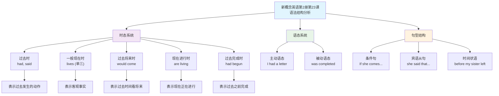

# 新概念英语第2册 第23课

## 课文内容

| 英文原句 | 对话语境/翻译 | 语法说明（含动词变化） |
|---------|-------------|-------------------|
| I had a letter from my sister yesterday. | 我昨天收到来自姐姐的一封信 | 动词：have → had 时态：一般过去时 结构：主语+动词过去式 说明：表示过去发生的动作。 |
| She lives in Nigeria. | 她住在尼日利亚 | 动词：live → lives 时态：一般现在时 结构：主语+动词三单形式 说明：描述客观事实或习惯。 |
| In her letter, she said that she would come to England next year. | 在她的信中，她说明年她将会来英国 | 主句动词：say → said（一般过去时） 从句动词：will → would（过去将来时），come（原形） 结构：主句+that+宾语从句 说明：主句为一般过去时，从句用过去将来时，表示在过去某时对将来的预测。 |
| If she comes, she will get a surprise. | 如果她来，她将会得到一个惊喜 | 条件从句动词：come → comes（一般现在时） 主句动词：will get（一般将来时） 结构：if引导条件状语从句 说明：第一类条件句，条件从句用一般现在时，主句用一般将来时。 |
| We are now living in a beautiful new house in the country. | 我们现在住在乡下一个漂亮的新房子里 | 动词：live → are living 时态：现在进行时 结构：主语+be动词+动词-ing 说明：表示正在进行的动作。 |
| Work on it had begun before my sister left. | 在我姐姐离开之前，这个房子的工作就已经开始了 | 主句动词：begin → had begun（过去完成时） 从句动词：leave → left（一般过去时） 结构：主句+before+时间状语从句 说明：过去完成时表示在过去某一时间或动作之前已经完成的动作。 |
| The house was completed five months ago. | 这个房子是在五个月之前完成的 | 动词：complete → was completed（一般过去时被动语态） 结构：主语+was/were+过去分词 说明：被动语态，强调动作的承受者。 |

## 语法重点

1. **时态运用**：
   - 过去时：had, said
   - 一般现在时：lives (单三形式)
   - 过去将来时：would come
   - 现在进行时：are living
   - 过去完成时：had begun

2. **被动语态**：
   - was completed (房子被完成)

3. **固定短语**：
   - get a surprise 得到惊喜
   - work on 在...方面工作

## 课文朗读练习

连读练习：
I had a letter from my sister yesterday. She lives in Nigeria. In her letter, she said that she would come to England next year. If she comes, she will get a surprise. We are now living in a beautiful new house in the country. Work on it had begun before my sister left. The house was completed five months ago.

## 语法结构分析图

